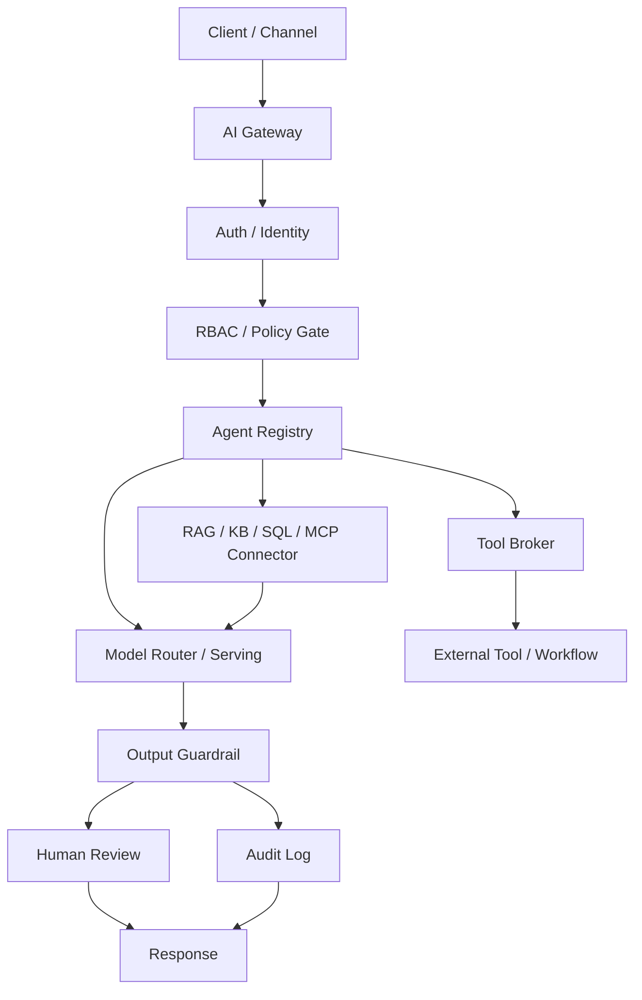

# 學生講義：AI Gateway 架構證據

## 1. 第一個結論

一個會呼叫 LLM API 的 demo，不等於一套企業級 AI 系統。

一套可以交付的企業級 AI 系統，必須回答：

1. 誰送出了這個請求？
2. 這個使用者可以存取什麼？
3. 哪一個 agent 被允許處理這個任務？
4. 這個 agent 可以 retrieve 哪些資料來源？
5. 這個 agent 可以呼叫哪些工具？
6. 哪些工具呼叫會產生 side effect？
7. 回答回傳之前，會跑哪些輸出檢查？
8. 哪些動作需要 human review？
9. 哪一筆 audit record 可以在之後證明這個 request lifecycle？

Day 1 不是要打造完整 backend。Day 1 是要產出 architecture evidence。

## 2. 在畫架構之前，先讀懂 AI Request

在畫 AI Gateway 之前，先把一次 AI 互動讀成一個 system request。

```text
Client
-> HTTP request
-> backend route
-> handler
-> policy / retrieval / tool / model workflow
-> audit log
-> HTTP response
-> Client
```

### 2.1 HTTP Request And Response

HTTP request 是 client 要求 server 做某件事。它通常包含 method、path、
headers，以及 body：

```http
POST /ai/chat
Authorization: Bearer demo-user-token
Content-Type: application/json

{
  "message": "I cannot log in to VPN. Please find the setup steps."
}
```

在 AI Gateway 裡，request body 不只是 user message。真實的 request 也會
帶有 user identity、role、requested agent、requested tools、task type、
metadata，通常也會有 `trace_id`。

#### 為什麼我們選擇 HTTP ?

AI Gateway 常使用 HTTP request/response，因為 gateway 是 network service
entrypoint 以及 control API。HTTP 是 browser、mobile app、backend service、
Slack bot、webhook、cloud load balancer、enterprise network controls、
security tools，以及 logging systems 都能共同理解的語言。

Gateway flow 很自然地對應 HTTP：

```text
Client / Web App / Mobile App / Slack Bot
-> HTTP Request
-> AI Gateway
-> Policy / Agent / Tool / RAG / Model
-> HTTP Response
-> Client
```

HTTP 對 AI Gateway design 很有用，因為它提供：

- 讓許多 client 都能整合的共同邊界
- 用於 identity 與 token checks 的 `Authorization` headers
- 用於 routing 的 method 與 route information
- 用於成功、malformed input、missing login、denied access、rate limit、service
  failure 的 status codes
- 成熟的 observability fields，例如 route、latency、status code、error，以及
  `trace_id`
- 與 load balancers、reverse proxies、WAFs、firewalls、API gateways、IAM、
  rate limits、TLS，以及 service mesh tools 相容

這不表示每一個 internal gateway connection 都必須是簡單的 request/response
HTTP。Production systems 也可能在 gateway 後面使用 HTTP streaming 或 SSE
做 token streaming、WebSocket 做 realtime voice 或 agent sessions、gRPC 做
internal service-to-service calls、queues 做 asynchronous work、event streams
做 audit 與 monitoring，以及 database/model-server/MCP connections。

初學者的 mental model 是：

```text
HTTP request  = one AI task entering the system
AI Gateway    = the control entrypoint that checks, authorizes, routes, and logs it
HTTP response = the result, denial reason, error, or review status returned to the client
```

HTTP response 是 server 回傳的內容。它通常有 status code、headers，以及 body：

```http
200 OK
Content-Type: application/json

{
  "answer": "Start by checking MFA, VPN client version, and account status.",
  "sources": ["vpn-guide-2026-01"],
  "ticket_status": "pending_review"
}
```

常見 status codes：

| Status | 在 gateway design 裡的意義 |
|---:|---|
| 200 | Request completed 或 review status 成功回傳 |
| 400 | JSON body 或 schema malformed |
| 401 | Login/session/token missing 或 invalid |
| 403 | User 已 authenticated，但沒有 permission |
| 404 | Requested resource 或 route not found |
| 429 | Rate limit reached |
| 500 | Backend、model、retrieval，或 tool service failed |

### 2.2 JSON Object And Schema

JSON 是常見的 API data format。JSON object 是 key-value structure：

```json
{
  "user_id": "student_001",
  "role": "student",
  "message": "I cannot log in to VPN"
}
```

JSON 可以包含 strings、numbers、booleans、arrays、nested objects，以及
`null`。AI Gateway contracts 使用 JSON，讓系統可以檢查 role、task type、
requested tools、risk class、policy decision、source IDs，以及 audit status
等 fields。

Schema 是 JSON 的預期形狀。例如 ticket tool 可能要求 `title`、`description`
以及 `priority`。如果 agent 只送出 `{"text": "open a ticket"}`，tool broker
應該拒絕，因為 contract 不完整。

### 2.2.1 Free Text, Selected Lists, And Hybrid Requests

學生與 staff 可能用三種常見方式提交 request。

Free-text chat 對使用者來說很自然：

```text
I cannot log in to VPN. Please find the setup steps. If it still fails,
help me create an IT ticket.
```

這很有彈性，但對 policy 不穩定，因為一句話可能同時包含 knowledge retrieval、
ticket creation、PII，以及 side-effect request。

Selected lists 或 forms 比較容易 govern：

```text
category = vpn
requested_action = create_ticket
urgency = medium
```

這比較 structured，但彈性較低。真實使用者常會描述不容易乾淨放進單一 menu
option 的問題。

最強的 beginner design 是 hybrid：

```text
free text:
"I cannot log in to VPN. If it still fails, create a ticket."

controlled fields:
category = vpn
requested_action = create_ticket
channel = student_portal
```

Client-provided fields 是有用的 hints，但不是 final truth。Gateway 應該從可信的
server-side sources，例如 token、identity provider、permission database、
agent registry，以及 policy database，resolve identity、role、permission、
allowed tools、agent scope，以及 policy rules。

這不只是 AI design preference。這是正常的 web security model。OWASP 不是法律
或政府規範；它是廣泛使用的 application security community，會發布 guidelines、
verification standards、cheat sheets，以及 risk lists。對 gateway design 來說，
OWASP 的重要教訓是：client-side checks 可以改善 UX，但 authorization decision
必須在 trusted server-side code、gateway，或 serverless function 裡完成。預設姿態
應該是 deny-by-default：如果系統無法證明 caller 可以 access resource 或 run tool，
就不應允許。

NIST 用更正式的 control language 給出相同想法。NIST SP 800-53 access-control
controls 描述 enforcing approved authorizations 與 least privilege。NIST SP
800-162 描述 ABAC，其中 policy decision 會考量：

```text
subject     = user / service / agent identity
object      = document / database row / ticket / email / tool
operation   = read / create / update / send / approve
environment = tenant / time / network / channel / risk_class
```

這會直接對應到 AI Gateway policy input。學生 request 不只是 message；它是一個
subject，在 specific environment 下要求對 objects 執行 operations。

Trusted identity flow 通常長這樣：

```text
1. Client sends Authorization: Bearer <token>.
2. Gateway verifies token signature and expiration.
3. Gateway checks issuer and audience.
4. Gateway reads subject/user_id from verified token claims.
5. Gateway queries identity provider or user database for role/group.
6. Gateway queries permission database or policy engine.
7. Gateway ignores client-provided role, permission, risk_class, and allowed_tools.
8. Gateway evaluates allow / deny / review_required per action.
```

OIDC ID Tokens 與 JWTs 是常見的 authentication claims 承載方式，但 gateway
仍然必須先 verify，才能 trust 其內容。

Serverless API 表示 gateway handler 可以作為 function 執行，而不是長時間運行的
server process。"Serverless" 不表示「沒有 server」。它表示 cloud platform 代你管理
server process、runtime startup、scaling、isolation、routing，以及 execution
environment。

HTTP boundary 仍然存在：

```text
Client
-> HTTP request
-> API Gateway / Vercel Function / Cloudflare Worker
-> gateway handler code
-> response
```

Traditional backend hosting 與 serverless API hosting 是執行同一種 backend
responsibility 的不同方式：

```text
Traditional server:
Client
-> HTTP request
-> Load Balancer / Nginx
-> long-running backend server
-> route handler
-> database / external service
-> response

Serverless API:
Client
-> HTTP request
-> API Gateway / Edge Route / Function URL
-> function invocation
-> handler code
-> database / queue / external service
-> response
```

用 AWS 的說法，Amazon API Gateway 可以 publish 並 secure HTTP、REST，以及
WebSocket APIs，然後把 requests route 到 AWS Lambda 等 services。Lambda 可以透過
API Gateway exposed，讓 function 接收 HTTP request event 並回傳 HTTP response。
Vercel Functions 與 Cloudflare Workers 也遵循同樣的 teaching model：一個 request
會 invoke 由 platform 管理的 function code。

Serverless 不會移除 backend，也不會移除 security responsibility。Function 仍然必須
verify tokens、resolve permissions、validate schema、evaluate policy、broker tools、
write audit logs，並 return clear status。Examples：

```text
AWS:
Student Portal -> Amazon API Gateway -> Lambda authorizer / Lambda handler
-> policy table or OPA -> model/RAG/tool -> DynamoDB or RDS audit table

Vercel:
Next.js frontend -> /api/gateway -> Vercel Function
-> Auth.js / Clerk / Auth0 session check -> Prisma/Postgres policy/audit

Cloudflare:
Browser -> Cloudflare Worker
-> JWT or Cloudflare Access check -> Workers AI / external provider
-> D1 / KV / Vectorize / external audit store
```

### 2.2.2 Serverless API Boundary

在 Day 1，請把 serverless API 視為 trusted gateway handler 的 hosting pattern。

完整 request lifecycle 是：

```text
1. Client sends HTTP request.
2. DNS, TLS, CDN, or edge network receives traffic.
3. API Gateway, route handler, or function URL matches method and path.
4. Authentication checks who is calling.
5. Authorization checks whether the caller can perform the action.
6. Rate limit or quota checks protect the system and cost.
7. Request validation checks headers, query parameters, and JSON body.
8. Platform converts the HTTP request into a function event.
9. Function runtime starts or reuses an execution environment.
10. Handler runs gateway logic.
11. Handler calls database, queue, object storage, RAG, model, or tool APIs.
12. Handler returns response body, headers, and status code.
13. Platform records logs, metrics, traces, and audit events.
```

Beginner terms：

| Term | Meaning |
|---|---|
| API | 讓 systems 溝通的 contract |
| Endpoint | 可呼叫的 URL，例如 `/gateway/requests` |
| Route | Method 與 path，例如 `POST /gateway/requests` |
| Handler | 處理 request 的 code |
| Function invocation | serverless handler code 的一次 execution |
| Runtime | Python、Node.js、Go，或 Java 等 language environment |
| Cold start | Platform 建立新的 execution environment 時額外的 startup time |
| Warm start | Platform 可以 reuse existing environment 時比較快的 invocation |
| Stateless | Handler 不應依賴 local memory 或 local files 作為 durable state |

最重要的 engineering rule 是：

```text
Serverless changes the hosting model.
It does not change the trust model.
```

Serverless API 不等於「把 backend server 放到 cloud 上」。那是 cloud hosting。

```text
Cloud hosting:
You rent cloud compute and run a long-lived backend process such as FastAPI,
Express, Django, Spring Boot, or a containerized service.

Serverless API:
You deploy handler code and configuration. When a request or event arrives, the
platform invokes the function in a managed execution environment.
```

換句話說：

```text
Cloud hosting = your app server is always running somewhere you provision.
Serverless API = your handler runs when the platform invokes it.
```

這個 distinction 重要，因為 "serverless" 這個詞談的是 ownership，不是 physics。
Servers 仍然存在。Platform infrastructure 仍然存在。改變的是 application team
不需要為那個 function 管理 dedicated、always-running app server process。

Cloud provider 的視角比較接近：

```text
Platform infrastructure that exists continuously:
API Gateway / router / scheduler / runtime manager / container or microVM pool
logs / metrics / IAM / deployment control plane

Your project normally exists as:
function code + config + route mapping + IAM / policy + environment variables

When a request arrives:
platform selects or creates an execution environment
-> loads or reuses your function
-> runs the handler
-> returns the response
-> keeps the environment warm for possible reuse or recycles it later
```

AWS Lambda 把這描述為 execution environment lifecycle：init、invoke，以及
shutdown，其中 environment 有時會被 frozen 並 reused 給後續 invocations。這個
reuse 是為什麼第二個 request 可能是 warm start，而新的 environment 會有 cold-start
latency。

精準的 mental model 是：

```text
not "no server"
but "no server process that this team directly manages"

not "no backend"
but "backend execution unit = event-triggered function invocation"

not "nothing is always running"
but "the always-running layer belongs to the platform, not to your app server"
```

#### Localhost, Emulators, And Serverless-Like Platforms

你可以在 localhost 做 serverless API 嗎？

有三個層次。

第一，你可以在 local simulate serverless。AWS SAM local、Serverless Framework
offline、Vercel dev、Cloudflare Wrangler，以及 LocalStack 等 tools 可以 emulate
cloud request/event flow 的部分內容。這對 class labs 很有用，因為學生可以不用每次
改動都 deploy，就測試 handler code。

第二，你可以在自己的 machine、private server，或 Kubernetes cluster 上執行
serverless-like platform。OpenFaaS 可以把 functions deploy 到 Kubernetes，並在
on-premises 或 cloud environments 裡執行。Knative 是 Kubernetes-based serverless
workloads platform；Knative Serving 可以 route HTTP requests、autoscale services，
並在 idle 時 scale to zero。

第三，如果你只是用 FastAPI 或 Express 在 `localhost:8000` 執行，且沒有 function
platform，那它其實不是 serverless。它是 local backend server。它可能很小、很 local，
但仍然有一個 process 正在 running 並 listening for requests。

所以規則是：

```text
Local emulator = good for development, but it simulates cloud serverless.
OpenFaaS / Knative / similar = serverless-like platform you operate yourself.
Plain localhost web server = cloud hosting style, just on your laptop.
```

Serverless 是從 application developer 的觀點來說的 "serverless"。從 platform
operator 的觀點來看，仍然有人管理 routers、schedulers、runtimes、containers、logs、
metrics、security patches，以及 capacity。

Trusted handler 仍然必須做：

```text
verify token
resolve identity / role / permission server-side
validate request schema
normalize intent into structured actions
evaluate policy
enforce tool decisions
write audit events
protect secrets and logs
return explicit HTTP status or review state
```

不要 trust 像這樣的 browser payload：

```json
{
  "user_id": "student_001",
  "role": "admin",
  "requested_tool": "view_audit_log"
}
```

Frontend 可以送 user intent 與 UI hints。Serverless handler 必須從 verified
session 或 token 推導出真正的 identity 與 permissions。

#### Minimal Serverless AI Gateway Shape

以 serverless functions hosting 的 AI Gateway 通常有這些 pieces：

```text
API layer:
- Amazon API Gateway, Vercel Route Handler, Cloudflare Worker, or Google API Gateway

Identity layer:
- Cognito, Auth0, Clerk, Auth.js, Cloudflare Access, or internal OIDC

Schema layer:
- Pydantic for Python
- Zod for TypeScript
- JSON Schema for cross-language contracts

Policy layer:
- policy table first
- OPA, Casbin, Cedar / Amazon Verified Permissions, or Cerbos later

State layer:
- DynamoDB, PostgreSQL, Supabase, Neon, D1, KV, R2, S3, or Redis

Async layer:
- SQS, Pub/Sub, Cloudflare Queues, Step Functions, Temporal, or a job table

Observability layer:
- structured logs, request_id, trace_id, metrics, audit table, OpenTelemetry
```

對小型 class project，好的路徑是：

```text
FastAPI + Pydantic locally
-> same handler shape wrapped by Mangum for AWS Lambda
-> API Gateway HTTP API
-> DynamoDB or PostgreSQL audit table
-> optional SQS worker for long-running AI jobs
```

對 TypeScript web app：

```text
Next.js route handler
-> Vercel Function
-> Zod validation
-> Auth.js / Clerk / Auth0 session check
-> Postgres / Prisma audit table
```

對 edge-oriented demos：

```text
Cloudflare Worker
-> Hono router
-> JWT or Cloudflare Access check
-> D1 / KV / R2 / Vectorize
-> Workers AI or external model provider
```

#### Synchronous And Asynchronous APIs

不是每個 task 都應該在一個 HTTP request 內完成。

短的 control-plane tasks 可以是 synchronous：

```text
POST /gateway/requests
-> validate
-> policy
-> short RAG search
-> short model call
-> response
```

長 jobs 通常應該是 asynchronous：

```text
POST /v1/summary-jobs
-> validate request
-> create job_id
-> enqueue job
-> return 202 Accepted

worker:
-> read job from queue
-> run ASR / RAG / LLM / evaluation
-> save result

GET /v1/summary-jobs/{job_id}
-> return queued / running / completed / failed
```

這對 AI systems 很重要，因為 audio transcription、long document processing、
batch evaluation，以及 multi-step review workflows 可能超過一般 HTTP timeout
expectations。Queue-based design 也讓 retry 與 failure handling 比較容易推理。

#### Idempotency

Serverless 與 queue-based systems 可能 retry work。Client 可能在 timeout 後 retry。
Queue message 可能再次 delivered。Worker 可能在一半時 fail。

Idempotency 的意思是：

```text
The same request can be retried without creating duplicate side effects.
```

對 `create_ticket`、`send_email`、`charge_card`，或 `update_record` 這類
side-effect tools，使用 idempotency key：

```http
POST /gateway/tool-calls
Idempotency-Key: ticket-req-0001
```

Backend stores：

```text
idempotency_key
request_hash
status: processing | completed | failed
response_body
expires_at
```

如果同一個 key 再次出現，gateway 回傳前一次 result，而不是建立 duplicate ticket
或送出 duplicate email。

#### Security And Observability

Serverless AI Gateway 仍然需要和 traditional backend 一樣的 security controls：

```text
Authentication: who is calling?
Authorization: may this caller do this action?
Object-level authorization: may this caller access this ticket/file/session?
Input validation: does JSON match the schema?
Output filtering: are sensitive fields removed?
Least privilege IAM: can this function access only needed resources?
Secret management: are API keys outside source code?
Rate limiting: can one user create cost or abuse spikes?
Audit logging: can we reconstruct who did what?
PII redaction: do logs avoid leaking sensitive text?
```

Observability 應該包含：

```json
{
  "trace_id": "req-0001",
  "route": "POST /gateway/requests",
  "user_id_hash": "sha256:...",
  "role": "student",
  "status_code": 200,
  "latency_ms": 142,
  "policy_decision": "review_required",
  "tool_decisions": ["search_it_faq:allow", "create_it_ticket:review_required"],
  "retrieved_source_ids": ["vpn-guide-2026-01"],
  "audit_event_id": "audit-0001"
}
```

不要 log raw access tokens、API keys、完整 medical records、完整 customer
profiles，或不必要的 PII。好的 logs 讓系統可解釋。壞的 logs 會變成 data leak。

#### Real-World Flow: AI Intake Summary

假設 clinic 想要一個 kiosk 收集 patient symptoms，並準備 staff-review summary。
API 不應命名為 `POST /diagnose`，因為系統不是在做 final clinical decisions。比較好的
API surface 是：

```text
POST /v1/intake-sessions
POST /v1/intake-sessions/{session_id}/answers
POST /v1/intake-sessions/{session_id}/summary-jobs
GET  /v1/intake-sessions/{session_id}/staff-review-summary
```

Production-style serverless flow 是：

```text
1. Patient mobile app calls POST /v1/intake-sessions.
2. API Gateway invokes a function handler.
3. Handler validates schema and creates a session record.
4. Patient submits answers.
5. Handler checks session ownership and stores answers.
6. Patient or staff requests summary generation.
7. Handler enqueues a summary job and returns 202 Accepted with job_id.
8. Worker function reads the queue.
9. Worker loads allowed session fields, not the whole medical database.
10. Worker calls an LLM gateway to draft a staff-review summary.
11. Guardrail checks unsupported diagnosis or unsafe wording.
12. Worker saves the summary and audit event.
13. Staff dashboard reads the summary after authorization.
```

這個 design 把 user-facing latency 和 long AI work 分開。它也把 AI output 保留在
staff-review workflow 裡，而不是假裝 model 是 doctor。

#### Real-World Flow: Webhook Receiver

Serverless APIs 也常用於 webhooks。例如 payment、GitHub、LINE、Slack、form，
或 ticketing system 可能會 call your API：

```text
External service
-> POST /v1/webhooks/ticket-system
-> verify signature
-> check idempotency
-> enqueue event
-> return 200 quickly
```

重要想法是：

```text
Webhook received does not mean business processing is complete.
Webhook received means the event was authenticated, deduplicated, stored,
and queued for processing.
```

這可以避免 external services 因為你的 handler 正在忙著 calling an LLM 或等待 slow
database operation 而 retry。

#### When Serverless Is A Poor Fit

Serverless API 對 gateway entrypoints、policy checks、webhook receivers、audit
writes、short RAG calls，以及 job creation 很有用。它通常不適合：

```text
very long synchronous jobs
large always-warm in-memory models
GPU inference that needs model weights kept resident
heavy local filesystem state
special non-HTTP network protocols
very large dependency packages
workloads where cold start is unacceptable
downstream databases that cannot handle bursty connections
```

對 enterprise AI，成熟設計通常是 hybrid：

```text
Serverless API = entrypoint and control plane
Queue / workflow = long-running coordination
Container / Kubernetes / managed inference endpoint = heavy compute or GPU
Database / object storage = durable state
Observability / audit = evidence and operations
```

#### Cloud Hosting Vs Serverless In Enterprise AI

Enterprise teams 通常不只選一個。它們兩個都會用。

Cloud hosting 通常是指 VMs、containers、managed container services，或 Kubernetes
執行 long-lived services。Serverless 通常是指 functions、event handlers，以及 managed
platform invocations。

First-principles comparison：

| Question | Serverless API 通常比較好，當 | Cloud hosting / containers 通常比較好，當 |
|---|---|---|
| Traffic | Low、spiky，或 unpredictable | High、steady，或 very high volume |
| Workload | Event-driven、short、stateless | Long-running、stateful、streaming，或 always warm |
| Team size | Small team、MVP、PoC、internal automation | Larger team with platform / SRE / DevOps ownership |
| Cost model | Pay-per-use 在 low volume 時較便宜 | Reserved capacity 在 sustained high volume 時較便宜 |
| Control | Platform defaults acceptable | CPU、RAM、GPU、network、runtime、latency 需要更嚴格控制 |
| Portability | Vendor lock-in 為了速度可以接受 | Multi-cloud、on-prem、private network，或 customer deployment 很重要 |
| AI fit | Webhooks、file intake、job triggers、audit events、notifications | AI Gateway core、streaming、memory service、agent runtime、GPU inference |

Cost intuition：

```text
Serverless = like paying per ride.
Cloud hosting = like owning or leasing capacity.

Low request volume:
serverless often wins because idle time costs little or nothing.

High steady volume:
containers or VMs often win because you pay for capacity, not every invocation.
```

這就是為什麼大型公司仍然把許多 core systems 跑在 Kubernetes、containers，或
dedicated services 上。Serverless 不是「比較新所以比較好」。Serverless 對特定類型
的 workload 比較好。

對 AI systems，這個分工特別重要。簡單的 webhook 或 file upload trigger 是很好的
serverless job：

```text
PDF upload
-> serverless handler validates request
-> enqueue processing job
-> return 202 Accepted
-> worker / GPU service performs OCR, embedding, RAG indexing, or evaluation
```

但 core AI inference 通常需要不同形狀：

```text
Load balancer / API Gateway
-> containerized AI Gateway
-> agent service / policy service / memory service / tool service
-> GPU inference cluster or managed model endpoint
-> PostgreSQL / Redis / object storage / vector database
```

成熟的 enterprise pattern 是：

```text
Cloud hosting / containers:
- core backend
- AI Gateway core
- agent registry
- tool registry
- policy service
- memory service
- streaming / WebSocket sessions
- GPU inference
- high-volume internal services

Serverless API:
- webhooks
- event processing
- file upload intake
- scheduled jobs
- background job triggers
- notification handlers
- lightweight policy or audit extensions
- internal automation tools
```

對 Day 1 AI Gateway architecture，實務建議是：

```text
Use Kubernetes / containers / managed services for the stable enterprise AI
control plane.

Use serverless functions around the edges for event-driven automation,
webhooks, job triggers, and small internal tools.
```

這就是 hybrid architecture。它很常見，因為 cloud hosting 與 serverless 解決的是不同
workload problems。

Normalized gateway envelope 應該把 actor、task、actions、resources、environment，
以及 trace context 分開：

```json
{
  "trace_id": "req-0001",
  "channel": "student_portal",
  "actor": {
    "user_id": "student_001",
    "role": "student",
    "permissions": ["read_public_faq", "request_ticket_creation"]
  },
  "task": {
    "raw_message": "I cannot log in to VPN. If it still fails, create a ticket.",
    "task_type": "helpdesk_question",
    "category": "vpn",
    "risk_class": "medium"
  },
  "requested_actions": [
    {
      "action_type": "retrieve_knowledge",
      "resource": "it_public_faq",
      "tool_name": "search_it_faq",
      "side_effect": false
    },
    {
      "action_type": "create_ticket",
      "resource": "ticket_system",
      "tool_name": "create_it_ticket",
      "side_effect": true
    }
  ],
  "environment": {
    "ip_range": "campus_network"
  }
}
```

規則是：

```text
Human input may be natural language.
Gateway decisions require structured data.
The LLM may help propose intent, but it must not replace the policy engine.
```

這表示 product 仍然可以從簡單 prompt box 開始。限制不在使用者；限制在 execution。

```text
Good:
user prompt -> gateway action proposals -> schema validation -> policy -> execute / draft / confirm / clarify / deny

Bad:
user prompt -> LLM decides -> tool executes
```

第一個 design 對使用者是 natural-language-first，對系統內部是 policy-first。第二個
design 一開始感覺方便，但可能會 execute 錯 tool、read 錯 data，或建立不可逆的
side effect。

### 2.2.3 How Free Text Becomes Actions

Gateway 可以使用 LLM 幫忙把 free text 拆成 actions，但 LLM 只是 planner 的一部分。
可靠的 production design 通常是 hybrid：

```text
raw text
-> input validation / PII or prompt-injection checks
-> intent classification
-> slot extraction
-> action proposal
-> canonical action mapping
-> schema validation
-> policy evaluation
-> tool broker enforcement
-> audit log
```

最難的 practical pain point 是真實使用者不會用 JSON schemas 說話。學生或 staff
可能會寫：

```text
幫我處理一下 VPN，那個帳號好像又壞了，順便開單給 IT。
```

這個 prompt 不是一個乾淨的 action。它可能包含：

| Phrase | Possible system interpretation |
|---|---|
| `處理一下 VPN` | search VPN FAQ、check VPN status、ask for error message |
| `帳號好像又壞了` | account locked、password expired、MFA issue、permission revoked、certificate expired |
| `順便開單給 IT` | create ticket draft、ask for missing fields、submit ticket after confirmation |

所以 classifier 不只是回答「這是什麼 category？」有用的 gateway classifier 會產生
structured proposal：

```text
multi-label intent labels
action candidates
risk labels
required and missing slots
ambiguity signals
recommended next step
```

重要細節是 multi-label classification。Prompt 不是：

```text
vpn_issue OR ticket_creation
```

而比較接近：

```text
vpn_issue AND account_issue AND ticket_creation
```

所以 single-label classifier 對 enterprise AI Gateway design 通常太弱。

有幾種常見 approach：

| Method | Good fit | Weakness |
|---|---|---|
| UI controlled fields | stable internal workflows、category chips、urgency selector | 如果在使用者說明問題前強迫填寫，彈性較低 |
| rule-based parser | delete、send、reset、export、open permission 等 high-risk verbs | 對 varied language 脆弱；最適合作為 risk signal |
| traditional classifier | IT、billing、HR、VPN、account lock 等重複 categories | 需要 labeled examples；對 multi-intent prompts 較弱 |
| transformer classifier | semantic variants 與 multi-label probabilities | 需要 training/evaluation data 與 threshold tuning |
| embedding retrieval over action registry | 在 planner 選擇前找出 known tools | 需要 maintained action/tool registry |
| LLM structured output | flexible action extraction 與 slot filling | 必須 schema-validated 與 policy-checked |
| workflow planner / graph | multi-step processes 與 human review | 需要更多 state 與 failure handling |

Example：

```text
User:
I cannot log in to VPN. If it still fails, create an IT ticket.
```

Action proposal：

```json
{
  "task_type": "helpdesk_question",
  "category": "vpn",
  "actions": [
    {
      "action_type": "retrieve_knowledge",
      "tool_name": "search_it_faq",
      "resource": "public_it_faq",
      "side_effect": false
    },
    {
      "action_type": "create_ticket",
      "tool_name": "create_it_ticket",
      "resource": "ticket_system",
      "side_effect": true
    }
  ]
}
```

LLM 可以透過 structured output 或 tool-calling schemas 產生這個 JSON。Gateway
仍然必須 validate JSON 是否 match schema、map tool names 到 known tool registry、
classify side effects、run policy，並 write audit evidence。Prompt injection 是這種
separation 的原因之一：malicious input 或 retrieved documents 可能試圖讓 model
bypass safety controls 或 trigger unauthorized tools。

對複雜 VPN prompt，較豐富的 proposal 可能長這樣：

```json
{
  "intent_labels": {
    "vpn_troubleshooting": 0.91,
    "account_issue": 0.82,
    "ticket_creation": 0.88
  },
  "actions": [
    {
      "action_type": "search_vpn_faq",
      "risk_level": "read_only",
      "confidence": 0.91,
      "side_effect": false,
      "missing_slots": []
    },
    {
      "action_type": "check_account_status",
      "risk_level": "restricted",
      "confidence": 0.62,
      "side_effect": false,
      "missing_slots": ["account_id"]
    },
    {
      "action_type": "create_ticket_draft",
      "risk_level": "draft",
      "confidence": 0.84,
      "side_effect": false,
      "missing_slots": ["affected_user", "error_message", "device_type"]
    },
    {
      "action_type": "submit_ticket",
      "risk_level": "side_effect",
      "confidence": 0.55,
      "side_effect": true,
      "missing_slots": ["explicit_submit_confirmation"]
    }
  ],
  "ambiguity": {
    "ambiguous_terms": ["那個帳號", "壞了", "處理一下"],
    "needs_clarification": true
  },
  "recommended_next_step": "answer_vpn_faq_create_ticket_draft_and_ask_minimal_clarification"
}
```

#### UI Hints Without Annoying Users

UI hints 在幫助 gateway 解讀 request、又不強迫使用者填一長串 form 時很有用。差的 UX
會讓使用者服務 schema：

```text
Before explaining the issue, choose category, department, device, error code,
priority, reviewer, ticket type, and escalation path.
```

更好的 UX 讓使用者自然開始，然後顯示小型 interpretation preview：

```text
Input:
"VPN 又不能連了，順便幫我開 IT ticket"

Gateway preview:
[VPN 問題] [建立 ticket 草稿] [需要錯誤訊息] [送出前確認]
```

使用者不需要學 schema。Gateway 在背後使用 schema。如果 fields missing，只問最少必要
問題：

```text
這是你的帳號嗎？如果不是，請提供受影響帳號。
你看到的 VPN 錯誤訊息是什麼？
要送出 ticket，還是先保留草稿？
```

思考 total user cost：

```text
total cost
= typing cost
+ understanding cost
+ waiting cost
+ correction cost
+ damage from wrong side effects
+ trust loss
```

Direct prompt input 降低 typing cost。Gateway previews、confidence thresholds，
以及 confirmation 降低 correction cost 與 side-effect risk。

使用這個 safe-default table：

| Risk | Confidence | Gateway behavior |
|---|---:|---|
| Low | High | Execute read-only action |
| Low | Low | Ask one minimal clarification question |
| High | High | Create draft or preview; require confirmation |
| High | Low | Clarify, deny, or escalate to human review |

對 VPN example，好的 first response 是：

```text
我可以先查 VPN troubleshooting，並建立 IT ticket 草稿。
要查帳號狀態或送出 ticket 前，我會先請你確認。
```

### 2.3 Route, Handler, And Log

Backend route 會把 method 與 URL path 對應到 server function：

```text
POST /gateway/requests
GET /gateway/audit/:trace_id
POST /gateway/tool-calls
```

Handler 是 route 背後的 code。Gateway handler 通常會建立 trace ID、authenticate
user、check policy、select agent、filter retrieval、broker tool calls、check
guardrails、write audit evidence，並 return response。

Log 是 lifecycle evidence。有用的 AI Gateway audit log 會記錄 `trace_id`、
`user_id`、`role`、`agent_id`、`policy_decision`、`requested_tools`、
`allowed_tools`、`denied_tools`、`retrieved_source_ids`、`model_version`、
`guardrail_result`、`human_review_status`，以及 outcome 等 fields。

### 2.4 Login, Role, Permission

Login 回答：「你是誰？」這是 authentication。

Authorization 回答：「你可以對這個 resource 做這個 action 嗎？」

User identity 是發出 request 的 specific person、account，或 service。Role 是指派給
該 identity 的 category 或 responsibility。Permission 是具體 allowed action。

```json
{
  "user_id": "student_001",
  "email": "student001@example.edu",
  "role": "student"
}
```

在這裡，`user_id` 與 `email` identify who is making the request。`role` 告訴 gateway
這個 identity 是哪一種 user。

```text
Identity answers: Who is making this request?
Role answers: What kind of user is this person?
Permission answers: What concrete action can this user perform?
```

Role 是粗略 access category，例如 `student`、`staff`、`admin`，或
`compliance_officer`。Permission 是具體 allowed action，例如 `read_public_faq`、
`read_staff_sop`、`create_ticket`、`query_database`，或 `view_audit_log`。

Example：

```text
Jason logs in.
System confirms identity: Jason, user_id = jason_001.

Then the system checks role:
role = student.

Because role = student:
- can read public IT FAQ
- can request ticket creation
- cannot read staff-only SOP
- cannot approve admin actions
```

Enterprise AI policy decisions 通常需要三種 outcomes：

```text
allow
deny
review_required
```

這很重要，因為 logged-in student 可能被允許 read public VPN FAQ documents、被拒絕
access staff-only SOPs，並在 ticket submission 會建立 external side effect 時被 route
to review。

Decision pipeline 是：

```text
1. Authenticate.
2. Resolve identity, role, and permission server-side.
3. Validate request schema.
4. Normalize user intent into actions, resources, and tools.
5. Classify task and risk.
6. Resolve allowed resources and tools.
7. Evaluate policy.
8. Return allow, deny, or review_required.
9. Execute allowed actions.
10. Queue review_required actions.
11. Write audit log.
```

新 AI Gateway feature 的 practical access-control SOP 是：

```text
Before launch:
1. List roles: student, staff, admin, reviewer.
2. List data sources and mark access_level, owner, tenant, and document version.
3. List tools and mark read-only or side-effect.
4. Define required input schema for each tool.
5. Define policy table or policy-as-code rules.
6. Define audit fields and retention boundary.
7. Write authorization tests for allow, deny, and review_required.

At runtime:
1. Verify token and resolve identity server-side.
2. Ignore client-provided role, permission, risk_class, and allowed_tools.
3. Normalize requested actions.
4. Evaluate policy per action.
5. Execute allowed actions, block denied actions, queue review_required actions.
6. Write audit event with trace_id, policy_id, source IDs, and tool decisions.

After launch:
1. Review permissions regularly to avoid privilege creep.
2. Version policy changes.
3. Reconstruct incidents from trace_id and audit events.
4. Add regression tests for any authorization bug found in production.
```

Typical decision rules：

| Decision | When it fits | Example |
|---|---|---|
| allow | authenticated user、sufficient permission、allowed data/tool、valid schema、low risk | student searches public VPN FAQ |
| deny | missing login、insufficient role、forbidden resource/tool、attempted privilege bypass | student asks for staff-only SOP |
| review_required | side effect、external communication、sensitive output、high-risk task、low confidence、human approval needed | student requests ticket creation |

Review 不是 failure。它是 high-risk automation 的正常 control point。

常見錯誤是以為 "logged in" 等於 "allowed"。不是。User 可能被正確 identified，但仍然
被 blocked：

```text
Identity check:
Yes, this is student_001.

Permission check:
student_001 has role=student, so staff-only documents are not allowed.

Decision:
deny
```

在 enterprise AI systems 中，audit logs 通常同時記錄 identity 與 role：

```json
{
  "trace_id": "req-0001",
  "user_id": "student_001",
  "role": "student",
  "requested_tool": "create_ticket",
  "policy_decision": "review_required"
}
```

對 gateway design：

```text
identity tells us who to audit
role helps decide policy
permission decides whether an action is allowed, denied, or sent to review_required
```

Automation 應該是 state machine，而不是 model-only judgment：

```text
received
-> authenticated
-> schema_validated
-> intent_normalized
-> policy_checked
-> retrieval_allowed
-> tool_proposed
-> tool_decision_made
-> model_generated
-> guardrail_checked
-> completed / denied / pending_review
-> audit_written
```

Division of labor 是：

```text
LLM proposes action.
Gateway validates action.
Policy engine decides allow / deny / review_required.
Tool broker enforces the decision.
Audit log records the evidence.
```

### 2.5 LLM, RAG, API, And Database

LLM 會 generate 或 transform language。它是 inference component，不是 governance
layer。

#### 2.5.1 Model Serving: vLLM And SGLang

當學生聽到「run an LLM」，常會想像一支 Python script 載入 model 並呼叫
`model.generate()`。這對學習很有用，但不等於 production serving。

例如，research script 可能長這樣：

```python
from transformers import AutoModelForCausalLM, AutoTokenizer

model = AutoModelForCausalLM.from_pretrained("Qwen/Qwen2.5-1.5B-Instruct")
tokenizer = AutoTokenizer.from_pretrained("Qwen/Qwen2.5-1.5B-Instruct")

inputs = tokenizer("Explain what an API is.", return_tensors="pt")
outputs = model.generate(**inputs, max_new_tokens=100)
print(tokenizer.decode(outputs[0]))
```

這對 single user 與 small experiment 沒問題。對 real service 很弱，因為 real traffic
比較像這樣：

```text
09:00:00 user A sends a 200-token prompt
09:00:01 user B sends a 5,000-token RAG prompt
09:00:02 user C wants streaming output
09:00:02 user D wants JSON output
09:00:03 user E starts a multi-turn agent workflow
09:00:04 user F sends a long-context document question
```

Serving system 必須管理：

```text
many concurrent requests
batching so the GPU does not sit idle
KV cache memory
streaming responses
time to first token
time per output token
model loading and versioning
quantization
multi-GPU parallelism
OOM prevention
metrics and logs
Docker / Kubernetes deployment
OpenAI-compatible APIs
```

這就是 **vLLM** 與 **SGLang** 的位置。

```text
model weights = the learned neural network parameters
vLLM / SGLang = inference serving engines that run the weights efficiently
AI Gateway = control plane for auth, policy, routing, quota, audit, and review
```

所以 beginner mental model 是：

```text
vLLM / SGLang are usually data-plane serving engines.
AI Gateway is the control plane in front of them.
```

它們不 train model。它們不 replace backend。它們不 replace AI Gateway。它們讓 model
inference 夠快、夠穩，可以被 backend、RAG system、agent workflow，或 gateway 呼叫。

##### LLM Inference Lifecycle

送到 model server 的一個 request 通常會經過這個 flow：

```text
user request
-> HTTP API server receives request
-> tokenizer converts text into tokens
-> prefill: model reads the prompt and builds KV cache
-> decode: model generates one token at a time
-> detokenizer converts output tokens back into text
-> server streams or returns the response
```

最重要的兩個 phases：

```text
prefill = process the full input prompt
decode  = generate new tokens one by one
```

Prefill 通常 compute-intensive。如果 prompt 包含 8,000 tokens 的 RAG context，model
必須先處理這 8,000 tokens。

Decode 通常 memory-intensive。Model 產生下一個 token，然後下一個，再下一個。每一步
都會透過 cached attention data 使用 previous context。

這就是 long prompts、long answers、streaming，以及 many concurrent users 會用不同
方式壓力測試 model server 的原因。好的 serving engine 必須同時良好 schedule prefill
與 decode。

##### KV Cache

KV cache 是 LLM serving performance 背後的 key concept。

Transformer attention 使用 Query、Key，以及 Value vectors。當 model 已經處理過先前
tokens，它可以存下這些 tokens 的 Key 與 Value vectors，而不是每次產生下一個 token
都重新計算。

簡化如下：

```text
prompt tokens:
[What] [is] [an] [API]

model stores:
K cache = key vectors for previous tokens
V cache = value vectors for previous tokens
```

當 model 產生 next token，它會 reuse KV cache。

挑戰是 KV cache 可能變得非常巨大：

```text
user A: 200 tokens
user B: 8,000 tokens
user C: 1,500 tokens
user D: 32,000 tokens
```

如果 GPU memory 管理不好，system 會出現 fragmentation、low batch size、slow
throughput，以及 out-of-memory errors。

##### vLLM

vLLM 是 high-performance LLM inference and serving engine。給學生最直接的 mental
model 是：

```text
Hugging Face model weights
-> vLLM engine
-> OpenAI-compatible API server
-> backend / RAG / agent / app
```

vLLM 是學習 local 或 private LLM serving 的強力 first tool，因為它讓 "model as API
server" 這個想法具體化。

Typical start command：

```bash
vllm serve Qwen/Qwen2.5-1.5B-Instruct
```

接著 app 可以用 OpenAI-compatible client 呼叫 local vLLM server：

```python
from openai import OpenAI

client = OpenAI(
    api_key="EMPTY",
    base_url="http://localhost:8000/v1",
)

response = client.chat.completions.create(
    model="Qwen/Qwen2.5-1.5B-Instruct",
    messages=[
        {"role": "user", "content": "請用大二資工學生能理解的方式解釋 API。"}
    ],
    temperature=0.2,
    max_tokens=512,
)

print(response.choices[0].message.content)
```

重要細節是 `base_url`。Code 使用 OpenAI Python SDK 的形狀，但 request 會送到 local
vLLM server，不一定送到 OpenAI cloud。

vLLM 以這些能力著稱：

```text
PagedAttention
continuous batching
chunked prefill
prefix caching
OpenAI-compatible API server
streaming output
quantization support
tensor / pipeline / data / expert parallelism
multi-LoRA support
structured outputs and tool-calling support
many Hugging Face model architectures
```

PagedAttention 是 vLLM 的 classic idea。它把 KV cache memory 更像 operating-system
paging 一樣處理：不要求每個 request 都有一大塊 continuous memory block，而是用較小
blocks 管理 KV cache。這有助於減少 waste 與 fragmentation，讓 GPU 上能做更有用的
batching。

當你有以下需求，先用 vLLM：

```text
you want to serve Qwen / Llama / Gemma / Mistral / DeepSeek-style models
you need an OpenAI-compatible local API
you are building a RAG backend or internal chatbot
you want streaming
you want a mature general-purpose serving engine
you are learning model serving for the first time
```

##### SGLang

SGLang 也是大型語言模型與 multimodal models 的 high-performance serving framework。
它的 beginner mental model 是：

```text
vLLM = high-performance general model server
SGLang = high-performance serving runtime that also focuses strongly on
         structured generation, prefix reuse, and complex LLM workflows
```

當 workload 不只是「問 model 一次」，而是像 language-model program 時，SGLang 很有
吸引力：

```text
1. read a long shared system prompt
2. extract structured fields
3. call or propose tools
4. generate JSON
5. reuse long prompt prefixes across many requests
6. run many similar agent / RAG / extraction workflows
```

SGLang 以這些能力著稱：

```text
RadixAttention and prefix caching
structured outputs with JSON schema / regex / EBNF
OpenAI-compatible APIs
native generation APIs
continuous batching
paged attention
chunked prefill
prefill/decode disaggregation
multi-GPU parallelism
quantization
multi-LoRA batching
Prometheus production metrics
```

Typical start command：

```bash
python3 -m sglang.launch_server \
  --model-path qwen/qwen2.5-0.5b-instruct \
  --host 0.0.0.0 \
  --port 30000
```

接著用 OpenAI-compatible API 呼叫：

```bash
curl http://localhost:30000/v1/chat/completions \
  -H "Content-Type: application/json" \
  -d '{
    "model": "qwen/qwen2.5-0.5b-instruct",
    "messages": [
      {"role": "user", "content": "What is the capital of France?"}
    ]
  }'
```

SGLang 的 RadixAttention 著重於 reuse common prompt prefixes。這很重要，因為
enterprise prompts 常會重複大段內容：

```text
shared system prompt
+ policy rules
+ tool rules
+ response format instructions
+ user-specific message
```

如果許多 requests share same prefix，reuse prefix KV cache 可以降低 repeated prefill
work。

當 backend 需要可靠 machine-readable output 時，SGLang 的 structured outputs 很重要。
例如：

```json
{
  "risk_level": "critical",
  "need_human_review": true,
  "reason": "user reported money transfer and suspected fraud"
}
```

這比 free-form paragraph 更容易讓 backend 用 Pydantic 或 JSON Schema validate。

SGLang 也記錄 prefill/decode disaggregation。概念是 prefill 與 decode 有不同瓶頸，
所以大型 systems 可能把它們拆到不同 workers：

```text
client
-> router
-> prefill workers process long prompts and build KV cache
-> KV transfer
-> decode workers generate tokens
-> response
```

學生 Day 1 不需要 deploy 這個。他們只需要理解 large LLM serving 是 scheduling 與
memory-management problem，不只是 Python API problem。

##### vLLM Vs SGLang

| Question | vLLM | SGLang |
|---|---|---|
| Core identity | General high-performance LLM inference / serving engine | High-performance LLM / multimodal serving framework with strong workflow and structured-generation focus |
| First mental model | Turn Hugging Face model weights into an API server | Execute complex LLM workflows and structured generation efficiently |
| Signature ideas | PagedAttention, continuous batching, OpenAI-compatible serving | RadixAttention, prefix caching, structured outputs, PD disaggregation |
| Good first use | General chatbot, RAG backend, internal model API | JSON extraction, agent workflows, repeated prefixes, long-context workflows |
| Student starting point | Usually easier first | Better after serving basics are understood |
| Gateway replacement? | No | No |

不要用 brand 選擇。用 workload 選擇：

```text
If you need general model serving first:
start with vLLM.

If your workload has repeated prefixes, structured output, or complex agent
programs:
benchmark SGLang seriously.

If the system is important:
benchmark both with real prompt distributions.
```

##### Serving Metrics

不要用一個 manual prompt 判斷 serving engine。要量測：

```text
TTFT  = time to first token
TPOT  = time per output token
E2E latency = full request latency
throughput = tokens/sec
request throughput = requests/sec
GPU memory usage
GPU utilization
queue length
cache hit rate
OOM / failed request rate
JSON validity rate for structured output
```

SGLang 可以 expose Prometheus metrics，例如 prompt tokens、generation tokens、
token usage、cache hit rate、time to first token、running requests、queue requests，
以及 generation throughput。vLLM 也有 production metrics 與 observability docs。
確切 metric names 可能會隨 version 改變，所以 real deployment 應該 pin versions 並
document dashboards。

##### Relationship To AI Gateway

vLLM / SGLang 通常放在 AI Gateway 後面：

```text
Frontend / internal app
-> backend API
-> AI Gateway
   - auth
   - tenant / user / role
   - rate limit and quota
   - policy and guardrails
   - model routing
   - audit and cost tracking
-> serving layer
   - vLLM server for Qwen
   - vLLM server for Llama
   - SGLang server for structured extraction
   - SGLang server for agent workflow
-> GPU nodes
```

在 enterprise system 中，不要把 vLLM 或 SGLang 直接 expose 給 browser。它們不是完整
governance boundary。把它們放在 backend/gateway 後面，並保護在 service network 內。

##### Real-World Example: Internal RAG Assistant

Example requirement：

```text
Employees ask questions about HR rules, IT SOPs, engineering docs, and security
procedures.
The system must cite sources.
The system must not retrieve unauthorized documents.
The system must stream the answer.
The system must record user, role, source IDs, model version, and latency.
```

Possible architecture：

```text
Web UI
-> FastAPI / NestJS backend
-> SSO / OAuth
-> permission filter
-> vector DB: Qdrant / Milvus / pgvector
-> RAG prompt construction
-> AI Gateway: LiteLLM or custom gateway
-> vLLM or SGLang
-> GPU
-> audit log + Prometheus/Grafana
```

vLLM 或 SGLang handles model inference。Backend 與 gateway handle identity、
retrieval permissions、policy、audit、quota，以及 review。

##### Real-World Example: Fraud Call Triage

Example requirement：

```text
ASR transcript enters the system.
LLM extracts fraud type, transferred amount, risk level, and review need.
Output must be JSON.
High-risk cases must go to human review.
```

Expected output shape：

```json
{
  "fraud_type": "fake_investment",
  "has_transferred_money": true,
  "amount_twd": 200000,
  "risk_level": "critical",
  "need_human_review": true,
  "evidence": [
    "caller reported transferring 200000 TWD",
    "caller mentioned an investment group"
  ]
}
```

SGLang 是這種 structured-output workload 的強力候選。vLLM 也可以 support structured
outputs，所以負責任的 engineering answer 是用 actual transcripts、JSON schema、
concurrency level，以及 latency target 測試兩者。

##### Minimal Project Path

第一個 student project 可以是：

```text
client -> FastAPI -> vLLM -> model -> response
```

Folder：

```text
local-llm-api/
  app.py
  requirements.txt
  README.md
```

`requirements.txt`：

```text
fastapi
uvicorn
openai
pydantic
```

Start vLLM：

```bash
vllm serve Qwen/Qwen2.5-1.5B-Instruct \
  --host 0.0.0.0 \
  --port 8000
```

FastAPI backend：

```python
from fastapi import FastAPI
from pydantic import BaseModel
from openai import OpenAI

app = FastAPI()

llm = OpenAI(
    api_key="EMPTY",
    base_url="http://localhost:8000/v1",
)

class ChatRequest(BaseModel):
    message: str

@app.post("/chat")
def chat(req: ChatRequest):
    response = llm.chat.completions.create(
        model="Qwen/Qwen2.5-1.5B-Instruct",
        messages=[
            {"role": "system", "content": "你是一位嚴謹的資工教學助理。"},
            {"role": "user", "content": req.message},
        ],
        temperature=0.2,
        max_tokens=512,
    )

    return {
        "answer": response.choices[0].message.content
    }
```

Run：

```bash
uvicorn app:app --reload --port 8080
```

Test：

```bash
curl http://localhost:8080/chat \
  -H "Content-Type: application/json" \
  -d '{"message": "請解釋什麼是 KV cache"}'
```

Then add, in order：

```text
streaming
RAG
auth
rate limit
structured logs
Prometheus metrics
Docker Compose
Kubernetes deployment
AI Gateway routing
multiple model backends
fallback routing
```

##### Common Misunderstandings

| Misunderstanding | Correction |
|---|---|
| vLLM / SGLang are models | 它們是 serving engines。Qwen、Llama、Gemma、DeepSeek，以及 Mistral 是 model families。 |
| vLLM / SGLang are AI Gateways | 它們 expose APIs，但不會 replace enterprise gateway governance。 |
| If it runs once, it is production-ready | Production 需要 concurrency、latency、OOM、observability、security、rollback，以及 versioning tests。 |
| Benchmarking one prompt is enough | Benchmark real prompt distribution：short、long、RAG、streaming、JSON、agent，以及 multi-turn。 |
| You must choose only one | 公司可能用 vLLM 做 general chat，並用 SGLang 做 structured extraction 或 prefix-heavy agent workloads。 |

RAG 在 generation 之前 retrieve relevant documents。在 enterprise system 中，retrieval
必須在 model 看到 context 之前，先依 permission 與 metadata filter：

```text
correct: role/permission filter -> allowed documents -> model context
weak: all matching documents -> model context -> prompt says "do not leak"
```

API 是 systems 之間的 contract。Tool calling 通常是一個 controlled API action，所以
gateway 必須檢查 tool existence、input schema、permission、timeout、side effects、
approval need，以及 audit logging。

Database 儲存 evidence 與 operating state：users、roles、permissions、documents、
chunks、metadata、policies、audit events、review items、chat history，以及 evaluation
results。如果系統之後必須被 governed，evidence 必須被存放在 somewhere inspectable。

## 3. AI System Formula

```text
AI system
= model
+ data
+ infrastructure
+ workflow
+ governance
+ security
+ evaluation
+ delivery
```

| Part | Beginner explanation | Engineering evidence |
|---|---|---|
| model | 會 generate 或 classify 的 model | endpoint、version、config |
| data | Documents、databases、KBs、audio、images | source IDs、metadata、access level |
| infrastructure | Runtime environment | Docker、K8s、VM、GPU、network |
| workflow | Request 如何變成 outcome | lifecycle、approval flow |
| governance | 誰可以做什麼 | RBAC、policy gate、registries |
| security | 系統如何保護 boundaries | auth、masking、guardrails、audit |
| evaluation | 如何檢查 quality 與 safety | tests、red-team cases、acceptance criteria |
| delivery | 系統如何 hand off | docs、runbook、review packet |

## 4. Why AI Gateway Exists

最簡單的 chatbot architecture 是：

```text
User -> Web App -> LLM API -> Response
```

這對 demo 足夠，但無法回答 enterprise questions：

- 學生可以讀 staff-only documents 嗎？
- Agent 可以在沒有 approval 的情況下 submit ticket 嗎？
- 哪些 source IDs 支撐這個 answer？
- 哪個 policy decision allowed 或 blocked 這個 request？
- Operator 之後可以 reconstruct lifecycle 嗎？

AI Gateway 是 AI requests 的 control plane：

```text
Client / Channel
-> AI Gateway
-> Auth / Identity
-> RBAC / Policy Gate
-> Agent Registry
-> Tool Broker
-> RAG / KB / SQL / MCP Connector
-> Model Router / Serving
-> Guardrail
-> Audit Log
-> Human Review when required
-> Response
```

真實 systems 常會結合數種 gateway types：

| Gateway type | Examples | Primary job |
|---|---|---|
| API Gateway | AWS API Gateway、Kong Gateway、Apigee、NGINX、Envoy、Azure API Management | HTTP routing、authentication integration、rate limits、API logs |
| AI / LLM Gateway | Cloudflare AI Gateway、LiteLLM、Portkey、Kong AI Gateway | model routing、retries、fallbacks、caching、token/cost tracking |
| Tool Gateway / Broker | MCP gateway、internal tool broker、function-calling proxy | schema validation、side-effect control、approval workflow |
| Policy Gateway / PDP | OPA、Casbin、Cedar / Amazon Verified Permissions、Cerbos | 從 structured input 做 allow / deny / review_required decisions |

最難的 practical pain points 是讓這些 controls 一起運作：

| Pain point | Why it is hard | Practical control |
|---|---|---|
| Free text is ambiguous | 一句話可能包含 retrieval、side effect，以及 restricted data requests | hybrid UI hints + structured output + schema validation |
| RAG permissions drift | source systems、shares、tenants，以及 document versions 會改變 | metadata filtering before retrieval + source permission re-check |
| Side-effect tools are risky | agents 可以 create tickets、send email、update records，或 delete data | tool registry + tool broker + idempotency key + human review |
| Policy drift | roles 與 exceptions 會隨時間增加 | policy-as-code、versioning、authorization tests、periodic access review |
| Audit gaps | teams 只 log prompt 與 answer | trace_id、source IDs、tool decisions、policy ID、guardrail result |
| Cost and latency | 每個 extra check 與 model call 都增加 delay 與 spend | risk-tiered automation、caching、fallbacks、smaller classifiers |
| UX friction | users 不喜歡反覆 approvals | allow low-risk actions，只 review side effects/high-risk outputs |

成熟方向是 layered control，不是一個 magic gateway：

```text
API Gateway for HTTP traffic.
AI Gateway for model routing and observability.
Policy Engine for authorization decisions.
Tool Broker for action enforcement.
RAG Connector for source boundaries.
Guardrails for input/output/tool checks.
Human Review for high-risk decisions.
Audit / Observability for evidence.
Evaluation / red-team tests for regression control.
```

## 5. Core Terms

| Term | Beginner definition | Engineering meaning |
|---|---|---|
| AI Gateway | 統一的 AI request entrypoint | Controls routing、policy、tools、data、audit、guardrails |
| API Gateway | 一般 HTTP/API traffic boundary | Handles routing、auth integration、rate limits、logs |
| AI / LLM Gateway | Model-provider control layer | Handles model routing、caching、fallback、spend、observability |
| Tool Gateway / Broker | Agent action enforcement point | Validates schema、side effects、approval、audit |
| Policy Gateway / Engine | Authorization decision point | Evaluates structured input against policy rules |
| Serverless API | Handler hosted as managed function 的 HTTP API | 改變 hosting，不改變 backend responsibility；仍需要 auth、policy、validation、state、idempotency、logs、audit |
| Cloud Hosting | Cloud compute 執行 long-lived app server 或 container | 更適合 high-volume、long-running、streaming，或 tightly controlled services |
| Local Serverless Emulator | 模擬 serverless invocation 的 local tool | 對 development 有用，但不等於真實 cloud platform |
| Self-hosted Serverless-like Platform | OpenFaaS、Knative，或在你操作的 infrastructure 上的類似平台 | 提供 serverless-style workflow，同時讓 platform responsibility 留在 local/on-prem |
| Hybrid Architecture | 混合 containers、Kubernetes、serverless、queues、databases，以及 observability | 常見 enterprise pattern，因為 workloads 不同 |
| Auth / Identity | Verifies the caller | Produces trusted user context |
| User Identity | Specific person、account，或 service | Determines who is audited |
| Role | Assigned to an identity 的 access category | Helps policy decide user scope |
| Permission | Identity 可執行的 concrete action | Allows、denies，或 routes an action to review_required |
| RBAC | Role-Based Access Control | Uses role to decide permissions |
| Policy Gate | Allows、denies，或 routes to review_required | Enforces system rules outside the prompt |
| Agent Registry | Records available agents | Stores owner、scope、tools、data sources、risk class |
| Tool Broker | Mediates tool calls | Checks schema、timeout、permission、side effects、audit |
| RAG Connector | Retrieves allowed data | Filters by metadata and access level before model context |
| Model Router | Selects model endpoint | Manages model choice、version、latency、cost |
| Model Serving Engine | Runs model inference | vLLM/SGLang/hosted provider loads model or calls provider、batches requests、manages KV cache、streams tokens |
| vLLM | Open-weight model serving engine | 將 Qwen/Llama/Gemma-style models 透過 OpenAI-compatible API expose 的常見 first tool |
| SGLang | Complex LLM workflows 的 model serving framework | 適合 structured output、prefix-heavy prompts，以及 agent/RAG serving patterns |
| KV Cache | Stored attention keys/values | Reduces repeated computation during token generation but consumes GPU memory |
| TTFT / TPOT | Serving latency metrics | Time to first token and time per output token |
| Guardrail | Checks input/output risk | Detects PII、unsafe output、unsupported claims |
| Audit Log | Request lifecycle evidence | Records user、agent、policy、sources、tools、outcome |
| Human Review | High-risk cases 的 workflow node | Creates pending/approve/reject states |
| API Contract | Systems 之間約定的 input/output shape | Method、path、JSON schema、status、errors |
| Authentication | Verifies who the caller is | Token、session、OAuth、SSO，或 service identity |
| Authorization | Checks whether the caller may do the action | Role、permission、policy、resource scope |
| Database | Stores durable operating data and evidence | Identity、policy、metadata、audit、evaluation records |

## 6. Main Scenario: Campus IT Helpdesk Assistant

Public-safe scenario：

```text
A student asks:
"I cannot log in to VPN. Please find the setup steps. If it still fails,
help me create an IT ticket."
```

Important design facts：

- `search_it_faq` 是 read-only。
- `create_it_ticket` 是 side-effect tool。
- Student role 可以 read public IT FAQ documents。
- Staff-only SOPs 必須在 retrieval 前被 filtered。
- Ticket submission 應該需要 review、rate limit，或 explicit workflow control。
- Audit event 應該記錄 trace ID、user role、agent ID、source IDs、tool decisions、
  guardrail result、review state，以及 outcome。

## 7. Minimum Architecture Diagram



## 8. Request Lifecycle Template

寫一個 10-15 steps 的 lifecycle。好的 lifecycle 包含：

```text
1. Client sends POST /gateway/requests with a JSON body.
2. Gateway route receives the request and calls the handler.
3. Handler creates trace_id.
4. Gateway authenticates caller.
5. Gateway resolves trusted identity, role, permissions, and agent scope.
6. Gateway validates schema and normalizes free text/form hints into actions.
7. Gateway classifies task risk and evaluates policy.
8. Gateway selects an agent from registry.
9. Connector filters data by permission and metadata.
10. RAG returns allowed source IDs and active document versions.
11. Model generates response from allowed context.
12. Tool broker validates schema, permission, timeout, and side effects.
13. Review-required actions enter human review; denied actions are not executed.
14. Audit log records trace, policy, sources, tools, guardrail, review, outcome.
15. Server returns HTTP status plus JSON response or review status.
```

## 9. Risk-Control Map Template

| Risk | Example | System control | Evidence |
|---|---|---|---|
| Prompt injection | Malicious document asks model to ignore policy | Retrieval filter、instruction hierarchy、output guardrail | red-team test log |
| PII leakage | Phone or ID appears in output/log | PII detector、masking、log minimization | masked audit event |
| Tool abuse | Agent submits ticket automatically | Tool broker、schema validation、approval gate | tool decision log |
| Permission bypass | Student reads staff-only SOP | RBAC、metadata filtering before retrieval | policy decision log |
| Action extraction error | Free text is mapped to the wrong tool | schema validation、confidence threshold、review queue | normalized action record |
| RAG ACL drift | Permission changes in source system are not reflected in vector index | metadata sync、pre-retrieval filter、source re-check | source permission check log |
| Policy drift | roles gain exceptions over time | policy versioning、access review、authorization tests | policy test report |
| Cost / latency blowup | every request calls many models/tools | rate limits、caching、risk-tiered routing | gateway metrics |
| Missing audit trail | No source/tool/policy record | trace_id、source IDs、audit schema | complete audit event |

## 10. Key Rules To Remember

```text
Prompt is not a permission boundary.
Model output is not an audit trail.
Tool calling is not safe without a broker.
RAG is not safe without data and metadata boundaries.
Human review is a workflow node, not a final disclaimer.
```

## 11. Day 1 Submission

提交一份 packet，包含：

1. Architecture diagram.
2. Component responsibility table.
3. Request lifecycle.
4. Risk-control map.
5. 一段說明為什麼 prompt-only governance 不足。
