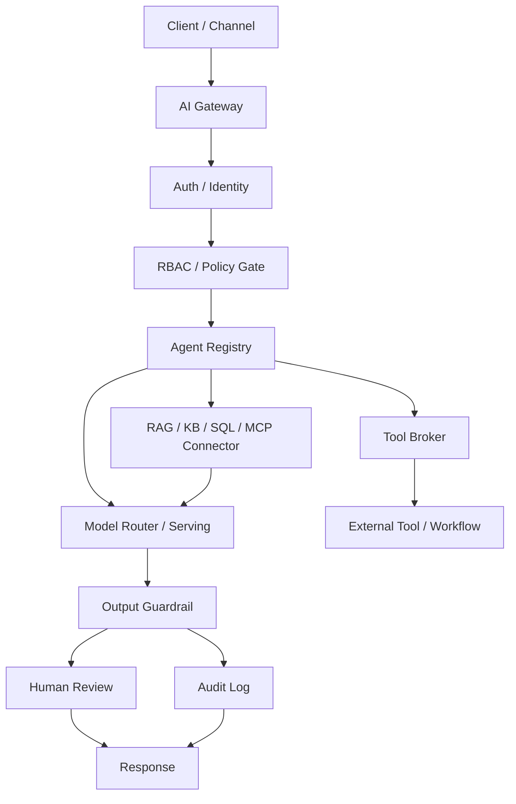

# Student Handout: AI Gateway Architecture Evidence

## 1. First Conclusion

A demo that calls an LLM API is not the same as an enterprise AI system.

A deliverable enterprise AI system must answer:

1. Who sent the request?
2. What can this user access?
3. Which agent is allowed to handle the task?
4. Which data sources can the agent retrieve?
5. Which tools can the agent call?
6. Which tool calls create side effects?
7. Which output checks run before the answer returns?
8. Which actions require human review?
9. Which audit record proves the request lifecycle later?

Day 1 is not about building a full backend. Day 1 is about producing
architecture evidence.

## 2. Read The AI Request Before The Architecture

Before drawing an AI Gateway, read one AI interaction as a system request.

```text
Client
-> HTTP request
-> backend route
-> handler
-> policy / retrieval / tool / model workflow
-> audit log
-> HTTP response
-> Client
```

### 2.1 HTTP Request And Response

An HTTP request is the client asking the server to do something. It usually has
a method, path, headers, and body:

```http
POST /ai/chat
Authorization: Bearer demo-user-token
Content-Type: application/json

{
  "message": "I cannot log in to VPN. Please find the setup steps."
}
```

In an AI Gateway, the request body is more than the user message. A real request
also carries user identity, role, requested agent, requested tools, task type,
metadata, and usually a `trace_id`.

AI Gateway commonly uses HTTP request/response because the gateway is a network
service entrypoint and control API. HTTP is the shared language of browsers,
mobile apps, backend services, Slack bots, webhooks, cloud load balancers,
enterprise network controls, security tools, and logging systems.

The gateway flow naturally matches HTTP:

```text
Client / Web App / Mobile App / Slack Bot
-> HTTP Request
-> AI Gateway
-> Policy / Agent / Tool / RAG / Model
-> HTTP Response
-> Client
```

HTTP is useful for AI Gateway design because it provides:

- a common integration boundary for many clients
- `Authorization` headers for identity and token checks
- method and route information for routing
- status codes for success, malformed input, missing login, denied access,
  rate limit, and service failure
- mature observability fields such as route, latency, status code, error, and
  `trace_id`
- compatibility with load balancers, reverse proxies, WAFs, firewalls, API
  gateways, IAM, rate limits, TLS, and service mesh tools

This does not mean every internal gateway connection must be simple
request/response HTTP. Production systems may also use HTTP streaming or SSE
for token streaming, WebSocket for realtime voice or agent sessions, gRPC for
internal service-to-service calls, queues for asynchronous work, event streams
for audit and monitoring, and database/model-server/MCP connections behind the
gateway.

The beginner mental model is:

```text
HTTP request  = one AI task entering the system
AI Gateway    = the control entrypoint that checks, authorizes, routes, and logs it
HTTP response = the result, denial reason, error, or review status returned to the client
```

An HTTP response is what the server returns. It usually has a status code,
headers, and a body:

```http
200 OK
Content-Type: application/json

{
  "answer": "Start by checking MFA, VPN client version, and account status.",
  "sources": ["vpn-guide-2026-01"],
  "ticket_status": "pending_review"
}
```

Common status codes are:

| Status | Meaning in gateway design |
|---:|---|
| 200 | Request completed or review status returned successfully |
| 400 | JSON body or schema is malformed |
| 401 | Login/session/token is missing or invalid |
| 403 | User is authenticated but lacks permission |
| 404 | Requested resource or route is not found |
| 429 | Rate limit is reached |
| 500 | Backend, model, retrieval, or tool service failed |

### 2.2 JSON Object And Schema

JSON is a common API data format. A JSON object is a key-value structure:

```json
{
  "user_id": "student_001",
  "role": "student",
  "message": "I cannot log in to VPN"
}
```

JSON can contain strings, numbers, booleans, arrays, nested objects, and `null`.
AI Gateway contracts use JSON so the system can inspect fields such as role,
task type, requested tools, risk class, policy decision, source IDs, and audit
status.

Schema is the expected shape of the JSON. For example, a ticket tool may require
`title`, `description`, and `priority`. If an agent sends only
`{"text": "open a ticket"}`, the tool broker should reject it because the
contract is incomplete.

### 2.2.1 Free Text, Selected Lists, And Hybrid Requests

Students and staff may submit requests in three common ways.

Free-text chat is natural for users:

```text
I cannot log in to VPN. Please find the setup steps. If it still fails,
help me create an IT ticket.
```

This is flexible, but unstable for policy because one sentence can contain
knowledge retrieval, ticket creation, PII, and a side-effect request.

Selected lists or forms are easier to govern:

```text
category = vpn
requested_action = create_ticket
urgency = medium
```

This is structured, but less flexible. Real users often describe issues that do
not fit cleanly into one menu option.

The strongest beginner design is hybrid:

```text
free text:
"I cannot log in to VPN. If it still fails, create a ticket."

controlled fields:
category = vpn
requested_action = create_ticket
channel = student_portal
```

Client-provided fields are useful hints, but they are not final truth. The
gateway should resolve identity, role, permission, allowed tools, agent scope,
and policy rules from trusted server-side sources such as the token, identity
provider, permission database, agent registry, and policy database.

This is not only an AI design preference. It is the normal web security model.
OWASP is not a law or government regulation; it is a widely used application
security community that publishes guidelines, verification standards, cheat
sheets, and risk lists. For gateway design, the important OWASP lesson is:
client-side checks can improve UX, but the authorization decision must be made
in trusted server-side code, at a gateway, or in a serverless function. The
default posture should be deny-by-default: if the system cannot prove that the
caller may access a resource or run a tool, it should not allow it.

NIST gives the same idea in a more formal control language. NIST SP 800-53
access-control controls describe enforcing approved authorizations and least
privilege. NIST SP 800-162 describes ABAC, where a policy decision considers:

```text
subject     = user / service / agent identity
object      = document / database row / ticket / email / tool
operation   = read / create / update / send / approve
environment = tenant / time / network / channel / risk_class
```

That maps directly to AI Gateway policy input. A student request is not only a
message; it is a subject asking to perform operations on objects under a
specific environment.

The trusted identity flow usually looks like this:

```text
1. Client sends Authorization: Bearer <token>.
2. Gateway verifies token signature and expiration.
3. Gateway checks issuer and audience.
4. Gateway reads subject/user_id from verified token claims.
5. Gateway queries identity provider or user database for role/group.
6. Gateway queries permission database or policy engine.
7. Gateway ignores client-provided role, permission, risk_class, and allowed_tools.
8. Gateway evaluates allow / deny / review_required per action.
```

OIDC ID Tokens and JWTs are common ways to carry authentication claims, but the
gateway still has to verify them before trusting their content.

Serverless API means the gateway handler can run as a function instead of a
long-running server process. "Serverless" does not mean "there is no server."
It means the cloud platform manages the server process, runtime startup,
scaling, isolation, routing, and execution environment for you.

The HTTP boundary still exists:

```text
Client
-> HTTP request
-> API Gateway / Vercel Function / Cloudflare Worker
-> gateway handler code
-> response
```

Traditional backend hosting and serverless API hosting are different ways to
run the same backend responsibility:

```text
Traditional server:
Client
-> HTTP request
-> Load Balancer / Nginx
-> long-running backend server
-> route handler
-> database / external service
-> response

Serverless API:
Client
-> HTTP request
-> API Gateway / Edge Route / Function URL
-> function invocation
-> handler code
-> database / queue / external service
-> response
```

In AWS terms, Amazon API Gateway can publish and secure HTTP, REST, and
WebSocket APIs, then route requests to services such as AWS Lambda. Lambda can
be exposed through API Gateway so the function receives an HTTP request event
and returns an HTTP response. Vercel Functions and Cloudflare Workers follow
the same teaching model: a request invokes function code managed by the
platform.

Serverless does not remove the backend or the security responsibility. The
function still has to verify tokens, resolve permissions, validate schema,
evaluate policy, broker tools, write audit logs, and return clear status.
Examples:

```text
AWS:
Student Portal -> Amazon API Gateway -> Lambda authorizer / Lambda handler
-> policy table or OPA -> model/RAG/tool -> DynamoDB or RDS audit table

Vercel:
Next.js frontend -> /api/gateway -> Vercel Function
-> Auth.js / Clerk / Auth0 session check -> Prisma/Postgres policy/audit

Cloudflare:
Browser -> Cloudflare Worker
-> JWT or Cloudflare Access check -> Workers AI / external provider
-> D1 / KV / Vectorize / external audit store
```

### 2.2.2 Serverless API Boundary

For Day 1, treat serverless API as a hosting pattern for the trusted gateway
handler.

The complete request lifecycle is:

```text
1. Client sends HTTP request.
2. DNS, TLS, CDN, or edge network receives traffic.
3. API Gateway, route handler, or function URL matches method and path.
4. Authentication checks who is calling.
5. Authorization checks whether the caller can perform the action.
6. Rate limit or quota checks protect the system and cost.
7. Request validation checks headers, query parameters, and JSON body.
8. Platform converts the HTTP request into a function event.
9. Function runtime starts or reuses an execution environment.
10. Handler runs gateway logic.
11. Handler calls database, queue, object storage, RAG, model, or tool APIs.
12. Handler returns response body, headers, and status code.
13. Platform records logs, metrics, traces, and audit events.
```

Beginner terms:

| Term | Meaning |
|---|---|
| API | Contract that lets systems communicate |
| Endpoint | Callable URL such as `/gateway/requests` |
| Route | Method and path such as `POST /gateway/requests` |
| Handler | Code that processes the request |
| Function invocation | One execution of serverless handler code |
| Runtime | Language environment such as Python, Node.js, Go, or Java |
| Cold start | Extra startup time when the platform creates a fresh execution environment |
| Warm start | Faster invocation when the platform can reuse an existing environment |
| Stateless | Handler should not rely on local memory or local files for durable state |

The most important engineering rule is:

```text
Serverless changes the hosting model.
It does not change the trust model.
```

The trusted handler must still do:

```text
verify token
resolve identity / role / permission server-side
validate request schema
normalize intent into structured actions
evaluate policy
enforce tool decisions
write audit events
protect secrets and logs
return explicit HTTP status or review state
```

Do not trust a browser payload like this:

```json
{
  "user_id": "student_001",
  "role": "admin",
  "requested_tool": "view_audit_log"
}
```

The frontend may send user intent and UI hints. The serverless handler must
derive the real identity and permissions from a verified session or token.

#### Minimal Serverless AI Gateway Shape

An AI Gateway hosted as serverless functions usually has these pieces:

```text
API layer:
- Amazon API Gateway, Vercel Route Handler, Cloudflare Worker, or Google API Gateway

Identity layer:
- Cognito, Auth0, Clerk, Auth.js, Cloudflare Access, or internal OIDC

Schema layer:
- Pydantic for Python
- Zod for TypeScript
- JSON Schema for cross-language contracts

Policy layer:
- policy table first
- OPA, Casbin, Cedar / Amazon Verified Permissions, or Cerbos later

State layer:
- DynamoDB, PostgreSQL, Supabase, Neon, D1, KV, R2, S3, or Redis

Async layer:
- SQS, Pub/Sub, Cloudflare Queues, Step Functions, Temporal, or a job table

Observability layer:
- structured logs, request_id, trace_id, metrics, audit table, OpenTelemetry
```

For a small class project, a good path is:

```text
FastAPI + Pydantic locally
-> same handler shape wrapped by Mangum for AWS Lambda
-> API Gateway HTTP API
-> DynamoDB or PostgreSQL audit table
-> optional SQS worker for long-running AI jobs
```

For a TypeScript web app:

```text
Next.js route handler
-> Vercel Function
-> Zod validation
-> Auth.js / Clerk / Auth0 session check
-> Postgres / Prisma audit table
```

For edge-oriented demos:

```text
Cloudflare Worker
-> Hono router
-> JWT or Cloudflare Access check
-> D1 / KV / R2 / Vectorize
-> Workers AI or external model provider
```

#### Synchronous And Asynchronous APIs

Not every task should finish inside one HTTP request.

Short control-plane tasks can be synchronous:

```text
POST /gateway/requests
-> validate
-> policy
-> short RAG search
-> short model call
-> response
```

Long jobs should usually be asynchronous:

```text
POST /v1/summary-jobs
-> validate request
-> create job_id
-> enqueue job
-> return 202 Accepted

worker:
-> read job from queue
-> run ASR / RAG / LLM / evaluation
-> save result

GET /v1/summary-jobs/{job_id}
-> return queued / running / completed / failed
```

This matters for AI systems because audio transcription, long document
processing, batch evaluation, and multi-step review workflows can exceed normal
HTTP timeout expectations. Queue-based design also makes retry and failure
handling easier to reason about.

#### Idempotency

Serverless and queue-based systems can retry work. A client may retry after a
timeout. A queue message may be delivered again. A worker may fail halfway.

Idempotency means:

```text
The same request can be retried without creating duplicate side effects.
```

For side-effect tools such as `create_ticket`, `send_email`, `charge_card`, or
`update_record`, use an idempotency key:

```http
POST /gateway/tool-calls
Idempotency-Key: ticket-req-0001
```

The backend stores:

```text
idempotency_key
request_hash
status: processing | completed | failed
response_body
expires_at
```

If the same key appears again, the gateway returns the previous result instead
of creating a duplicate ticket or sending a duplicate email.

#### Security And Observability

A serverless AI Gateway still needs the same security controls as a traditional
backend:

```text
Authentication: who is calling?
Authorization: may this caller do this action?
Object-level authorization: may this caller access this ticket/file/session?
Input validation: does JSON match the schema?
Output filtering: are sensitive fields removed?
Least privilege IAM: can this function access only needed resources?
Secret management: are API keys outside source code?
Rate limiting: can one user create cost or abuse spikes?
Audit logging: can we reconstruct who did what?
PII redaction: do logs avoid leaking sensitive text?
```

Observability should include:

```json
{
  "trace_id": "req-0001",
  "route": "POST /gateway/requests",
  "user_id_hash": "sha256:...",
  "role": "student",
  "status_code": 200,
  "latency_ms": 142,
  "policy_decision": "review_required",
  "tool_decisions": ["search_it_faq:allow", "create_it_ticket:review_required"],
  "retrieved_source_ids": ["vpn-guide-2026-01"],
  "audit_event_id": "audit-0001"
}
```

Do not log raw access tokens, API keys, full medical records, full customer
profiles, or unnecessary PII. Good logs make the system explainable. Bad logs
become a data leak.

#### Real-World Flow: AI Intake Summary

Suppose a clinic wants a kiosk that collects patient symptoms and prepares a
staff-review summary. The API should not be named `POST /diagnose`, because the
system is not making final clinical decisions. A better API surface is:

```text
POST /v1/intake-sessions
POST /v1/intake-sessions/{session_id}/answers
POST /v1/intake-sessions/{session_id}/summary-jobs
GET  /v1/intake-sessions/{session_id}/staff-review-summary
```

The production-style serverless flow is:

```text
1. Patient mobile app calls POST /v1/intake-sessions.
2. API Gateway invokes a function handler.
3. Handler validates schema and creates a session record.
4. Patient submits answers.
5. Handler checks session ownership and stores answers.
6. Patient or staff requests summary generation.
7. Handler enqueues a summary job and returns 202 Accepted with job_id.
8. Worker function reads the queue.
9. Worker loads allowed session fields, not the whole medical database.
10. Worker calls an LLM gateway to draft a staff-review summary.
11. Guardrail checks unsupported diagnosis or unsafe wording.
12. Worker saves the summary and audit event.
13. Staff dashboard reads the summary after authorization.
```

This design separates user-facing latency from long AI work. It also keeps the
AI output inside a staff-review workflow instead of pretending the model is a
doctor.

#### Real-World Flow: Webhook Receiver

Serverless APIs are also common for webhooks. For example, a payment, GitHub,
LINE, Slack, form, or ticketing system may call your API:

```text
External service
-> POST /v1/webhooks/ticket-system
-> verify signature
-> check idempotency
-> enqueue event
-> return 200 quickly
```

The important idea is:

```text
Webhook received does not mean business processing is complete.
Webhook received means the event was authenticated, deduplicated, stored,
and queued for processing.
```

This prevents external services from retrying because your handler was busy
calling an LLM or waiting for a slow database operation.

#### When Serverless Is A Poor Fit

Serverless API is useful for gateway entrypoints, policy checks, webhook
receivers, audit writes, short RAG calls, and job creation. It is often a poor
fit for:

```text
very long synchronous jobs
large always-warm in-memory models
GPU inference that needs model weights kept resident
heavy local filesystem state
special non-HTTP network protocols
very large dependency packages
workloads where cold start is unacceptable
downstream databases that cannot handle bursty connections
```

For enterprise AI, a mature design is usually hybrid:

```text
Serverless API = entrypoint and control plane
Queue / workflow = long-running coordination
Container / Kubernetes / managed inference endpoint = heavy compute or GPU
Database / object storage = durable state
Observability / audit = evidence and operations
```

A normalized gateway envelope should separate actor, task, actions, resources,
environment, and trace context:

```json
{
  "trace_id": "req-0001",
  "channel": "student_portal",
  "actor": {
    "user_id": "student_001",
    "role": "student",
    "permissions": ["read_public_faq", "request_ticket_creation"]
  },
  "task": {
    "raw_message": "I cannot log in to VPN. If it still fails, create a ticket.",
    "task_type": "helpdesk_question",
    "category": "vpn",
    "risk_class": "medium"
  },
  "requested_actions": [
    {
      "action_type": "retrieve_knowledge",
      "resource": "it_public_faq",
      "tool_name": "search_it_faq",
      "side_effect": false
    },
    {
      "action_type": "create_ticket",
      "resource": "ticket_system",
      "tool_name": "create_it_ticket",
      "side_effect": true
    }
  ],
  "environment": {
    "ip_range": "campus_network"
  }
}
```

The rule is:

```text
Human input may be natural language.
Gateway decisions require structured data.
The LLM may help propose intent, but it must not replace the policy engine.
```

### 2.2.3 How Free Text Becomes Actions

The gateway can use an LLM to help split free text into actions, but the LLM is
only one part of the planner. A reliable production design is usually hybrid:

```text
raw text
-> input validation / PII or prompt-injection checks
-> intent classification
-> slot extraction
-> action proposal
-> canonical action mapping
-> schema validation
-> policy evaluation
-> tool broker enforcement
-> audit log
```

There are five common approaches:

| Method | Good fit | Weakness |
|---|---|---|
| UI controlled fields | stable internal workflows | less flexible for users |
| rule-based parser | phrases such as "open ticket" or "send email" | brittle for varied language |
| traditional classifier | repeated categories such as IT, billing, HR | needs labeled examples |
| LLM structured output | flexible action extraction and slot filling | must be validated and policy-checked |
| workflow planner / graph | multi-step processes and human review | more state and failure handling |

Example:

```text
User:
I cannot log in to VPN. If it still fails, create an IT ticket.
```

Action proposal:

```json
{
  "task_type": "helpdesk_question",
  "category": "vpn",
  "actions": [
    {
      "action_type": "retrieve_knowledge",
      "tool_name": "search_it_faq",
      "resource": "public_it_faq",
      "side_effect": false
    },
    {
      "action_type": "create_ticket",
      "tool_name": "create_it_ticket",
      "resource": "ticket_system",
      "side_effect": true
    }
  ]
}
```

The LLM may generate this JSON through structured output or tool-calling
schemas. The gateway must still validate that the JSON matches the schema,
map tool names to a known tool registry, classify side effects, run policy, and
write audit evidence. Prompt injection is one reason for this separation:
malicious input or retrieved documents can try to make the model bypass safety
controls or trigger unauthorized tools.

### 2.3 Route, Handler, And Log

A backend route maps a method and URL path to a server function:

```text
POST /gateway/requests
GET /gateway/audit/:trace_id
POST /gateway/tool-calls
```

The handler is the code behind the route. A gateway handler usually creates a
trace ID, authenticates the user, checks policy, selects an agent, filters
retrieval, brokers tool calls, checks guardrails, writes audit evidence, and
returns a response.

A log is lifecycle evidence. A useful AI Gateway audit log records fields such
as `trace_id`, `user_id`, `role`, `agent_id`, `policy_decision`,
`requested_tools`, `allowed_tools`, `denied_tools`, `retrieved_source_ids`,
`model_version`, `guardrail_result`, `human_review_status`, and outcome.

### 2.4 Login, Role, Permission

Login answers: "Who are you?" This is authentication.

Authorization answers: "Can you do this action on this resource?"

User identity is the specific person, account, or service making the request.
Role is the category or responsibility assigned to that identity. Permission is
the concrete allowed action.

```json
{
  "user_id": "student_001",
  "email": "student001@example.edu",
  "role": "student"
}
```

Here, `user_id` and `email` identify who is making the request. `role` tells the
gateway what kind of user this identity is.

```text
Identity answers: Who is making this request?
Role answers: What kind of user is this person?
Permission answers: What concrete action can this user perform?
```

Role is a coarse access category such as `student`, `staff`, `admin`, or
`compliance_officer`. Permission is the concrete allowed action, such as
`read_public_faq`, `read_staff_sop`, `create_ticket`, `query_database`, or
`view_audit_log`.

Example:

```text
Jason logs in.
System confirms identity: Jason, user_id = jason_001.

Then the system checks role:
role = student.

Because role = student:
- can read public IT FAQ
- can request ticket creation
- cannot read staff-only SOP
- cannot approve admin actions
```

Enterprise AI policy decisions usually need three outcomes:

```text
allow
deny
review_required
```

This matters because a logged-in student may be allowed to read public VPN FAQ
documents, denied from staff-only SOPs, and routed to review when a ticket
submission would create an external side effect.

The decision pipeline is:

```text
1. Authenticate.
2. Resolve identity, role, and permission server-side.
3. Validate request schema.
4. Normalize user intent into actions, resources, and tools.
5. Classify task and risk.
6. Resolve allowed resources and tools.
7. Evaluate policy.
8. Return allow, deny, or review_required.
9. Execute allowed actions.
10. Queue review_required actions.
11. Write audit log.
```

A practical access-control SOP for a new AI Gateway feature is:

```text
Before launch:
1. List roles: student, staff, admin, reviewer.
2. List data sources and mark access_level, owner, tenant, and document version.
3. List tools and mark read-only or side-effect.
4. Define required input schema for each tool.
5. Define policy table or policy-as-code rules.
6. Define audit fields and retention boundary.
7. Write authorization tests for allow, deny, and review_required.

At runtime:
1. Verify token and resolve identity server-side.
2. Ignore client-provided role, permission, risk_class, and allowed_tools.
3. Normalize requested actions.
4. Evaluate policy per action.
5. Execute allowed actions, block denied actions, queue review_required actions.
6. Write audit event with trace_id, policy_id, source IDs, and tool decisions.

After launch:
1. Review permissions regularly to avoid privilege creep.
2. Version policy changes.
3. Reconstruct incidents from trace_id and audit events.
4. Add regression tests for any authorization bug found in production.
```

Typical decision rules:

| Decision | When it fits | Example |
|---|---|---|
| allow | authenticated user, sufficient permission, allowed data/tool, valid schema, low risk | student searches public VPN FAQ |
| deny | missing login, insufficient role, forbidden resource/tool, attempted privilege bypass | student asks for staff-only SOP |
| review_required | side effect, external communication, sensitive output, high-risk task, low confidence, human approval needed | student requests ticket creation |

Review is not a failure. It is a normal control point for high-risk automation.

The common mistake is thinking "logged in" means "allowed." It does not. A user
can be correctly identified and still be blocked:

```text
Identity check:
Yes, this is student_001.

Permission check:
student_001 has role=student, so staff-only documents are not allowed.

Decision:
deny
```

In enterprise AI systems, audit logs usually record both identity and role:

```json
{
  "trace_id": "req-0001",
  "user_id": "student_001",
  "role": "student",
  "requested_tool": "create_ticket",
  "policy_decision": "review_required"
}
```

For gateway design:

```text
identity tells us who to audit
role helps decide policy
permission decides whether an action is allowed, denied, or sent to review_required
```

Automation should be a state machine, not a model-only judgment:

```text
received
-> authenticated
-> schema_validated
-> intent_normalized
-> policy_checked
-> retrieval_allowed
-> tool_proposed
-> tool_decision_made
-> model_generated
-> guardrail_checked
-> completed / denied / pending_review
-> audit_written
```

The division of labor is:

```text
LLM proposes action.
Gateway validates action.
Policy engine decides allow / deny / review_required.
Tool broker enforces the decision.
Audit log records the evidence.
```

### 2.5 LLM, RAG, API, And Database

An LLM generates or transforms language. It is an inference component, not a
governance layer.

RAG retrieves relevant documents before generation. In an enterprise system,
retrieval must filter by permission and metadata before the model sees context:

```text
correct: role/permission filter -> allowed documents -> model context
weak: all matching documents -> model context -> prompt says "do not leak"
```

An API is a contract between systems. Tool calling is usually a controlled API
action, so the gateway must check tool existence, input schema, permission,
timeout, side effects, approval need, and audit logging.

A database stores evidence and operating state: users, roles, permissions,
documents, chunks, metadata, policies, audit events, review items, chat history,
and evaluation results. If the system must be governed later, the evidence must
be saved somewhere inspectable.

## 3. AI System Formula

```text
AI system
= model
+ data
+ infrastructure
+ workflow
+ governance
+ security
+ evaluation
+ delivery
```

| Part | Beginner explanation | Engineering evidence |
|---|---|---|
| model | The model that generates or classifies | endpoint, version, config |
| data | Documents, databases, KBs, audio, images | source IDs, metadata, access level |
| infrastructure | Runtime environment | Docker, K8s, VM, GPU, network |
| workflow | How a request becomes an outcome | lifecycle, approval flow |
| governance | Who can do what | RBAC, policy gate, registries |
| security | How the system protects boundaries | auth, masking, guardrails, audit |
| evaluation | How quality and safety are checked | tests, red-team cases, acceptance criteria |
| delivery | How the system is handed off | docs, runbook, review packet |

## 4. Why AI Gateway Exists

The simplest chatbot architecture is:

```text
User -> Web App -> LLM API -> Response
```

This is enough for a demo, but it does not answer enterprise questions:

- Can a student read staff-only documents?
- Can an agent submit a ticket without approval?
- Which source IDs supported the answer?
- Which policy decision allowed or blocked the request?
- Can an operator reconstruct the lifecycle later?

An AI Gateway is the control plane for AI requests:

```text
Client / Channel
-> AI Gateway
-> Auth / Identity
-> RBAC / Policy Gate
-> Agent Registry
-> Tool Broker
-> RAG / KB / SQL / MCP Connector
-> Model Router / Serving
-> Guardrail
-> Audit Log
-> Human Review when required
-> Response
```

Real systems often combine several gateway types:

| Gateway type | Examples | Primary job |
|---|---|---|
| API Gateway | AWS API Gateway, Kong Gateway, Apigee, NGINX, Envoy, Azure API Management | HTTP routing, authentication integration, rate limits, API logs |
| AI / LLM Gateway | Cloudflare AI Gateway, LiteLLM, Portkey, Kong AI Gateway | model routing, retries, fallbacks, caching, token/cost tracking |
| Tool Gateway / Broker | MCP gateway, internal tool broker, function-calling proxy | schema validation, side-effect control, approval workflow |
| Policy Gateway / PDP | OPA, Casbin, Cedar / Amazon Verified Permissions, Cerbos | allow / deny / review_required decisions from structured input |

The hardest practical pain points are making these controls work together:

| Pain point | Why it is hard | Practical control |
|---|---|---|
| Free text is ambiguous | one sentence may contain retrieval, side effect, and restricted data requests | hybrid UI hints + structured output + schema validation |
| RAG permissions drift | source systems, shares, tenants, and document versions change | metadata filtering before retrieval + source permission re-check |
| Side-effect tools are risky | agents can create tickets, send email, update records, or delete data | tool registry + tool broker + idempotency key + human review |
| Policy drift | roles and exceptions grow over time | policy-as-code, versioning, authorization tests, periodic access review |
| Audit gaps | teams log only prompt and answer | trace_id, source IDs, tool decisions, policy ID, guardrail result |
| Cost and latency | every extra check and model call adds delay and spend | risk-tiered automation, caching, fallbacks, smaller classifiers |
| UX friction | users dislike repeated approvals | allow low-risk actions, review only side effects/high-risk outputs |

The mature direction is layered control, not one magic gateway:

```text
API Gateway for HTTP traffic.
AI Gateway for model routing and observability.
Policy Engine for authorization decisions.
Tool Broker for action enforcement.
RAG Connector for source boundaries.
Guardrails for input/output/tool checks.
Human Review for high-risk decisions.
Audit / Observability for evidence.
Evaluation / red-team tests for regression control.
```

## 5. Core Terms

| Term | Beginner definition | Engineering meaning |
|---|---|---|
| AI Gateway | Unified AI request entrypoint | Controls routing, policy, tools, data, audit, guardrails |
| API Gateway | General HTTP/API traffic boundary | Handles routing, auth integration, rate limits, logs |
| AI / LLM Gateway | Model-provider control layer | Handles model routing, caching, fallback, spend, observability |
| Tool Gateway / Broker | Agent action enforcement point | Validates schema, side effects, approval, audit |
| Policy Gateway / Engine | Authorization decision point | Evaluates structured input against policy rules |
| Serverless API | HTTP API whose handler is hosted as a managed function | Changes hosting, not backend responsibility; still needs auth, policy, validation, state, idempotency, logs, and audit |
| Auth / Identity | Verifies the caller | Produces trusted user context |
| User Identity | Specific person, account, or service | Determines who is audited |
| Role | Access category assigned to an identity | Helps policy decide user scope |
| Permission | Concrete action the identity can perform | Allows, denies, or routes an action to review_required |
| RBAC | Role-Based Access Control | Uses role to decide permissions |
| Policy Gate | Allows, denies, or routes to review_required | Enforces system rules outside the prompt |
| Agent Registry | Records available agents | Stores owner, scope, tools, data sources, risk class |
| Tool Broker | Mediates tool calls | Checks schema, timeout, permission, side effects, audit |
| RAG Connector | Retrieves allowed data | Filters by metadata and access level before model context |
| Model Router | Selects model endpoint | Manages model choice, version, latency, cost |
| Guardrail | Checks input/output risk | Detects PII, unsafe output, unsupported claims |
| Audit Log | Request lifecycle evidence | Records user, agent, policy, sources, tools, outcome |
| Human Review | Workflow node for high-risk cases | Creates pending/approve/reject states |
| API Contract | Agreed input/output shape between systems | Method, path, JSON schema, status, errors |
| Authentication | Verifies who the caller is | Token, session, OAuth, SSO, or service identity |
| Authorization | Checks whether the caller may do the action | Role, permission, policy, resource scope |
| Database | Stores durable operating data and evidence | Identity, policy, metadata, audit, evaluation records |

## 6. Main Scenario: Campus IT Helpdesk Assistant

Public-safe scenario:

```text
A student asks:
"I cannot log in to VPN. Please find the setup steps. If it still fails,
help me create an IT ticket."
```

Important design facts:

- `search_it_faq` is read-only.
- `create_it_ticket` is a side-effect tool.
- Student role can read public IT FAQ documents.
- Staff-only SOPs must be filtered before retrieval.
- Ticket submission should require review, rate limit, or explicit workflow
  control.
- The audit event should record trace ID, user role, agent ID, source IDs, tool
  decisions, guardrail result, review state, and outcome.

## 7. Minimum Architecture Diagram



## 8. Request Lifecycle Template

Write a lifecycle with 10-15 steps. A good lifecycle includes:

```text
1. Client sends POST /gateway/requests with a JSON body.
2. Gateway route receives the request and calls the handler.
3. Handler creates trace_id.
4. Gateway authenticates caller.
5. Gateway resolves trusted identity, role, permissions, and agent scope.
6. Gateway validates schema and normalizes free text/form hints into actions.
7. Gateway classifies task risk and evaluates policy.
8. Gateway selects an agent from registry.
9. Connector filters data by permission and metadata.
10. RAG returns allowed source IDs and active document versions.
11. Model generates response from allowed context.
12. Tool broker validates schema, permission, timeout, and side effects.
13. Review-required actions enter human review; denied actions are not executed.
14. Audit log records trace, policy, sources, tools, guardrail, review, outcome.
15. Server returns HTTP status plus JSON response or review status.
```

## 9. Risk-Control Map Template

| Risk | Example | System control | Evidence |
|---|---|---|---|
| Prompt injection | Malicious document asks model to ignore policy | Retrieval filter, instruction hierarchy, output guardrail | red-team test log |
| PII leakage | Phone or ID appears in output/log | PII detector, masking, log minimization | masked audit event |
| Tool abuse | Agent submits ticket automatically | Tool broker, schema validation, approval gate | tool decision log |
| Permission bypass | Student reads staff-only SOP | RBAC, metadata filtering before retrieval | policy decision log |
| Action extraction error | Free text is mapped to the wrong tool | schema validation, confidence threshold, review queue | normalized action record |
| RAG ACL drift | Permission changes in source system are not reflected in vector index | metadata sync, pre-retrieval filter, source re-check | source permission check log |
| Policy drift | roles gain exceptions over time | policy versioning, access review, authorization tests | policy test report |
| Cost / latency blowup | every request calls many models/tools | rate limits, caching, risk-tiered routing | gateway metrics |
| Missing audit trail | No source/tool/policy record | trace_id, source IDs, audit schema | complete audit event |

## 10. Key Rules To Remember

```text
Prompt is not a permission boundary.
Model output is not an audit trail.
Tool calling is not safe without a broker.
RAG is not safe without data and metadata boundaries.
Human review is a workflow node, not a final disclaimer.
```

## 11. Day 1 Submission

Submit one packet with:

1. Architecture diagram.
2. Component responsibility table.
3. Request lifecycle.
4. Risk-control map.
5. One paragraph explaining why prompt-only governance is insufficient.
