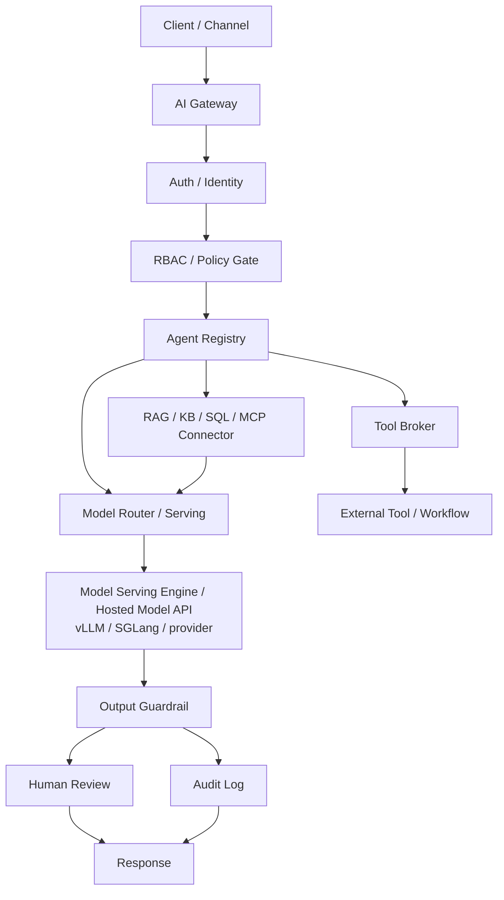

# Worksheet: Day 1 AI Gateway Architecture Evidence

Use this worksheet during class. Do not start from a blank page.

## 1. Request Contract And Scenario Selection

First read the request as a backend contract:

```http
POST /gateway/requests
Authorization: Bearer demo-user-token
Content-Type: application/json

{
  "session_token": "demo-user-token",
  "channel": "student_portal",
  "raw_message": "I cannot log in to VPN. If it still fails, create an IT ticket.",
  "client_hints": {
    "category": "vpn",
    "requested_actions": ["search_faq", "create_ticket"],
    "urgency": "medium"
  },
  "requested_agent": "campus_it_helpdesk_agent"
}
```

Fill this before drawing the architecture:

```text
HTTP method:
Route path:
Authentication signal:
Input mode: free text / selected list / form / hybrid
Raw message:
Controlled fields or client hints:
Which client-provided fields are only hints:
Which fields must be resolved server-side:
Requested agent:
Read-only tool:
Side-effect tool:
Why HTTP is a good boundary for this request:
Possible 401 cause:
Possible 403 cause:
Possible review_required cause:
Audit fields needed later:
```

Normalize the request into structured policy input:

```json
{
  "trace_id": "",
  "channel": "",
  "actor": {
    "user_id": "",
    "role": "",
    "permissions": []
  },
  "task": {
    "raw_message": "",
    "task_type": "",
    "category": "",
    "risk_class": ""
  },
  "requested_actions": [
    {
      "action_type": "",
      "resource": "",
      "tool_name": "",
      "side_effect": false
    }
  ],
  "environment": {
    "ip_range": "",
    "time": ""
  }
}
```

Choose one public-safe scenario:

```text
Scenario name:
Primary user:
Primary task:
High-risk action:
Main data sources:
Expected response:
```

Suggested scenarios:

- Campus IT Helpdesk Assistant.
- Bank Internal Knowledge Assistant.
- Medical Intake Support.
- Manufacturing Audio Monitoring.

## 2. Boundary Worksheet

```text
User boundary:
Agent boundary:
Tool boundary:
Data boundary:
Model boundary:
Model serving boundary:
Human review boundary:
```

## 3. Data Source Worksheet

| Data source | Example content | Access level | Metadata needed | Risk |
|---|---|---|---|---|
|  |  |  |  |  |
|  |  |  |  |  |
|  |  |  |  |  |

Metadata examples: `source_id`, `access_level`, `owner`,
`document_version`, `last_updated`, `status`.

## 4. Tool Worksheet

| Tool | Read-only or side-effect | Input schema | Policy needed | Audit fields |
|---|---|---|---|---|
|  |  |  |  |  |
|  |  |  |  |  |

## 5. Policy Worksheet

Write one example for each policy decision:

```text
allow:
deny:
review_required:
specific identity:
role involved:
permission involved:
resource or tool involved:
action type:
risk class:
policy rule or table row:
allowed actions:
denied actions:
review actions:
why login is not enough:
status code or review status:
policy evidence to log:
```

Map the access-control design to a standard or guideline:

```text
OWASP idea used:
NIST / ABAC idea used:
Which fields are subject attributes:
Which fields are object/resource attributes:
Which fields are action/operation attributes:
Which fields are environment attributes:
Where deny-by-default happens:
Where server-side authorization happens:
```

Use this decision pipeline:

```text
1. Authenticate.
2. Resolve identity, role, and permission server-side.
3. Validate request schema.
4. Normalize intent into action/resource/tool fields.
5. Classify task and risk.
6. Resolve resources and tools.
7. Evaluate policy.
8. Return allow, deny, or review_required.
9. Execute allowed actions.
10. Queue review_required actions.
11. Write audit log.
```

## 6. Action Extraction Worksheet

Describe how the gateway turns free text into actions:

```text
Raw user text:
Controlled UI hints:
Action extraction method: UI fields / rules / classifier / LLM structured output / workflow planner
Why this method fits:
Fallback if intent is ambiguous:
Confidence or validation check:
Schema used for action output:
Known tool registry entries:
Side-effect actions:
Actions requiring review_required:
```

Fill one normalized action plan:

| Action | Resource | Tool | Read-only or side-effect | Extraction evidence | Decision |
|---|---|---|---|---|---|
|  |  |  |  |  |  |
|  |  |  |  |  |  |

## 7. Serverless API Boundary Worksheet

If this gateway were hosted as a serverless API, fill in:

```text
Platform: AWS Lambda / Vercel Function / Cloudflare Worker / other
Hosting model: cloud serverless / cloud hosting / local emulator / self-hosted serverless-like platform / plain localhost backend
HTTP route:
Where token validation runs:
Where permission lookup runs:
Where schema validation runs:
Where durable state is stored:
Which work is synchronous:
Which work should become async job / queue / workflow:
Queue or workflow tool if needed:
Idempotency key needed for which side-effect action:
Where audit log is written:
What must not be trusted from the browser:
Which secrets must not appear in code or logs:
Which log fields are safe to record:
Which PII fields must be redacted:
If localhost is used, what platform or emulator provides function invocation:
Which gateway components should stay on containers/Kubernetes/cloud hosting:
Which gateway components can be serverless edge functions:
One operational risk: cold start / timeout / duplicate retry / secret handling / log privacy / vendor limit
```

## 8. Audit Event Worksheet

List the minimum fields needed to reconstruct the request lifecycle:

```text
trace_id:
user_id:
email or service identity:
role:
route:
agent_id:
policy_decision:
requested_tools:
allowed_tools:
denied_tools:
retrieved_source_ids:
model_version:
guardrail_result:
human_review_status:
outcome:
```

## 9. Automation State Worksheet

Represent the gateway as a state machine:

```text
received:
authenticated:
schema_validated:
intent_normalized:
policy_checked:
retrieval_allowed:
tool_proposed:
tool_decision_made:
model_generated:
guardrail_checked:
completed / denied / pending_review:
audit_written:
```

## 10. Architecture Diagram

Fill in a diagram that includes:

- client/channel
- AI Gateway
- auth/identity
- RBAC/policy gate
- agent registry
- tool broker
- RAG/KB/SQL/MCP connector
- model router/serving
- model serving engine or hosted model API
- guardrail
- audit log
- human review
- response



## 11. Component Responsibility Table

| Component | Responsibility | Input | Output | Failure if missing |
|---|---|---|---|---|
| API Gateway / Serverless API |  |  |  |  |
| Auth / Identity |  |  |  |  |
| RBAC / Policy Gate |  |  |  |  |
| Intent Normalizer |  |  |  |  |
| Risk Classifier |  |  |  |  |
| Agent Registry |  |  |  |  |
| Tool Broker |  |  |  |  |
| RAG / MCP Connector |  |  |  |  |
| Model Router / Serving |  |  |  |  |
| Model Serving Engine / Hosted Model API |  |  |  |  |
| Guardrail |  |  |  |  |
| Audit Log |  |  |  |  |
| Human Review |  |  |  |  |

## 12. Request Lifecycle

Write 10-15 steps:

```text
1.
2.
3.
4.
5.
6.
7.
8.
9.
10.
11.
12.
13.
14.
15.
```

Your lifecycle must include HTTP method/path, JSON body, `trace_id`, identity,
schema validation, intent normalization, risk classification, policy decision,
agent selection, data filtering before model context, tool broker decision,
guardrail result, human-review state, audit event, and final HTTP response
status.

## 13. Gateway Type And Pain Point Map

Fill at least three gateway types:

| Gateway type | Example product/framework | What it controls | What it does not control |
|---|---|---|---|
| API Gateway |  |  |  |
| AI / LLM Gateway |  |  |  |
| Model Serving Engine |  |  |  |
| Tool Gateway / Broker |  |  |  |
| Policy Gateway / Engine |  |  |  |

Fill at least five practical pain points:

| Pain point | Who feels it | Why it hurts | Control layer | Evidence |
|---|---|---|---|---|
| Free-text ambiguity |  |  |  |  |
| RAG permission drift |  |  |  |  |
| Side-effect tool risk |  |  |  |  |
| Policy drift / privilege creep |  |  |  |  |
| Audit gap |  |  |  |  |
| Serverless timeout / retry |  |  |  |  |
| Serving engine overload or OOM |  |  |  |  |
| Serving engine mistaken for gateway |  |  |  |  |
| Cost / latency |  |  |  |  |
| UX friction from review |  |  |  |  |

## 14. Risk-Control Map

| Risk | Example | System control | Evidence |
|---|---|---|---|
| Free-text ambiguity |  |  |  |
| Client hint tampering |  |  |  |
| Prompt injection |  |  |  |
| PII leakage |  |  |  |
| Tool abuse |  |  |  |
| Permission bypass |  |  |  |
| RAG ACL drift |  |  |  |
| Policy drift |  |  |  |
| Duplicate side effect from retry |  |  |  |
| Model serving overload |  |  |  |
| Model endpoint exposed without gateway controls |  |  |  |
| Cost / latency blowup |  |  |  |
| Missing audit trail |  |  |  |

## 15. Short Explanation

Answer in 5-8 sentences:

```text
Why is prompt-only governance insufficient for this scenario?
```

## 16. Peer Review Checklist

- [ ] Request contract identifies method, route, JSON body, status, and user context.
- [ ] Free text, selected fields, or hybrid inputs are normalized into structured actions/resources.
- [ ] Client-provided role, permission, risk, and tool scope are not trusted as final truth.
- [ ] The design maps authorization to server-side / gateway / serverless enforcement.
- [ ] The design names at least one OWASP or NIST access-control principle.
- [ ] Action extraction method is explicit: UI fields, rules, classifier, LLM structured output, or workflow planner.
- [ ] Serverless API notes explain that function hosting still requires auth, authorization, validation, durable state, idempotency, logs, and audit.
- [ ] Serverless is distinguished from cloud hosting and from a plain local backend server.
- [ ] Enterprise hosting choice is workload-driven, not trend-driven.
- [ ] The design uses hybrid architecture when appropriate.
- [ ] Long-running AI work is separated from short synchronous request handling.
- [ ] vLLM/SGLang or any hosted model endpoint is placed behind the backend/gateway boundary.
- [ ] Model serving is described as inference data plane, not as the policy/audit control plane.
- [ ] Model-serving metrics include at least two of: TTFT, TPOT, queue length, cache hit rate, GPU memory, failed requests, or JSON validity.
- [ ] Side-effect actions have duplicate-prevention or idempotency behavior.
- [ ] Identity, role, and permission are separated.
- [ ] The design explains why a logged-in user may still be denied.
- [ ] Policy examples include allow, deny, and review_required.
- [ ] Review-required actions enter a queue or workflow state.
- [ ] Diagram has identity, policy, tool, data, model, guardrail, audit, review.
- [ ] RAG filtering happens before model context construction.
- [ ] Side-effect tools go through a broker and review path.
- [ ] Gateway type comparison separates API gateway, AI/LLM gateway, tool broker, and policy engine.
- [ ] Pain-point map includes at least five realistic engineering or user pain points.
- [ ] Audit log records source IDs, tool decisions, policy decisions, outcome.
- [ ] Human review is a workflow node with state, not a disclaimer.
- [ ] Scenario is public-safe.
