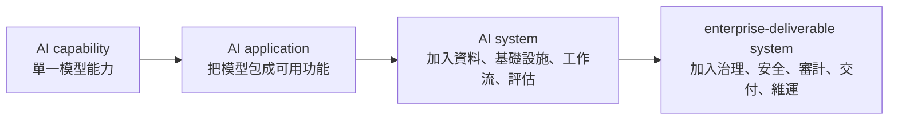
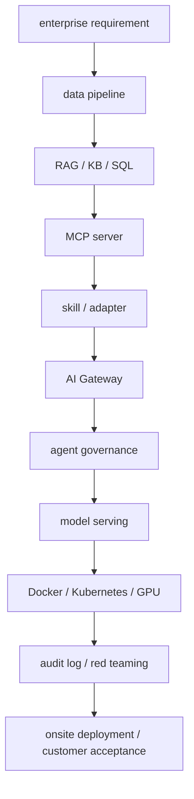

# What Is AI Systems Engineering?

## 1. Why This Chapter Exists

AI Systems Engineering 是把 AI capability 變成可部署、可治理、可評估、可維護、可交付系統的工程 discipline。它不是只問「模型能不能回答」，而是問：

> 這個 AI 需求能不能在客戶環境中安全、穩定、可追蹤、可維護地運作？

對大二資訊工程學生來說，這個差別很重要。你可能已經用過 ChatGPT、Ollama、Whisper、RAG 範例、LangChain、OpenAI API 或各種 chatbot demo。這些 demo 會讓人覺得「只要 model 夠強，AI 系統就完成了」。但在 enterprise AI 裡，模型只是一個元件。真正要交付的是一套能放進公司資料、公司權限、公司網路、公司維運、公司安全審查與客戶驗收流程中的系統。

NIST AI Risk Management Framework 將 AI products、services、systems 放進設計、開發、使用與評估的生命週期中管理。OWASP LLM Top 10 將 prompt injection、sensitive information disclosure、improper output handling、excessive agency 等列為 LLM application risk。Microsoft AI Red Teaming 也把 red teaming 視為 AI 系統上線前後發現風險的重要方法。這些公開來源共同指出一件事：AI engineering 不是只有「模型回答品質」，還包含資料、基礎設施、權限、安全、評估、交付與維運。

本章建立全書的核心公式：

```text
AI system
= model
+ data
+ infrastructure
+ workflow
+ governance
+ security
+ evaluation
+ delivery
```

這個公式是工程推論，不是某個標準文件的原句。它的價值在於幫你建立系統視角：看到一個 AI 需求時，不只問「用哪個模型」，而是能問完整工程問題。

## 2. Mental Model

先把 AI 分成四層：



**AI capability** 是模型本身的能力。例如 LLM 會生成文字、embedding model 會把文字轉成向量、Whisper 會做 ASR、TTS model 會產生語音、reranker 會重排搜尋結果。這一層常看 benchmark、WER、latency、throughput、context window、token cost。

**AI application** 是把模型能力包成可用功能。例如聊天機器人、文件問答、客服摘要、語音助理、程式碼助手。這一層開始有 prompt、UI、API、session state、基本錯誤處理、tool call。

**AI system** 是把 application 放進真實資料與真實工作流。這一層會加入 RAG pipeline、MCP server、tool integration、AI Gateway、evaluation、monitoring、audit log、fallback path、human review。

**Enterprise-deliverable system** 是能在客戶或組織環境中交付的系統。它要能 containerize、部署到 on-prem 或 private cloud、處理 GPU/VRAM、通過安全審查、留下 audit trail、支援 rollback、完成 customer acceptance。

enterprise AI flow 可以這樣看：



這張圖的重點是：企業需求不會直接變成模型呼叫。它會經過資料管線、知識庫、工具介面、治理層、模型 serving、部署環境、安全測試與驗收流程。AI Systems Engineering 就是在設計、實作、驗證這整條鏈。

## 3. Core Terms

| Term | Beginner definition | Enterprise meaning |
|---|---|---|
| AI model | 做推論的模型元件 | 能力來源，但不是完整系統 |
| AI application | 把模型包成一個功能 | demo 或產品功能雛形 |
| AI system | 模型加上資料、流程、基礎設施、監控與評估 | 可以放進真實工作流運作的系統 |
| Enterprise-deliverable system | 可在客戶環境部署與驗收的 AI system | 具備治理、安全、審計、維運、交付責任 |
| RAG | Retrieval-Augmented Generation | 一條 data pipeline，不只是 vector search |
| MCP server | Model Context Protocol server | 把 data sources、tools、workflows 以標準接口暴露給 AI application |
| Skill / adapter | 封裝任務能力或系統轉接邏輯 | 把 shared data/tool 轉成特定 workflow 可用能力 |
| AI Gateway | AI 流量、模型、工具、政策與審計的控制層 | agent governance 的集中控制面 |
| Permission boundary | 明確限制誰、哪個 agent、哪個 tool 可存取什麼 | 安全與治理的基本單位 |
| Approval gate | 高風險動作前要求 human review 或授權 | 防止 agent 自動執行高風險操作 |
| Audit log | 可追蹤 user、agent、tool、source、policy、time 的紀錄 | 事後調查、合規、維運與責任歸屬基礎 |
| Red teaming | 用對抗情境測試系統風險 | 發現 prompt injection、data leakage、tool abuse、misuse path |

這些名詞不要背成單字表。你要把它們放回同一條 request lifecycle：使用者輸入進來，系統檢查權限，檢索資料，呼叫工具，送給模型，產生輸出，做安全檢查，留下紀錄，回傳結果。

## 4. Mechanism

把核心公式拆開：

```text
AI system
= model
+ data
+ infrastructure
+ workflow
+ governance
+ security
+ evaluation
+ delivery
```

### Model

Model layer 處理 weights、tokenizer、context window、decoding、quantization、KV cache、serving runtime、model version。模型選擇不是只看「最強」，而是看任務適合度、延遲、成本、可部署性、資料邊界、輸出穩定性。

例子：客服摘要不一定需要最強 reasoning model，但可能需要穩定 JSON、低延遲、便宜、可在內網部署。

### Data

Data layer 處理 ingestion、OCR、parsing、chunking、metadata、embedding、retrieval、reranking、context construction、citation、freshness。RAG 的品質常常取決於資料管線，而不是 prompt 魔法。

例子：HR 問答如果沒有文件版本 metadata，系統可能回答舊版請假規則。

### Infrastructure

Infrastructure layer 處理 Docker、Kubernetes、GPU、networking、ports、DNS、TLS、storage、secrets、logs、metrics、traces。企業 AI 一定要能在目標環境運作，而不是只在工程師電腦上跑。

例子：模型 API 本機可用，但客戶機房 firewall 擋住 port，deployment 仍然失敗。

### Workflow

Workflow layer 處理多步驟任務：檢索、判斷、tool call、approval、fallback、human review。Agent 一旦能呼叫工具，它就不只是文字生成器，而是能影響外部系統的執行者。

例子：採購 agent 可以查詢價格，但建立採購單必須通過 approval gate。

### Governance

Governance layer 處理 model registry、tool registry、agent registry、policy gate、quota、ownership、audit log、versioning。企業要知道誰能用什麼、何時用、用在哪裡、做了什麼。

例子：多個部門共用 MCP servers 時，必須有 tool inventory 和 permission boundary。

### Security

Security layer 處理 prompt injection、PII、data leakage、tool abuse、improper output handling、excessive agency、vector store poisoning。安全控制不能只寫在 system prompt 裡；權限和政策要在系統外部執行。

例子：RAG 讀到惡意文件，文件要求 agent 忽略規則並匯出資料。真正的防線應該是 tool permission 與 approval gate。

### Evaluation

Evaluation layer 處理 answer quality、retrieval quality、citation correctness、groundedness、policy compliance、latency、cost、safety、regression。AI eval 要評整個 pipeline，不只評模型。

例子：回答看似正確，但 citation 指到不存在文件，這仍然是系統失敗。

### Delivery

Delivery layer 處理 packaging、deployment target、customer acceptance、handover、runbook、rollback、incident response、knowledge refresh、model upgrade。真正的企業交付不是「我 demo 給你看」，而是「你能在自己的環境中安全維運」。

例子：模型升級後回答品質變差，如果沒有 eval baseline 和 rollback path，維運就不可控。

## 5. System Context

一個 enterprise AI requirement 常常長這樣：

> 我們想做一個企業內部 AI assistant，可以回答 SOP、查詢 SQL、產生報告，最好可以在內網部署，並且留下紀錄。

初學者可能直接想：「接一個 LLM API，加一個 prompt，再接 vector database。」AI Systems Engineer 會把它拆成更完整的問題：

| 面向 | 第一輪要問的問題 |
|---|---|
| Model | hosted API 還是 local model？需要多長 context？延遲與成本上限？ |
| Data | SOP 在哪裡？PDF 是否可解析？SQL 權限如何切？文件多久更新？ |
| Infrastructure | 部署在 on-prem、private cloud 還是 public cloud？GPU 有幾張？port、TLS、DNS 如何配置？ |
| Workflow | 使用者只是查詢，還是 agent 可以建立 ticket、寄信、修改資料？ |
| Governance | 哪些 agent/tools 被註冊？誰是 owner？哪些操作需要 approval gate？ |
| Security | 有 PII 嗎？prompt injection 如何測？tool abuse 如何防？log 能否遮罩敏感資訊？ |
| Evaluation | 如何判定答案正確？citation 是否可驗？latency SLO 是多少？ |
| Delivery | 如何安裝、驗收、升級、rollback、交接維運？ |

這就是系統邊界。AI Systems Engineering 不只是把模型接起來，而是讓這些面向一起成立。

## 6. Engineering Workflow

一個務實的 enterprise AI workflow 可以分成十步：

1. **Requirement framing**：把需求改寫成使用者 workflow、資料來源、成功指標、風險範圍。
2. **Source and data survey**：盤點 PDF、SQL、KB、API、音訊、log、PII、資料更新頻率。
3. **System boundary design**：定義 model、data、infra、workflow、gateway、security、eval、delivery 的責任。
4. **Minimal PoC**：先做最小可驗證版本，例如 local model + 小型 KB + citation + basic logs。
5. **Evaluation baseline**：建立 golden set、retrieval eval、answer eval、latency measurement、security test cases。
6. **Governed workflow design**：加入 MCP/tool boundaries、skills/adapters、approval gates、audit log。
7. **Deployment packaging**：Docker image、config、secrets、ports、health checks、GPU requirements。
8. **Staging and red teaming**：在接近目標環境的 staging 做 prompt injection、data leakage、tool abuse、capacity tests。
9. **Customer acceptance**：用明確 acceptance criteria 驗收 task quality、security、latency、observability、rollback。
10. **Maintenance loop**：定期更新知識庫、模型、policy、eval set、security tests、runbook。

這個流程的精神是：不要等到最後才發現資料不能用、GPU 不夠、權限不清、log 沒留、客戶不能部署。

## 7. Enterprise / VOISS-Style Relevance

VOISS-style enterprise AI 在本 handbook 中是 curriculum lens，不是未公開公司事實。它代表一類 enterprise AI 工作：local deployment、on-prem/customer delivery、AI Gateway、agent governance、RAG、voice AI、security、red teaming、Spec/SDD、AI-assisted coding control。

七條學習主線如下：

| 主線 | 本章中的位置 | 第一個月要會到什麼程度 |
|---|---|---|
| On-prem / Docker / Kubernetes / customer delivery | Infrastructure + delivery | 能 containerize 一個 AI service，懂 ports、env、volumes、logs、Deployment、Service |
| GPU / VRAM / KV cache / vLLM / Ollama | Model serving | 能用 Ollama 跑 local model；能說明 KV cache 為什麼影響併發與 VRAM |
| AI Gateway / MCP / skill / adapter | Workflow + governance | 能畫出 agent 如何透過 MCP/tool/adapter 存取資料與工具 |
| RAG / metadata / reranker / data pipeline | Data + evaluation | 能說明 ingestion 到 citation 的完整路徑 |
| Voice AI / ASR / TTS / diarization / VAD / wake word | Realtime workflow | 能說明 ASR -> LLM -> TTS loop 與 latency budget |
| AI security / red teaming / OWASP / NIST / PII | Security + governance | 能舉 prompt injection、PII leakage、tool abuse 的測試方式 |
| Spec / SDD / Codex control | Engineering workflow | 能先寫 Spec/SDD，再讓 AI coding agent 實作受控範圍 |

這些不是彼此孤立的工具課。它們都是同一個 AI system equation 的不同層。

## 8. Security And Governance Implications

AI system 的安全與治理不能交給模型自律。模型可以協助判斷，但真正的控制要在系統層：

| Risk | Scope-control language | System control |
|---|---|---|
| Prompt injection | 不可信內容需要隔離與驗證 | content isolation、tool policy、output validation |
| PII leakage | 個資處理需要最小化與可追蹤 | PII detection、masking、access control、retention policy |
| Tool abuse | 高風險工具需要 permission boundary | least privilege、read-only default、approval gate |
| Unsafe autonomous action | 具商業或安全影響的動作需要 human review | approval workflow、audit trail、rollback |
| RAG data exfiltration | 知識來源需要權限與 citation control | metadata ACL、source filter、citation validation |
| Cross-agent privilege escalation | memory 與 tool access 需要隔離 | agent registry、memory governance、policy gate |

在醫療、金融、客戶資料、企業內部資料場景，工程語言要保持邊界清楚：staff-review intake support、human review workflow、audit log、approval gate、permission boundary、validation path。這不是降低系統價值，而是讓系統能被信任、審查與交付。

## 9. Failure Modes

| Failure mode | Symptom | Root cause | Prevention control | Verification method |
|---|---|---|---|---|
| demo works but deployment fails | 本機成功，客戶環境起不來 | 環境假設寫死 | Docker、deployment manifest、site survey | 乾淨環境 smoke test |
| model answers but system cannot audit | 答案無法追來源 | 沒有 trace/audit log | correlation ID、retrieval/tool trace | 抽樣追完整 request |
| RAG retrieves policy-wrong content | 語意相近但制度錯 | 缺 metadata/version filter | metadata、reranker、citation check | 版本衝突測試 |
| OCR silently drops key clauses | 文件有答案但找不到 | parsing/OCR 品質差 | ingestion QA | 原文與 chunk 抽樣比對 |
| stale knowledge contaminates answers | 引用過期文件 | 沒有 freshness policy | effective_date、re-index、deprecation | freshness regression test |
| GPU estimate ignores KV cache | 單人可跑，多人 OOM | 只算 weights | KV cache + concurrency sizing | 壓測 p95 latency/OOM |
| quantization hurts task quality | 省 VRAM 但答案變差 | 未做任務級 eval | A/B eval | 比較 quality/latency/cost |
| agent tool access too broad | agent 可做超權動作 | 缺 permission boundary | least privilege、approval gate | misuse red team |
| prompt injection bypasses instruction | 文件或使用者改寫系統行為 | 把 prompt 當安全邊界 | content isolation、tool policy | direct/indirect injection tests |
| sensitive data leaks in logs | log 含 PII/secret | log policy 不足 | redaction、retention、access control | log scanning |
| AI gateway lacks quotas | 成本或流量失控 | 沒有 rate/token limit | quota、budget alert | load test |
| no MCP/tool registry | 不知道誰接了什麼 | governance inventory 缺失 | registry、owner、risk tier | 定期盤點 |
| voice loop latency unusable | ASR 準但對話慢 | 沒有 end-to-end budget | streaming、latency measurement | speech-to-first-audio test |
| diarization merges speakers | 逐字稿人名錯 | speaker segmentation 不穩 | diarization pipeline | DER/speaker confusion test |
| no SDD or rollback path | AI 生成很多 code 但不可控 | 模組邊界與驗收不清 | Spec、SDD、tests、rollback | PR/design review |
| Codex overcouples modules | 改一處壞三處 | 缺 architecture guardrails | AGENTS.md、tests、module boundaries | diff review/regression tests |
| evaluation only before launch | 上線後 drift 無感 | 沒有 continuous eval | scheduled eval、trace-linked eval | 定期 eval report |

Failure mode 的價值是讓你在設計前就問對問題。好的 AI Systems Engineer 不是等出事才 debug，而是在設計階段先把常見失敗變成 controls 和 verification。

## 10. Minimal Example

假設需求是：

> 做一個內部文件問答 assistant，能回答 handbook 內容，並引用來源。

最小版本可以是：

```text
Markdown files
-> chunking script
-> embeddings
-> vector index
-> local LLM through Ollama
-> simple web/API endpoint
-> answer + citation
-> basic request log
```

這已經比「直接問模型」更像 AI system，因為它有 external knowledge、retrieval、citation、API 與 log。但它仍然不是 production-grade，因為它可能缺少：

- user authentication
- document permission filtering
- stale knowledge detection
- reranker
- prompt injection tests
- PII redaction
- gateway quota
- deployment manifest
- health check
- audit log schema
- customer acceptance criteria
- rollback path

Minimal example 的目的不是假裝完成企業交付，而是讓你看見系統責任從哪裡開始增加。

## 11. Production-Grade Example

同一個文件問答 assistant，如果要變成 enterprise-deliverable system，架構會擴張成：

```text
enterprise requirement
-> source inventory and data policy
-> ingestion / OCR / parsing / chunking / metadata
-> embedding index + hybrid retrieval + reranker
-> citation and freshness control
-> MCP server for KB / SQL / tools
-> skill / adapter for task-specific workflows
-> AI Gateway with auth, quota, routing, audit log
-> model serving with vLLM or hosted model
-> Docker / Kubernetes deployment
-> GPU capacity planning
-> security review and red teaming
-> staging eval and customer acceptance
-> monitoring / maintenance / rollback
```

Minimal vs production-grade 對照：

| Dimension | Minimal demo | Production-grade system |
|---|---|---|
| Data | 小型文件集 | source inventory、metadata、ACL、freshness |
| Retrieval | vector search | hybrid search、reranker、citation validation |
| Model | local model | model serving plan、versioning、latency/cost SLO |
| Tools | none or simple API | MCP/tool registry、permission boundary |
| Security | manual caution | prompt injection tests、PII controls、approval gate |
| Logs | basic request log | audit log、trace ID、policy/tool/source events |
| Deployment | run locally | Docker/Kubernetes/on-prem/private cloud |
| Evaluation | manual examples | golden set、retrieval eval、answer eval、regression |
| Delivery | README | installation guide、UAT、runbook、rollback |

Production-grade 不是把系統變複雜，而是把真實責任顯式化。

## 12. Checklist

看到一個 AI 需求時，用這份 checklist 做第一輪審查：

- [ ] Model：模型選擇是否符合任務、延遲、成本、資料邊界與部署限制？
- [ ] Data：資料來源、格式、更新頻率、權限、metadata、citation 是否清楚？
- [ ] Infrastructure：Docker、Kubernetes、GPU、networking、ports、secrets、logs 是否可部署？
- [ ] Workflow：哪些步驟由模型判斷，哪些 deterministic，哪些需要 human review？
- [ ] Governance：agent/tool/model registry、owner、quota、policy gate、audit log 是否存在？
- [ ] Security：prompt injection、PII、tool abuse、data leakage、output handling 是否測試？
- [ ] Evaluation：是否有 golden set、retrieval eval、answer eval、latency/cost/safety metrics？
- [ ] Delivery：是否有 installation guide、acceptance criteria、runbook、rollback path？
- [ ] Maintenance：知識庫、模型、index、policy、eval set 如何更新？
- [ ] Source boundary：哪些主張來自公開來源，哪些是工程推論，哪些是建議學習路徑？

## 13. Exercises

1. 選一個你熟悉的 AI demo，例如 PDF 問答、語音轉文字、客服 chatbot。把它分成 AI capability、AI application、AI system、enterprise-deliverable system 四層。
2. 用核心公式檢查這個 demo：model、data、infrastructure、workflow、governance、security、evaluation、delivery 哪些已經有？哪些還沒有？
3. 對同一個 demo 寫出 5 個 failure modes，並為每個 failure mode 寫 symptom、root cause、prevention control、verification method。
4. 設計一個 RAG pipeline，要求每個答案都要 citation。你會放哪些 metadata？如何偵測 stale knowledge？
5. 設計一個 agent tool permission boundary。哪些 tool 是 read-only？哪些 tool 需要 approval gate？
6. 設計一個 voice AI latency budget。把 ASR、LLM、TTS、playback 分開估算，並說明哪一段最容易造成體驗失敗。
7. 寫一段 10 行以內的 SDD 摘要，說明你的 AI 系統模組邊界、資料流、部署方式與驗收條件。

## 14. Related Chapters

- [Module 00: AI Systems Foundations](../README.md)
- [Module 03: Container, K8s, And DevOps](../../03-container-k8s-devops/README.md)
- [Module 04: GPU And AI Inference Infrastructure](../../04-gpu-inference-infrastructure/README.md)
- [Module 06: RAG And Data Pipeline](../../06-rag-data-pipeline/README.md)
- [Module 07: AI Gateway And Agent Governance](../../07-ai-gateway-agent-governance/README.md)
- [Module 08: Voice AI Systems](../../08-voice-ai-systems/README.md)
- [Module 09: Security, Red Teaming, And AI Risk](../../09-security-red-teaming/README.md)
- [Module 10: Enterprise Delivery And FAE Workflow](../../10-enterprise-delivery-fae/README.md)
- [Module 11: Spec, SDD, And AI-Assisted Coding Workflow](../../11-spec-sdd-ai-coding-workflow/README.md)

Primary research support for this chapter is recorded in [the accompanying dossier](../research/01-what-is-ai-systems-engineering-dossier.md).
