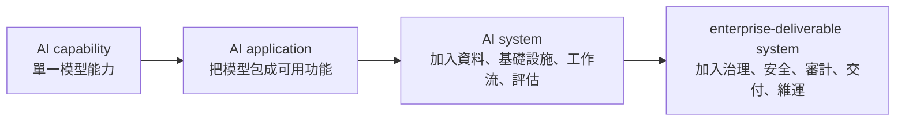
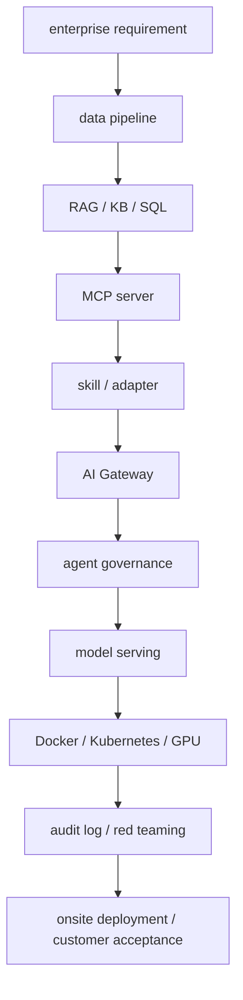

# Research Dossier: What Is AI Systems Engineering?

本 dossier 支撐 `modules/00-ai-systems-foundations/chapters/01-what-is-ai-systems-engineering.md`。它的任務不是替單一工具寫介紹，而是替 handbook 第一章建立一個可教、可審查、可延伸的研究基礎。

本文使用三種 claim label：

- **公開可驗證來源**：直接來自官方文件、標準文件、論文或主流技術文件。
- **工程推論**：把多個公開來源組合後得到的系統設計結論。
- **建議學習路徑**：面向大二資訊工程學生與 enterprise AI 初學工程師的課程安排，不等於任何單一標準原文。

核心公式：

```text
AI system
= model
+ data
+ infrastructure
+ workflow
+ governance
+ security
+ evaluation
+ delivery
```

enterprise AI flow：

```text
enterprise requirement
-> data pipeline
-> RAG / KB / SQL
-> MCP server
-> skill / adapter
-> AI Gateway
-> agent governance
-> model serving
-> Docker / Kubernetes / GPU
-> audit log / red teaming
-> onsite deployment / customer acceptance
```

## 1. Executive Thesis

AI Systems Engineering 是把 AI capability 轉成可部署、可治理、可評估、可維護、可交付系統的工程 discipline。它不是只問「模型能不能回答」，而是問「這個 AI 需求能不能在客戶環境中安全、穩定、可追蹤、可維護地運作」。NIST AI RMF 的公開文件把 AI products, services, and systems 放在 design、development、use、evaluation 的生命週期中管理，並把 trustworthiness 拆成可靠、安全、韌性、透明、可問責、隱私與公平等多個特性。這提供了第一個公開文獻基礎：企業 AI 的工程對象是 system，不是單一 prompt 或單一模型。

它和 model development、prompt engineering、MLOps、backend engineering 都有交集，但不等於其中任何一個。Model development 關心模型訓練、微調、權重、資料與能力上限；prompt engineering 關心如何用指令與上下文把既有模型能力穩定調出來；MLOps 關心 ML lifecycle 的自動化、測試、部署與監控；backend engineering 關心 API、資料庫、服務可靠性、權限與分散式系統。AI Systems Engineering 的範圍更大：它把 model、data、infrastructure、workflow、governance、security、evaluation、delivery 串成一個 enterprise-deliverable system。這個區分是工程推論，但可由 NIST AI RMF、RAG 論文、Kubernetes/Docker 文件、MCP 文件、OWASP LLM Top 10、Microsoft AI Red Teaming 文件共同支撐。

企業 AI 不能只看 benchmark，也不能只看 demo。Benchmark 通常測的是模型在受控任務上的單點能力；demo 通常展示 happy path；但 enterprise deployment 要面對真實資料、真實權限、真實網路、真實使用者、真實安全風險、真實維運責任與真實驗收條件。一個模型可以在公開榜單很強，仍然可能因為 OCR 解析錯誤、metadata 缺失、GPU KV cache 估算不足、agent tool 權限過大、audit log 不完整、voice latency 不可用或 on-prem 網路不通而交付失敗。

因此，AI Systems Engineering 的核心貢獻是把「AI 能力」放入「系統責任」。工程師面對需求時，第一輪問題不應只停在「要用哪個 model」，而應同時問：資料從哪裡來、能不能解析、知識是否過期、模型在哪裡跑、GPU/VRAM 能不能支撐併發、哪些工具可以被 agent 使用、權限邊界在哪裡、哪些操作需要 approval gate、log 能否追溯、如何 red team、如何 rollback、客戶如何驗收。這些問題共同定義了 AI Systems Engineering。

## 2. Core Mental Model

AI capability、AI application、AI system、enterprise-deliverable system 是四個逐層增加責任的層級。



- **AI capability**：模型或模型組件的能力，例如 text generation、embedding、ASR、TTS、reranking、tool-use tendency、long-context handling。這一層主要看 benchmark、model card、WER、latency、throughput、context window、token cost。
- **AI application**：把能力包成使用者可操作的功能，例如 chatbot、文件問答、客服摘要、語音助理、coding assistant。這一層開始出現 prompt、API、UI、session state、基本錯誤處理與簡單 tool calling。
- **AI system**：把 application 放進真實資料、真實工作流與真實運行環境。這一層包含 RAG pipeline、MCP/tool integration、model serving、observability、evaluation、policy gate、fallback、human review。
- **Enterprise-deliverable system**：能在客戶或組織環境中部署、審計、維護、驗收。這一層包含 Docker/Kubernetes、on-prem/private cloud、GPU capacity planning、networking、audit log、red teaming、approval gate、runbook、rollback、customer acceptance。

把 enterprise AI flow 展開：



這張圖的重點是：企業需求不會直接落到模型。需求會先決定資料邊界與使用者 workflow，再決定資料管線、知識庫、SQL、工具介面、agent 能力、gateway policy、model serving、部署環境與驗收方式。這個 flow 是工程推論，但每一個節點都有公開技術來源支撐：RAG 論文支撐 external knowledge，MCP 支撐 AI application 對外部 systems 的標準連接，Kubernetes/Docker 支撐 deployment 與 operations，OWASP/NIST/Microsoft 支撐 security、risk management 與 red teaming。

## 3. AI Model vs AI App vs AI System

| 層級 | 主要目標 | 主要元件 | 常見成功指標 | 常見失敗模式 | enterprise delivery concern |
|---|---|---|---|---|---|
| AI model | 產生 prediction、token、embedding、speech 或 score | model weights、tokenizer、context window、decoding、quantization、KV cache | benchmark、task accuracy、WER、latency、throughput、VRAM fit | 幻覺、domain mismatch、context overflow、長文退化、VRAM 不足 | 能否合法使用、能否在指定硬體上跑、能否被 serving stack 觀測 |
| AI application | 把模型能力包成可使用功能 | prompt、UI/API、session state、tool call、output parser、basic error handling | task completion、UX、response time、demo success | happy path 可跑，但無資料治理、無權限邊界、無系統級評估 | 基本 auth、錯誤處理、使用紀錄、API contract |
| AI system | 把應用放進真實資料與工作流 | RAG pipeline、MCP/tool integration、gateway、policy gate、audit log、eval、monitoring | groundedness、policy compliance、availability、traceability、latency SLO | RAG 找到相似但錯的資料、tool misuse、無審計、無 rollback、無 freshness control | 可部署、可治理、可維護、可驗收 |
| enterprise-deliverable system | 在客戶環境長期安全運作 | container、orchestrator、network、GPU planning、approval gate、runbook、acceptance test | UAT 通過、SLA/SLO、incident rate、MTTR、audit completeness | 現地拉不起來、port 不通、log 不全、資安掃描失敗、升級無回滾 | 上線流程、變更管理、責任邊界、維運交接 |

單一模型能力與完整系統能力之間的差距，通常不是「多寫一點 glue code」而已。完整系統要把資料生命週期、部署生命週期、權限生命週期、評估生命週期與維運生命週期全部納入。模型可以回答某個問題，但系統還要回答：答案根據哪個文件？文件是不是最新版？使用者有沒有權限看？有沒有被 prompt injection 操作？GPU 是否能支撐併發？出了事能不能查 log？客戶能不能在自己的機房復現？

## 4. The Eight Layers Of AI Systems Engineering

### 4.1 Model Layer

**Definition**：Model layer 處理模型本身與直接推論條件，包括 weights、tokenizer、context window、decoding strategy、quantization、KV cache、model serving runtime、model version。

**Why it matters**：模型不是抽象智慧，最後一定會落到記憶體、計算、延遲、吞吐、成本與品質取捨。PagedAttention 論文指出，LLM serving 的 KV cache memory 很大且會動態增減；如果管理不當，會因 fragmentation 與 duplicated cache 造成浪費，限制 batch size。vLLM 的價值正是把這種 serving-level memory management 變成產品工程能力。Ollama 則把 local model execution 變成開發與小型部署可操作的 API 與工具。

**Common failure mode**：只看模型參數量與 benchmark，沒有估算 context length、KV cache、batch、concurrency、TTFT、ITL、吞吐與 GPU memory utilization。

**Practical engineering question**：這個模型在客戶 GPU 上能支撐幾個同時使用者？4-bit 量化後任務品質是否仍可接受？context length 拉長後 KV cache 是否會把 VRAM 吃完？local inference 與 hosted inference 的 latency、cost、data boundary 如何取捨？

**Example in enterprise AI**：客服知識助理在工程師筆電上單人測試很順，但交付到客戶端後 30 個使用者同時查詢，因 KV cache 與 batch scheduling 沒估好，p95 latency 超出驗收條件。

### 4.2 Data Layer

**Definition**：Data layer 是從 source 到 usable context 的完整資料生命週期：ingestion、OCR、parsing、chunking、metadata、embedding、indexing、hybrid search、reranking、query rewriting、context construction、citation、freshness detection。

**Why it matters**：RAG 的原始問題意識是：純參數模型很難精準存取、更新與追溯知識。企業 RAG 更是 data pipeline，不只是 vector search。Vector similarity 可以找到語意接近內容，但企業答案需要文件版本、部門、權限、日期、政策適用範圍與 citation。沒有 metadata 與 freshness control，系統可能找到語意相似但制度上錯誤的內容。

**Common failure mode**：把 PDF 丟進 vector database 就以為完成 RAG；沒有處理 OCR 品質、chunk 邊界、metadata、reranker、citation validity、資料更新與 stale knowledge。

**Practical engineering question**：哪些文件可以進知識庫？掃描 PDF 的 OCR 是否可靠？chunk 是否保留語義完整性？metadata 是否能支援權限與版本過濾？retrieval 是否有 reranking？citation 是否能回到原始來源？舊文件如何下架？

**Example in enterprise AI**：HR chatbot 回答請假規則時，向量檢索抓到 2023 年舊版 SOP，因缺少 `effective_date` metadata 與 freshness filter，回覆了已失效政策。

### 4.3 Infrastructure Layer

**Definition**：Infrastructure layer 是 AI system 的執行地基，包括 Linux、networking、Docker、Kubernetes、GPU driver、storage、secrets、ports、DNS、TLS、load balancing、logging、metrics、traces、resource limits。

**Why it matters**：企業交付不是 notebook 成功，而是服務能在目標環境復現、啟動、暴露、監控、重啟、擴縮、排錯。Docker 提供 container packaging 與 runtime isolation；Kubernetes 提供 deployment、scaling、management、Service、probe、rollout 等生產運行能力。AI system 還要考慮 GPU driver、CUDA/ROCm、volume、network policy、log retention 與 observability。

**Common failure mode**：模型能跑，但 container 起不來；container 起來但 port 不通；service 已啟動但 readiness probe 還沒 ready；GPU 在 host 可見但 container 內不可用；log 沒集中收集。

**Practical engineering question**：服務跑在哪裡？本機、on-prem、private cloud、public cloud 還是 hybrid？需要哪些 ports？哪些 secrets？logs 留在哪？GPU 如何排程？Kubernetes readiness/liveness/startup probes 怎麼設？

**Example in enterprise AI**：客戶機房要求內網部署，工程團隊交付 image 後才發現 customer firewall、TLS certificate、GPU driver 與容器 runtime 版本沒有事先盤點，導致 acceptance test 失敗。

### 4.4 Workflow Layer

**Definition**：Workflow layer 把 user request、資料、模型、工具與人類審核串成可控流程。它包含 prompt orchestration、state machine、tool invocation、MCP server、skill、adapter、approval gate、fallback path、human review。

**Why it matters**：企業 AI 不只回覆文字，常常會查資料庫、讀文件、呼叫內部 API、產生報告、建立 ticket、通知人員或執行 workflow。一旦 AI 可以使用工具，它就進入外部系統邊界。MCP 提供 AI applications 連接 data sources、tools、workflows 的標準，但標準連接不等於自動安全；仍然需要 policy、auth、least privilege 與 approval。

**Common failure mode**：agent 有過大的 tool access，可以讀寫高風險資料或執行高風險操作；workflow 沒有 deterministic checks、沒有 retry/fallback、沒有 human review。

**Practical engineering question**：哪些步驟由模型判斷，哪些步驟必須 deterministic？哪些 tool 是 read-only？哪些 tool 需要 approval gate？失敗時如何降級？如何記錄每次 tool call？

**Example in enterprise AI**：採購 agent 可以查詢供應商資料，也可以建立採購單。若沒有 approval gate 與 permission boundary，錯誤推理或 prompt injection 可能直接觸發高風險 business action。

### 4.5 Governance Layer

**Definition**：Governance layer 定義誰可以用什麼能力、接觸什麼資料、呼叫什麼工具、在哪些條件下執行、如何追溯責任。它包含 agent registry、tool registry、model registry、policy gate、permission boundary、usage quota、audit log、approval chain、ownership、versioning。

**Why it matters**：企業 AI 的風險常常不是某個模型單點失準，而是組織不知道哪些 agent、tools、MCP servers、data sources、models 正在被誰使用。NIST AI RMF 把 Govern 視為跨生命週期功能；MCP 與 AI Gateway 的企業使用也要求 registry、auth、monitoring、audit logging 與 policy enforcement。

**Common failure mode**：各部門各自接工具與資料庫，沒有統一 inventory；半年後無法回答某個 agent 有哪些資料權限、誰批准、哪個版本、哪些 log 可查。

**Practical engineering question**：誰能新增 MCP tool？誰能把 read-only tool 改成 write-capable？agent memory 是否能跨任務共享？audit log 粒度到 user、agent、tool、policy、timestamp 嗎？

**Example in enterprise AI**：銀行多代理平台中，不同 agent 共用 KB 與 SQL source；若沒有 centralized registry 與 policy gate，跨 agent memory 或 tool access 可能造成 privilege escalation。

### 4.6 Security Layer

**Definition**：Security layer 把 AI system 當成攻擊面管理，包括 prompt injection、indirect prompt injection、PII、data leakage、tool abuse、improper output handling、excessive agency、supply chain、vector/embedding weaknesses、auditability。

**Why it matters**：OWASP LLM Top 10 把 prompt injection、sensitive information disclosure、supply chain、data and model poisoning、improper output handling、excessive agency 等列為 LLM application 風險。Microsoft AI Red Teaming 與 AI threat modeling 文件也強調，生成式與 agentic AI 的風險常出現在模型、資料、工具、使用者與外部系統的 integration boundaries。

**Common failure mode**：把 system prompt 當安全邊界，把 model output 當可信命令，把 RAG retrieved content 當可信資料，把 tool schema 當 authorization。

**Practical engineering question**：不可信 user input 與 retrieved content 如何隔離？PII 如何最小化、遮罩與記錄？tool call 是否經過 policy gate？高風險輸出是否需要 human review？red team 是否涵蓋 prompt injection、data leakage、tool abuse 與 user-side misuse？

**Example in enterprise AI**：文件摘要 agent 讀到外部 PDF 中的惡意文字，該文字試圖要求 agent 忽略原本 policy 並呼叫資料匯出工具。若 tool policy 只靠 prompt，而沒有外部 permission boundary，就可能造成資料外洩。

### 4.7 Evaluation Layer

**Definition**：Evaluation layer 對 AI system 做 testing、evaluation、validation、verification。它不只評模型回答，也評 retrieval quality、groundedness、citation correctness、policy compliance、tool behavior、latency、cost、safety、regression、human review outcome。

**Why it matters**：AI system 的品質是 context-dependent。模型 benchmark 不能替代系統 eval；一次 demo 也不能替代 continuous evaluation。RAG 要評 retrieval 和 answer；agent 要評 task success、tool trace、policy compliance；voice AI 要評 end-to-end latency 與 interruption；security 要評 red-team scenarios。

**Common failure mode**：只有 offline benchmark，沒有 task-level golden set；只評 answer correctness，不評 citation、latency、policy、tool trace；只在上線前 eval，沒有上線後 monitoring。

**Practical engineering question**：這次改模型、改 chunking、改 reranker、改 prompt、改 gateway policy 後，哪個 KPI 不准退步？failure sample 是否可重現？trace 是否能連到 eval case？human review rubric 是否一致？

**Example in enterprise AI**：RAG chatbot 在人工測試問題上答得很好，但上線後常引用不存在或過期文件；根因是 eval 只看 final answer，沒有評 citation validity 與 freshness。

### 4.8 Delivery / Maintenance Layer

**Definition**：Delivery / maintenance layer 處理 packaging、deployment target、customer acceptance、handover、runbook、rollback、incident response、model upgrade、knowledge refresh、security patch、capacity scaling、long-term ownership。

**Why it matters**：企業真正購買的是可長期運行的能力。能在工程師本機跑，不代表能在客戶機房跑；能在 staging 跑，不代表能被維運團隊接手。AI system 的維護還包含模型版本、embedding/index 版本、RAG 來源更新、evaluation drift、policy 更新與安全修補。

**Common failure mode**：PoC 很漂亮，但沒有 installation guide、acceptance criteria、rollback path、monitoring dashboard、incident playbook、version matrix。

**Practical engineering question**：客戶如何安裝？如何驗收？如何升級模型與向量索引？如何 rollback？誰負責 incident？哪些 log 可以交給客戶，哪些保留在內部？知識庫多久更新？

**Example in enterprise AI**：交付 on-prem AI assistant 後，客戶要求半年後更新模型。若沒有版本化 model、prompt、index、schema、gateway policy 與 eval baseline，升級很可能破壞既有使用者流程。

## 5. Seven Interview-Derived Technical Mainlines

下列七條線是 handbook 的學習地圖。它們來自 VOISS-style enterprise AI curriculum lens，但寫法保持 public-safe：只保留公開可教的技術責任，不把 private interview material 當公開事實。

| 主線 | 它在系統中的位置 | 為什麼企業 AI 需要它 | 第一個月要學到什麼程度 | 對應 failure modes |
|---|---|---|---|---|
| On-prem / Docker / Kubernetes / customer delivery | Infrastructure + delivery | 客戶常要求資料不出域、內網部署、機房交付、版本可控與維運交接 | 能把簡單 AI service containerize；懂 ports、env、volumes、logs；能說明 Deployment、Service、probes、rollback | demo works but deployment fails；port 不通；無 health check；無 rollback |
| GPU / VRAM / KV cache / vLLM / Ollama | Model serving + capacity planning | LLM 產品化受 weights、KV cache、batch、concurrency、latency、throughput 約束 | 能用 Ollama 跑 local model；能說明 vLLM、KV cache、TTFT/ITL；能做粗略 VRAM sizing | 只算 weights 不算 KV cache；併發上升後 latency 爆；量化造成品質退化 |
| AI Gateway / agent governance / MCP / skill / adapter | Workflow + governance + security | 多 agent、多 tool、多 data source 需要 registry、routing、policy、quota、audit | 能說明 MCP host/client/server、tool/resource/prompt；能設計 read-only vs write tool 與 approval gate | agent tool access 過大；無 registry；無 audit log；cross-agent privilege escalation |
| RAG / metadata / reranker / data pipeline | Data + evaluation | 企業知識多在 PDF、SOP、SQL、內部文件；答案要可引用、可更新、可控權 | 能畫出 ingestion、chunking、metadata、embedding、retrieval、rerank、citation；能做小型 eval | semantic similarity 找錯政策；OCR/parsing 漏字；stale knowledge；citation 不可驗 |
| Voice AI / ASR / TTS / diarization / VAD / wake word / real-time voice | Workflow + model + realtime infrastructure | 語音 AI 是 ASR -> LLM -> TTS loop，受噪音、遠場、插話與延遲限制 | 能說明 ASR、VAD、diarization、TTS、wake word、barge-in；能量測 end-to-end latency | ASR 準但對話慢；多人語音 speaker attribution 錯；遠場噪音不可用 |
| AI Security / red teaming / OWASP / NIST / PII / guardrails / prompt injection | Security + governance + evaluation | AI 連接資料與工具後，攻擊面跨 prompt、RAG、tool、memory、logs、users | 能解釋 OWASP LLM Top 10、NIST AI RMF、prompt injection、PII、tool abuse、human review | prompt injection；PII leakage；improper output handling；tool abuse；unbounded consumption |
| Spec / SDD / design pattern / Codex / AI-assisted coding control | Delivery + engineering workflow | AI-assisted coding 會加速實作，也會放大模組邊界不清、context pollution 與 missing tests | 能先寫 Spec/SDD；用 AGENTS.md/README/test plan 控制 Codex；會做 AI-generated code review | vibe coding；over-coupling；無 acceptance criteria；無 rollback；缺 tests |

## 6. Failure Modes

| Failure mode | Symptom | Root cause | Prevention control | Verification method |
|---|---|---|---|---|
| demo works but deployment fails | 本機 demo 可跑，客戶環境起不來 | 環境假設寫死；未 containerize；未盤點 ports、volumes、secrets、drivers | Docker image、deployment manifest、environment contract、site survey | 在乾淨機器與 staging 重新部署；跑 smoke test |
| model answers but system cannot audit | 答案看似合理，但無法追來源、工具與 policy | 沒有 correlation ID、audit log、retrieval trace、tool trace | Gateway 與 workflow 層記錄 user、agent、tool、source、policy、timestamp | 抽樣追溯完整 request lifecycle |
| benchmark high but enterprise task fails | 模型榜單高，但業務任務效果差 | benchmark 與真實任務、資料、權限、語言不一致 | 建 task-level eval dataset、golden set、human rubric | 比較 offline eval、UAT 與 production trace |
| RAG retrieves semantically similar but policy-wrong content | 回答語意相近但制度錯誤 | 缺 metadata、version filter、permission filter、reranker | metadata schema、freshness filter、reranking、citation check | 用版本衝突與權限衝突樣本做 retrieval eval |
| OCR/parsing silently drops key clauses | 文件有答案但系統找不到或引用錯 | 掃描 PDF、表格、欄位、版面解析失敗 | ingestion QA、parse coverage、抽樣人工複核 | 比對原檔、chunk、citation 的可讀性 |
| stale knowledge contaminates answers | 系統引用過期文件 | 沒有 source lifecycle、re-index policy、deprecation policy | freshness detection、effective_date、retention/deprecation workflow | 對已更新文件做 freshness regression test |
| GPU estimate ignores KV cache | 單人可跑，多人就 OOM 或延遲爆 | 只估 model weights，沒估 KV cache、batch、concurrency | capacity planning 包含 weights、KV cache、runtime overhead、buffer | 壓測 tokens/sec、p95 latency、OOM rate、KV usage |
| quantization chosen blindly | VRAM 省了但任務品質下降 | 未評估 precision 與 domain quality trade-off | 量化前後做 task-level A/B eval | 比較 quality、latency、cost 三者曲線 |
| concurrency tuned for throughput but kills latency | throughput 上升但互動體驗不可用 | batch/scheduler 只追 TPS，忽略 TTFT/ITL | 設 latency SLO、admission control、separate workloads | 量 p50/p95/p99、TTFT、ITL、queue time |
| agent has tool access without permission boundary | agent 執行超出授權動作 | tool 暴露過大；缺 least privilege、approval gate | tool ACL、read-only default、human approval、policy gate | 用高風險 prompt 與 misuse scenario red team |
| prompt injection bypasses system instruction | 使用者或文件內容誘導 agent 違反政策 | 把 prompt 當安全邊界；外部內容未隔離 | content isolation、tool policy、output validation、human review | direct/indirect prompt injection 測試 |
| model output is executed as command | LLM 產生 SQL/shell/HTTP 後被直接執行 | improper output handling；缺 schema validation 與 sandbox | structured output、allowlist、sandbox、escaping、approval | 模擬惡意輸出與 command injection |
| sensitive data leaks through answers or logs | 回答或 logs 含 PII、secret、internal data | data minimization、masking、log policy 不足 | PII detection、redaction、retention policy、access control | 掃描 output/log；做 privacy review |
| AI gateway missing quota and throttles | 流量暴衝、成本失控、服務互相拖垮 | 沒有 token/request limit、budget、rate limiting | quota、rate limit、budget alert、admission control | 壓測 request/token/GPU utilization 上限 |
| no registry for MCP tools or agents | 不知道哪些 agent 能接哪些 tools | governance inventory 缺失 | agent/tool/MCP registry、owner、risk tier、change review | 定期盤點 registry 與實際 runtime |
| cross-agent memory governance fails | agent 讀到不該共享的 memory | memory scope、retention、permission boundary 不清 | memory ACL、tenant isolation、expiration、audit | 用跨使用者/跨部門樣本測試 memory leakage |
| voice loop has good ASR but unusable latency | 轉寫準，但對話卡、回應慢、插話失敗 | 沒有 end-to-end latency budget；只評 ASR | 分段量測 VAD、ASR、LLM、TTS、playback；streaming | 測 speech start 到 first audio out |
| noisy or far-field audio destroys usability | 會議室、工廠或遠距麥克風效果很差 | 噪音、回音、遠場收音未納入設計 | noise suppression、AEC、beamforming、VAD tuning、field test | 在目標聲學場景實測 WER/latency |
| diarization merges speakers | 會議紀錄把人講錯 | 多說話者分割、overlap、speaker embedding 不穩 | VAD + diarization + speaker-aware transcript | 測 DER、speaker confusion、人工抽查 |
| no SDD, acceptance criteria, rollback path | AI 寫了很多 code，但專案不可控 | 需求、模組邊界、done definition 缺失 | Spec、SDD、ADR、test plan、rollback plan | PR/design review 檢查 acceptance checklist |
| Codex-generated code overcouples modules | 改一個功能壞三個模組 | 缺 repo instructions、architecture guardrails、tests | AGENTS.md、module boundaries、custom instructions、regression tests | diff review、static analysis、test suite |
| observability missing until incident | 故障時只知道「怪怪的」 | 沒有 logs、metrics、traces、dashboards、alerts | OpenTelemetry/Prometheus/log aggregation、trace IDs | 故障演練；確認每個 request 可追 |
| evaluation exists only before launch | 上線後 drift、資料過期、模型退化無感 | 沒有 continuous evaluation 與 review cadence | scheduled eval、trace-linked eval、red-team cadence | 定期 eval report 與 failure sample review |
| customer acceptance criteria are vague | 客戶說不好用，但雙方無法收斂 | 沒有把需求轉成可測指標與 UAT | acceptance tests、SLO、security checklist、handover doc | UAT 簽核；逐項驗收 evidence |

## 7. Practical First Chapter Outline

# What Is AI Systems Engineering?

| Section | 章節要點 | 需要引用的來源 | 應該放入的圖或表格 | 章節完成後讀者應能回答的問題 |
|---|---|---|---|---|
| 1. Why This Chapter Exists | 企業 AI 的問題不是模型答不答，而是系統能否安全、穩定、可追蹤、可交付 | NIST AI RMF、OWASP LLM Top 10、Microsoft AI Red Teaming | demo vs deployment 對照表 | 為什麼 benchmark/demo 不足以代表 enterprise readiness？ |
| 2. Mental Model | capability -> application -> system -> enterprise-deliverable system | NIST AI RMF、MCP intro、Kubernetes/Docker docs | 四層 Mermaid | 每升一層，多了哪些工程責任？ |
| 3. Core Terms | model、application、system、deployment、RAG、MCP、AI Gateway、governance、evaluation、red teaming | MCP docs、RAG paper、OWASP、NIST | 術語對照表 | 這些名詞彼此的邊界是什麼？ |
| 4. Mechanism | 用核心公式拆解 AI system 八層 | NIST AI RMF、vLLM、Docker/K8s、MCP、RAG | 八層架構圖 | 為什麼企業 AI 不是只靠 model？ |
| 5. System Context | 用 enterprise flow 說明資料、工具、權限、serving、部署如何串起來 | RAG paper、MCP docs、AI Gateway docs、K8s docs | enterprise flow 圖 | 一個需求如何變成完整 AI system？ |
| 6. Engineering Workflow | 需求、資料、PoC、eval、security review、staging、deployment、acceptance、maintenance | NIST AI RMF、K8s production docs、Microsoft AI Red Teaming | 工程 workflow 圖 | 工程師第一輪應該問哪些問題？ |
| 7. Enterprise / VOISS-Style Relevance | 用 enterprise curriculum lens 串接 on-prem、gateway、RAG、voice、security、delivery | 本 dossier 七條主線來源 | 學習地圖表 | 為什麼這章是後續所有模組的入口？ |
| 8. Security And Governance Implications | human review、audit log、approval gate、permission boundary、validation path | OWASP、NIST、Microsoft AI Red Team | 風險控制矩陣 | 哪些控制不能交給 prompt 自己？ |
| 9. Failure Modes | 放 10-15 個最典型失敗模式 | 本 dossier failure mode matrix | failure mode table | 如何從症狀回推 root cause？ |
| 10. Minimal Example | local RAG chatbot：Ollama/local model + 小型 KB + citations + basic logs | Ollama docs、RAG paper、Docker docs | minimal stack 圖 | 最小可用 demo 還缺哪些 production responsibility？ |
| 11. Production-Grade Example | 同一需求擴成 gateway、audit、K8s、vLLM、eval、approval、rollback | vLLM、K8s、MCP、AI Gateway、OWASP | minimal vs production 對照表 | production-grade 多了哪些不可省略層？ |
| 12. Checklist | model、data、infra、workflow、governance、security、eval、delivery 檢查表 | NIST AI RMF、OWASP、K8s | chapter checklist | 看到新 AI 需求時如何做第一輪系統審查？ |
| 13. Exercises | 把單一 AI 需求畫成四層模型、八層公式與 failure-mode matrix | 課程設計推論 | exercise table | 能否把概念轉成工程判斷？ |
| 14. Related Chapters | 指到 Docker/K8s、GPU、RAG、AI Gateway、voice、security、Spec/SDD | handbook module map | chapter dependency graph | 接下來該學哪一章，為什麼？ |

## 8. Source List

| Title | URL | Source type | What claim it supports |
|---|---|---|---|
| NIST AI Risk Management Framework | https://www.nist.gov/itl/ai-risk-management-framework | standard / official docs | AI products, services, systems 應在 design、development、use、evaluation 中納入 trustworthiness 與 risk management |
| NIST AI RMF Playbook / AIRC resources | https://airc.nist.gov/airmf-resources/airmf/ | standard / official docs | Govern、Map、Measure、Manage 與 AI RMF 操作框架 |
| NIST Generative AI Profile | https://www.nist.gov/publications/artificial-intelligence-risk-management-framework-generative-artificial-intelligence | standard | GenAI 特有風險與風險管理 actions |
| Kubernetes Overview | https://kubernetes.io/docs/concepts/overview/ | official docs | Kubernetes 作為 containerized workloads 的 orchestration 與 production operations 基礎 |
| Kubernetes Deployments | https://kubernetes.io/docs/concepts/workloads/controllers/deployment/ | official docs | rollout、replica、deployment controller 與運行管理 |
| Kubernetes Services | https://kubernetes.io/docs/concepts/services-networking/service/ | official docs | Service 暴露 workload 與 networking concern |
| Kubernetes Probes | https://kubernetes.io/docs/concepts/workloads/pods/probes/ | official docs | readiness、liveness、startup probes 對 production AI service 的重要性 |
| Docker Overview | https://docs.docker.com/get-started/docker-overview/ | official docs | container packaging、image、runtime isolation |
| Docker Logging Drivers | https://docs.docker.com/engine/logging/configure/ | official docs | container logging 與 production troubleshooting |
| vLLM Documentation | https://docs.vllm.ai/ | technical docs | LLM serving、throughput、serving runtime、metrics |
| Efficient Memory Management for Large Language Model Serving with PagedAttention | https://arxiv.org/abs/2309.06180 | paper | KV cache memory 是 LLM serving 核心約束；vLLM/PagedAttention 的 memory-management motivation |
| Ollama API Documentation | https://docs.ollama.com/api/introduction | technical docs | local model API、localhost serving、local vs cloud model access |
| Ollama Import / Quantization Docs | https://docs.ollama.com/import | technical docs | quantization 與 local model packaging 的工程介面 |
| Model Context Protocol Introduction | https://modelcontextprotocol.io/docs/getting-started/intro | official docs | MCP 是 AI applications 連接 data sources、tools、workflows 的 open standard |
| MCP Architecture | https://modelcontextprotocol.io/docs/learn/architecture | official docs | MCP host/client/server architecture |
| MCP Specification | https://modelcontextprotocol.io/specification/ | official spec | tools、resources、prompts、transport、authorization 等接口責任 |
| Retrieval-Augmented Generation for Knowledge-Intensive NLP Tasks | https://arxiv.org/abs/2005.11401 | paper | RAG 結合 parametric memory 與 non-parametric memory；provenance 與 knowledge update 問題 |
| A Survey on Retrieval-Augmented Text Generation for Large Language Models | https://arxiv.org/abs/2404.10981 | paper | RAG pipeline 可分成 pre-retrieval、retrieval、post-retrieval、generation、evaluation |
| Azure AI Search RAG Overview | https://learn.microsoft.com/en-us/azure/search/retrieval-augmented-generation-overview | official docs | RAG 的 ingestion、chunking、vectorization、semantic ranking、citations 等工程責任 |
| Azure API Management AI Gateway Capabilities | https://learn.microsoft.com/en-us/azure/api-management/genai-gateway-capabilities | official docs | AI gateway 的 quotas、routing、monitoring、governance 能力 |
| Azure API Management MCP Server Overview | https://learn.microsoft.com/en-us/azure/api-management/mcp-server-overview | official docs | MCP server secure access、monitoring、registry/discovery 與 enterprise governance |
| OWASP Top 10 for Large Language Model Applications | https://owasp.org/www-project-top-10-for-large-language-model-applications/ | standard-like official project | prompt injection、sensitive data、output handling、excessive agency 等 LLM application risks |
| OWASP GenAI Security Project | https://genai.owasp.org/ | standard-like official project | GenAI security taxonomy 與 Top 10 resources |
| Microsoft AI Red Team | https://learn.microsoft.com/en-us/security/ai-red-team/ | official docs | AI red teaming 作為 enterprise AI 安全測試與風險發現實務 |
| Microsoft AI Threat Modeling | https://learn.microsoft.com/en-us/security/zero-trust/sfi/threat-modeling-ai | official docs | AI system 的 trust boundaries、integration boundaries、agentic risk |
| Whisper GitHub Repository | https://github.com/openai/whisper | model docs / open-source reference | ASR public model reference 與 Whisper usage |
| Robust Speech Recognition via Large-Scale Weak Supervision | https://arxiv.org/abs/2212.04356 | paper | Whisper ASR public research basis |
| pyannote.audio | https://github.com/pyannote/pyannote-audio | technical docs / open-source reference | speaker diarization、speech activity detection、speaker change detection、overlap detection |
| Coqui TTS Documentation | https://coqui-tts.readthedocs.io/ | technical docs | TTS toolkit reference for text-to-speech systems |
| SpeechT5: Unified-Modal Encoder-Decoder Pre-Training for Spoken Language Processing | https://aclanthology.org/2022.acl-long.393/ | paper | TTS / speech-text model reference |
| ISO/IEC/IEEE 29148 Systems and Software Engineering Requirements | https://standards.ieee.org/standard/29148-2018.html | standard | requirements engineering 與 acceptance criteria 的工程背景 |
| IEEE 1016-2009 Software Design Description | https://standards.ieee.org/ieee/1016/4502/ | standard | SDD 作為設計資訊與架構記錄的基礎 |
| OpenAI Codex AGENTS.md Guide | https://developers.openai.com/codex/guides/agents-md | official docs | AI coding agents 需要 repo-level instructions 與 project control |
| GitHub Copilot Code Review Docs | https://docs.github.com/copilot/using-github-copilot/code-review/using-copilot-code-review | official docs | AI-assisted code review 與 custom instructions 的工程控制面 |

## Source Boundary And Limitations

- **AI Systems Engineering** 在本 handbook 中是課程化工程框架，不是某個單一標準文件中的正式固定名詞。它的公共支撐來自 NIST 的 AI system/risk management 視角、RAG 的 external knowledge 問題、vLLM/Ollama 的 serving 現實、Docker/Kubernetes 的 deployment 現實、MCP/AI Gateway 的工具與治理介面、OWASP/Microsoft 的 security/red-team framework。
- **AI Gateway / skill / adapter / enterprise agent governance** 目前沒有單一中立標準完全定義。本 dossier 採工程推論方式定義其功能邊界：routing、policy、registry、quota、permission boundary、audit log、approval gate。
- **VOISS-style** 僅作為 enterprise AI curriculum lens，不作為任何未公開公司內部事實。
- **Voice AI latency budget** 高度依賴模型、硬體、網路、音訊環境與產品 UX。本 dossier 主張 voice AI 必須被當成 real-time system 管理，但不設定一個通用毫秒門檻。
