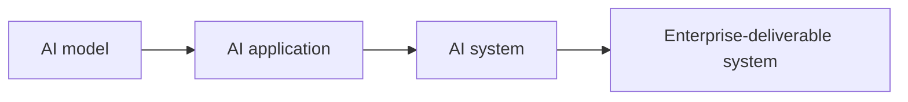
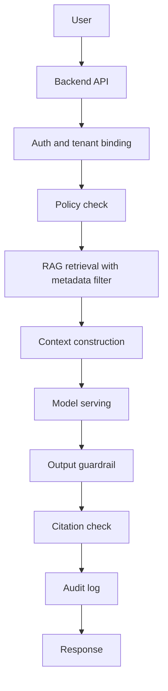

# AI Systems Engineering Handbook 30 天速成教師資料包

日期：2026-06-13

對象：協助撰寫教程的資訊工程學系教師

課程定位：大二資訊工程學生可理解、可實作、可驗證的 AI 系統工程入門速成課

Repo：`ai-systems-engineering-handbook`

---

## 1. 給老師的第一個結論

這個 repo 要建立的是一套 **AI 系統工程完整教程**。它的教學重點不是把學生訓練成只會呼叫模型 API 的使用者，而是讓學生建立系統工程視角：看見一個 AI 功能如何被設計成可以部署、治理、評估、除錯、維運、驗收的 enterprise AI system。

本課程的核心公式是：

```text
AI system
= model
+ data
+ infrastructure
+ workflow
+ governance
+ security
+ evaluation
+ delivery
```

請老師協助撰寫教程時，把每一章都寫成「初學者可以建立 mental model，工程師可以拿去實作，reviewer 可以檢查 failure modes」的教材。每一章要先教學生理解機制，再教實務 workflow，最後教如何驗證、除錯與交付。

30 天速成的目標，是讓大二資訊工程學生在一個月內具備 **working competence**：能解釋、部署、除錯、審查一個小型 governed local AI service。這不是承諾學生一個月內變成 production senior engineer，而是讓他們具備可延伸的 AI systems engineering 基礎。

---

## 2. Repo 是什麼

`ai-systems-engineering-handbook` 是一個 tutorial-oriented knowledge system，由 Master Knowledge Base、Knowledge Modules、Labs、Accelerators、Case Studies、Glossary、Diagrams、Templates、Prompts、Review Rubrics 和 Validation Scripts 組成。

它的正式中文定位是：

```text
AI 系統工程完整教程：
從地端部署、AI Gateway、Agent Governance、RAG、語音 AI 到企業交付
```

這個 repo 的教學責任是把 enterprise AI system 的知識結構化。學生學到的不是一堆散落工具名稱，而是可重複使用的工程模式。

### 2.1 Repo 的主要內容

| 區域 | 功能 | 老師撰寫教程時的用法 |
|---|---|---|
| `master-knowledge-base/` | 全局地圖、學習路線、核心 mental model | 用來決定章節順序與跨模組連結 |
| `modules/` | 每個知識域的教程主體 | 每章主要放在對應 module |
| `labs/` | 實作與除錯練習 | 每週至少要有可驗證的小練習 |
| `accelerators/` | 7 至 14 天 evidence sprint | 讓學生把多個模組組成可展示成果 |
| `case-studies/` | 真實世界情境整合 | 用來解釋企業交付與 failure modes |
| `glossary/` | 名詞定義 | 每章名詞要回連 glossary |
| `templates/` | 章節、lab、case study 模板 | 老師新增教程時必須遵守 |
| `review/` | rubric 和 checklist | 用來判斷章節是否可教、可驗證 |
| `references/` | 來源邊界與參考資料 | 用來維持 public-safe 與 source-bounded |

### 2.2 模組地圖

| Module | 名稱 | 教學任務 |
|---|---|---|
| `00` | AI Systems Foundations | 建立 AI system 的整體視角 |
| `01` | Linux, OS, Networking | 建立部署與除錯的系統基礎 |
| `02` | Cloud, On-Prem, Private Cloud | 理解 enterprise deployment environment |
| `03` | Container, K8s, DevOps | 學會 packaging、orchestration、health check |
| `04` | GPU And AI Inference Infrastructure | 理解 VRAM、KV cache、vLLM、Ollama、serving |
| `05` | LLM Application Architecture | 理解 LLM app 如何變成系統 |
| `06` | RAG And Data Pipeline | 理解 ingestion、metadata、retrieval、evaluation |
| `07` | AI Gateway And Agent Governance | 理解 agent、tool、policy、memory、audit control plane |
| `08` | Voice AI Systems | 理解 ASR、TTS、VAD、diarization、real-time loop |
| `09` | Security, Red Teaming, AI Risk | 建立 prompt injection、PII、tool abuse 防線 |
| `10` | Enterprise Delivery And FAE Workflow | 學會客戶現場交付、驗收、handover |
| `11` | Spec, SDD, AI-Assisted Coding Workflow | 學會先寫規格再請 AI agent 實作 |
| `12` | Integrated Case Studies | 把模組整合成真實專案 |

---

## 3. 30 天速成的目標

30 天速成不是「工具清單速讀」。它是一條 **工程能力建立路線**。學生完成後，應該能把一個 AI idea 拆成系統元件，說明每一層的責任、風險、驗證方式與交付條件。

### 3.1 最終能力目標

學生完成 30 天後要能做到：

1. 解釋 AI model、AI application、AI system、enterprise-deliverable system 的差異。
2. 用 Docker 打包一個小型 AI backend 或 model service。
3. 理解 Kubernetes 的 Pod、Deployment、Service、Ingress、ConfigMap、Secret、resource request / limit。
4. 估算基本 GPU / VRAM 需求，包含 model weights、quantization、KV cache、batch、concurrency。
5. 啟動或分析一個 vLLM / Ollama local model serving endpoint。
6. 設計一個 mini RAG pipeline，包含 ingestion、chunking、metadata、embedding、retrieval、reranking、citation。
7. 設計 basic AI Gateway：agent registry、tool registry、policy gate、approval gate、audit log。
8. 解釋 MCP server 如何暴露 tools / resources / prompts，以及為何 MCP 是 capability exposure protocol，不是完整 enterprise governance boundary。
9. 設計 prompt injection、tool abuse、PII leakage、unsafe retrieval 的 red-team tests。
10. 寫出 Spec、SDD、interface contract、acceptance criteria，再讓 AI coding agent 實作。
11. 用 logs、tests、eval、audit evidence 說明系統是否可交付。

### 3.2 30 天需要什麼

學生需要的先備能力：

| 類別 | 最低要求 | 老師需要補強的地方 |
|---|---|---|
| Programming | 會 Python 或 JavaScript 基礎語法 | 要能讀懂 API request / response 和簡單 service code |
| Web concepts | 知道 HTTP、JSON、API、status code | Day 1 要補「AI request lifecycle」 |
| Linux | 會基本 terminal 指令 | Week 1 需要補 process、port、log、env var |
| Data structures | 知道 list、dict、table、file | RAG metadata、JSONL audit log 需要連回資料結構 |
| Database | 知道 SQL / table 概念即可 | Week 2 可用 mock SQL，不要求 database administration |
| ML | 不要求完整 machine learning 理論 | 只需理解 inference、embedding、token、latency |
| Security | 不要求資安專精 | 要能理解 permission、PII、prompt injection、audit |

課程需要的工程環境：

```text
Linux or macOS development machine
Git
Python 3.11+
Node.js 20+ optional
Docker
VS Code or equivalent editor
curl
jq optional
Ollama optional for local LLM demo
GPU optional, not required for Day 1
```

如果課堂沒有 GPU，Week 1 到 Week 2 可以先用 mock model endpoint 或 Ollama CPU demo。GPU / vLLM 可作為 teacher demo 或 cloud lab，不應阻塞學生建立系統觀。

### 3.3 30 天重點

30 天課程要抓住四條主線：

1. **系統邊界**：AI 功能要被拆成 model、data、infra、workflow、governance、security、evaluation、delivery。
2. **可驗證 workflow**：每一個功能要有 health check、log、test、eval、audit event。
3. **企業交付視角**：學生要知道 demo 能跑與 customer acceptance 之間的差距。
4. **工程習慣**：先寫 Spec / SDD / acceptance criteria，再實作，再測試，再回收 failure modes。

### 3.4 30 天成果證據

課程完成時，學生應提交一個小型 evidence packet：

```text
project/
  README.md
  SPEC.md
  SDD.md
  docker-compose.yaml or Dockerfile
  app/
  configs/
    agents.yaml
    tools.yaml
    policy.yaml
  data/
    sample_docs/
  logs/
    audit.jsonl
    eval.jsonl
  tests/
  docs/
    architecture.md
    failure-modes.md
    acceptance-checklist.md
```

最低可驗收行為：

1. service 可以啟動，並回傳 health endpoint。
2. mini RAG 可以回傳 source-backed answer。
3. gateway mock 可以記錄 allow / deny / review policy decision。
4. 至少一個 prompt injection 或 unauthorized tool case 被 block 或進入 review。
5. 每次 request 都能產生 audit event。
6. README 能說明架構、scope、測試方式、已知限制與下一步。

---

## 4. 老師可以怎麼幫我們寫教程

老師的主要任務不是把內容寫成講義型百科，而是把 repo 變成「可教、可練、可審查」的教材系統。

### 4.1 每章教程的寫法

每一章請按照 `templates/chapter-template.md` 的順序撰寫：

1. Why This Chapter Exists
2. Mental Model
3. Core Terms
4. Mechanism
5. System Context
6. Engineering Workflow
7. VOISS-Style Relevance
8. Security And Governance Implications
9. Failure Modes
10. Minimal Example
11. Production-Grade Example
12. Checklist
13. Exercises
14. Related Chapters

每一章要回答七個問題：

1. 這是什麼？
2. 它為什麼存在？
3. 底層機制怎麼運作？
4. 它在真實 AI 系統中怎麼被使用？
5. 誤解它會造成什麼 failure mode？
6. 安全、治理、維運、交付上要注意什麼？
7. 學生要怎麼練習與驗證？

### 4.2 教程語氣

請使用初學者友善但工程上精準的語氣。建議語言策略：

- 用繁體中文解釋概念。
- 保留常見英文技術詞，例如 `RAG`、`AI Gateway`、`audit log`、`policy engine`。
- 先給 mental model，再給技術細節。
- 用真實世界情境引出問題，再說明系統設計。
- 把 constraints 寫成 scope controls、activation gates、validation path。
- 避免把章節寫成 command list。
- 避免只列工具名稱，必須說明工具在系統中的責任。

### 4.3 軟體工程實踐角度

每章都要連回軟體工程實踐：

| 軟體工程實踐 | 在教程中的寫法 |
|---|---|
| Interface contract | request / response schema、tool input schema、output schema |
| Modular design | model layer、data layer、gateway layer、runtime layer 分離 |
| Versioning | model version、agent version、policy version、dataset version |
| Testing | unit test、integration test、red-team test、eval test |
| Observability | log、metric、trace、audit event、eval result |
| Error handling | timeout、retry、fallback、idempotency、review_pending |
| Maintainability | config-driven design、registry、clear ownership、docs |
| AI-assisted coding control | Spec / SDD / acceptance criteria before implementation |

### 4.4 系統工程實踐角度

每章也要連回系統工程實踐：

| 系統工程實踐 | 在教程中的寫法 |
|---|---|
| Requirement framing | 把「想要 AI 助理」改成 user workflow、data source、SLO、risk scope |
| Boundary definition | 誰可以讀什麼、誰可以呼叫什麼、哪裡需要 human review |
| Lifecycle thinking | design、deploy、monitor、evaluate、update、rollback |
| Capacity planning | latency、throughput、concurrency、VRAM、storage、network |
| Safety case | policy、guardrail、audit、red-team、acceptance evidence |
| Handoff | README、runbook、deployment guide、rollback path |
| Failure analysis | root cause、mitigation、test case、regression gate |

### 4.5 Repo 需要老師產出的 artifacts

建議老師逐步協助產出：

```text
modules/00-ai-systems-foundations/chapters/02-model-vs-application-vs-system.md
modules/00-ai-systems-foundations/chapters/03-ai-request-lifecycle.md
modules/03-container-k8s-devops/chapters/01-docker-for-ai-services.md
modules/04-gpu-inference-infrastructure/chapters/01-gpu-vram-inference-basics.md
modules/06-rag-data-pipeline/chapters/01-rag-data-pipeline-basics.md
modules/07-ai-gateway-agent-governance/chapters/01-ai-gateway-control-plane.md
modules/09-security-red-teaming/chapters/01-prompt-injection-and-tool-abuse.md
modules/11-spec-sdd-ai-coding-workflow/chapters/01-spec-sdd-before-ai-coding.md
labs/local-dev/day01-ai-request-trace.md
labs/docker/fastapi-ai-service-docker-lab.md
labs/rag/mini-rag-source-backed-answer-lab.md
labs/ai-gateway/minimal-policy-audit-gateway-lab.md
```

---

## 5. 30 天課程建議路線

### Week 1: 系統基礎、部署基礎、model serving 基礎

| Day | 主題 | 學生要會 | 產出 |
|---|---|---|---|
| 1 | What Is AI Systems Engineering? | 分辨 model、application、system、enterprise-deliverable system | AI request lifecycle trace |
| 2 | Linux process, port, log, env | 查 process、port、log、env var | local service debugging note |
| 3 | HTTP API and service contract | 寫 request / response schema | simple API contract |
| 4 | Docker for AI services | 打包 FastAPI 或 mock model service | Dockerfile + health check |
| 5 | Kubernetes basics | 說明 Pod、Deployment、Service、Ingress | K8s object map |
| 6 | GPU / VRAM / KV cache | 做基本 VRAM 估算 | capacity estimate table |
| 7 | vLLM / Ollama serving | 啟動或分析 local model endpoint | model serving check report |

### Week 2: RAG、資料管線、evaluation

| Day | 主題 | 學生要會 | 產出 |
|---|---|---|---|
| 8 | RAG mental model | 說明 ingestion 到 answer 的路徑 | RAG flow diagram |
| 9 | Parsing, chunking, metadata | 設計 document metadata | sample metadata schema |
| 10 | Embedding and vector search | 理解 top-k、threshold、hybrid search | retrieval experiment note |
| 11 | Reranker and citations | 加上 citation 與 reranking 思維 | source-backed answer |
| 12 | RAG evaluation | 設計 golden questions | eval checklist |
| 13 | Data pipeline contracts | 定義 intermediate outputs | pipeline contract |
| 14 | RAG failure modes | 找 stale docs、bad metadata、leakage | failure-mode table |

### Week 3: AI Gateway、MCP、tools、memory、audit

| Day | 主題 | 學生要會 | 產出 |
|---|---|---|---|
| 15 | AI Gateway control plane | 解釋 gateway 不是單純 proxy | gateway architecture |
| 16 | Agent registry and policy | 設計 agent / policy metadata | agents.yaml + policy.yaml |
| 17 | Tool broker and MCP | 解釋 tool schema、timeout、approval | tools.yaml |
| 18 | Memory governance | 區分 session / user / task / audit memory | memory scope matrix |
| 19 | Audit log and trace | 設計 audit event | audit.jsonl schema |
| 20 | Human review workflow | 設計 approval gate | review_pending flow |
| 21 | Gateway mock integration | 串起 policy、tool、audit | minimal gateway mock |

### Week 4: Voice AI、安全、Spec/SDD、capstone

| Day | 主題 | 學生要會 | 產出 |
|---|---|---|---|
| 22 | Voice AI pipeline | ASR -> LLM -> TTS latency path | voice pipeline diagram |
| 23 | VAD, diarization, hotwords | 說明音訊前處理與 speaker handling | audio failure map |
| 24 | Prompt injection defense | 設計 input / retrieval / tool / output gate | red-team cases |
| 25 | PII and guardrails | 設計 masking、redaction、log boundary | PII control checklist |
| 26 | Spec writing | 寫需求、scope、acceptance criteria | SPEC.md |
| 27 | SDD writing | 寫架構、modules、interfaces、failure modes | SDD.md |
| 28 | AI-assisted coding control | 把 Codex task 切小並驗證 | implementation task plan |
| 29 | Capstone integration | 整合 local service、RAG、gateway、audit | project evidence packet |
| 30 | Review and handoff | Demo、review、retro、next validation | final handoff packet |

---

## 6. Downloads AI Gateway Deep Research 報告的定位

Downloads 中的 `deep-research-report-Enterprise-AI-Gateway-Architecture(GPTpro).md` 是高品質架構素材。它最適合用在兩個地方：

1. **Day 1 案例素材**：讓學生看見 enterprise AI system 為何需要 governance、policy、audit、human review。
2. **Week 3 專章來源**：改寫成 `modules/07-ai-gateway-agent-governance/chapters/01-ai-gateway-control-plane.md` 或擴充 `accelerators/enterprise-ai-architecture-sprint/01-ai-gateway-architecture.md`。

不建議把整份 deep research 報告直接當 Day 1 正課，因為它的深度已經進入 AI Gateway control plane、MCP governance、memory governance、audit schema、red-team evidence。Day 1 的正課應先建立全局系統觀，再用 AI Gateway 作為一個真實案例。

老師可從該報告抽取三個 Day 1 概念：

```text
AI Gateway as control plane
MCP as capability exposure protocol
Audit / evaluation / human review as evidence plane
```

---

## 7. Day 1 完整教程

### 7.1 Day 1 metadata

```yaml
title: "Day 1: What Is AI Systems Engineering?"
module: "00-ai-systems-foundations"
level: beginner
duration: 150 minutes
target_students: "大二資訊工程學生"
prerequisites:
  - basic programming
  - basic HTTP / JSON awareness
  - basic file and command-line awareness
learning_objectives:
  - Distinguish AI model, AI application, AI system, and enterprise-deliverable system.
  - Explain why enterprise AI requires model, data, infrastructure, workflow, governance, security, evaluation, and delivery.
  - Trace one AI request through data, RAG, MCP/tool, gateway, model serving, deployment, audit, and customer acceptance.
  - Identify first-level failure modes before implementation.
day1_output:
  - request-lifecycle diagram
  - component responsibility table
  - one audit event example
  - one failure-mode table
  - short reflection on demo vs deliverable system
```

### 7.2 Day 1 教師課前準備

老師課前請先閱讀 repo 內這些檔案：

```text
README.md
SPEC.md
SDD.md
master-knowledge-base/00-overview.md
master-knowledge-base/01-ai-systems-engineering-map.md
master-knowledge-base/08-first-30-days-learning-checklist.md
modules/00-ai-systems-foundations/module-spec.md
modules/00-ai-systems-foundations/chapters/01-what-is-ai-systems-engineering.md
templates/chapter-template.md
review/rubric.md
accelerators/enterprise-ai-architecture-sprint/01-ai-gateway-architecture.md
```

老師課前要準備三個小情境：

1. 企業內部 SOP 問答助理。
2. 銀行多 agent 報告草稿與 human review。
3. 客服或醫療行政預問診語音摘要系統，使用 synthetic-data demo context。

這三個情境都要用 public-safe、generic 的方式呈現。不要使用真實客戶資料、病患資料、公司內部紀錄或個人聯絡資訊。

### 7.3 Day 1 課程流程

| 時間 | 活動 | 老師要做 | 學生產出 |
|---|---|---|---|
| 0-10 min | 開場問題 | 問學生「一個 chatbot demo 和 enterprise AI system 差在哪？」 | 初始答案 |
| 10-30 min | 四層定義 | 解釋 model、application、system、enterprise-deliverable system | 名詞對照表 |
| 30-55 min | 核心公式 | 講解 AI system equation | component map |
| 55-75 min | Request lifecycle | 用內部 SOP assistant 畫 request path | lifecycle diagram |
| 75-85 min | 休息 | 讓學生整理筆記 | 無 |
| 85-110 min | 真實世界案例 | 講 bank governance、voice workflow、AI Gateway | failure-mode notes |
| 110-130 min | 小組活動 | 分組 trace 一個 AI request | group worksheet |
| 130-145 min | 回收與 answer key | 老師逐步修正架構圖 | corrected diagram |
| 145-150 min | 作業說明 | 指派個人短作業 | homework plan |

---

## 8. Day 1 教材正文

### 8.1 開場：為什麼「模型會回答」還不夠

請老師從一個學生熟悉的情境開始：

> 你用一個 LLM API 做了一個可以回答校務規章的 chatbot。它在你的筆電上可以回答問題，也可以讀一小包 PDF。這算完成一個 AI 系統嗎？

學生通常會說「算」或「差不多」。這時請引導學生看到 enterprise reality：

1. 誰可以問這個系統？
2. 它讀的是哪一版文件？
3. 它能不能看到受限制文件？
4. 它回答時有沒有 citation？
5. 它答錯時誰負責？
6. 它會不會把個資寫進 log？
7. 它部署到學校或公司內網時怎麼啟動？
8. 它壞掉時怎麼查？
9. 它被 prompt injection 攻擊時怎麼防？
10. 它要交給別人維運時有哪些文件？

這些問題共同導向 Day 1 的核心結論：

```text
AI engineering is systems engineering around AI capability.
```

繁體中文可說成：

```text
AI 系統工程，是把 AI 能力設計成可部署、可治理、可評估、可維護、可交付的系統。
```

### 8.2 四層定義

| 層級 | 初學者定義 | 真實系統意義 | 例子 |
|---|---|---|---|
| AI model | 做 inference 的模型 | 能力來源，但不是完整產品 | LLM、embedding model、ASR、TTS |
| AI application | 把模型包成可用功能 | demo 或產品功能雛形 | chatbot、文件問答、語音摘要 |
| AI system | 模型加上資料、流程、部署、監控、評估 | 可以放進真實 workflow 運作 | 企業內部知識助理 |
| Enterprise-deliverable system | 可在客戶環境部署、驗收、維運 | 有治理、安全、審計、交付責任 | on-prem AI assistant、bank agent platform |

老師要強調：模型能力是必要條件，但完整系統需要資料、部署、權限、安全、評估與交付。

### 8.3 核心 mental model



把這張圖展開，就得到：

```text
AI system
= model
+ data
+ infrastructure
+ workflow
+ governance
+ security
+ evaluation
+ delivery
```

逐項說明：

| 元件 | 責任 | 初學者要理解的問題 |
|---|---|---|
| Model | 產生文字、向量、語音、分類或 tool decision | 哪個模型？在哪裡跑？延遲多少？ |
| Data | 文件、資料庫、metadata、embedding、retrieval | 資料從哪來？是否新鮮？誰能看？ |
| Infrastructure | Linux、Docker、K8s、GPU、network、storage | 系統在哪裡跑？壞掉怎麼查？ |
| Workflow | request、retrieval、tool call、review、response | 一個任務如何從輸入走到輸出？ |
| Governance | agent registry、policy、approval、ownership | 誰可以做什麼？誰批准？誰負責？ |
| Security | prompt injection、PII、tool abuse、permission boundary | 什麼情況會越權或外洩？ |
| Evaluation | correctness、groundedness、latency、safety | 怎麼知道系統真的做對？ |
| Delivery | install、runbook、acceptance、handover、rollback | 怎麼交給別人維運？ |

### 8.4 一個 AI request 的完整生命週期

用企業內部 SOP 問答助理當例子。

使用者問題：

```text
我可以申請幾天遠端工作？請引用最新規定。
```

初學者可能想像：

```text
user question -> LLM -> answer
```

AI systems engineer 要畫成：



每一步要回答一個工程問題：

| Step | 工程問題 | 可驗證證據 |
|---|---|---|
| Backend API | request schema 是什麼？ | OpenAPI / API contract |
| Auth | caller 是誰？屬於哪個 role？ | principal、tenant_id |
| Policy | 這個人能問這個資料嗎？ | policy decision |
| RAG | 檢索到哪幾份文件？ | source refs、metadata |
| Context | 哪些內容被送進 model？ | context trace |
| Model | 哪個 model version？ | model_id、version |
| Guardrail | 有沒有 PII 或 unsafe output？ | guardrail result |
| Citation | citation 是否存在且對應回答？ | citation check |
| Audit | 誰在何時做了什麼？ | audit.jsonl |
| Response | 回答是否符合格式？ | response schema |

### 8.5 技術細節範例：request schema

Day 1 不要求學生實作完整 backend，但要讓學生看懂 request / response 形狀。

```json
{
  "user_id": "user_123",
  "tenant_id": "school_demo",
  "role": "student",
  "task_type": "policy_question",
  "question": "我可以申請幾天遠端工作？請引用最新規定。"
}
```

工程上要避免讓前端自行聲明敏感 identity。真實系統會透過 session、JWT、OIDC、mTLS 或 API gateway 驗證 caller，再建立 trusted principal context。Day 1 先用 JSON 示意即可。

### 8.6 技術細節範例：RAG metadata

RAG 不是「把 PDF 丟進 vector database」而已。RAG 是一條 data pipeline。

```json
{
  "doc_id": "hr_policy_2026_remote_work",
  "title": "Remote Work Policy",
  "version": "2026-04",
  "department": "HR",
  "classification": "internal",
  "allowed_roles": ["employee", "manager"],
  "source_url": "kb://hr/remote-work-policy",
  "chunk_id": "chunk_014",
  "text": "Employees may request remote work according to..."
}
```

metadata 決定系統能不能做 permission-aware retrieval。沒有 metadata，系統就很難知道哪份資料能不能給哪個使用者看。

### 8.7 技術細節範例：policy decision

```yaml
decision_id: dec_20260613_0001
principal:
  user_hash: u_8f31
  tenant_id: school_demo
  role: student
task:
  task_type: policy_question
  risk_level: low
resource:
  data_classification: internal
decision: allow
reason:
  - role_can_read_internal_policy
  - task_is_read_only
policy_version: policy_2026_06_13
```

老師要說明：policy decision 要外顯、可記錄、可測試。把規則只寫在 prompt 裡，無法形成穩定的治理與驗收證據。

### 8.8 技術細節範例：audit event

```json
{
  "event_type": "ai_request.completed",
  "trace_id": "trace_20260613_001",
  "time": "2026-06-13T09:00:00+08:00",
  "tenant_id": "school_demo",
  "user_hash": "u_8f31",
  "agent_id": "policy_qa_agent",
  "model_id": "local-llm-demo",
  "policy_version": "policy_2026_06_13",
  "retrieved_sources": [
    {
      "doc_id": "hr_policy_2026_remote_work",
      "version": "2026-04",
      "chunk_id": "chunk_014"
    }
  ],
  "tool_calls": [],
  "guardrail_result": "pass",
  "answer_grounded": true,
  "latency_ms": 1840,
  "outcome": "returned"
}
```

audit event 是 customer acceptance evidence 的一部分。它讓系統能回答 who、what、when、source、tool、policy、outcome。

### 8.9 真實世界案例一：企業內部知識助理

情境：

公司希望建立內部 SOP assistant，讓員工可以問請假、報帳、資安規定、產品流程。

系統設計重點：

1. 文件要有版本與分類。
2. RAG 要保留 citation。
3. 權限要依部門與 role 篩選。
4. 回答要標示來源與日期。
5. log 要避免保存原始個資。
6. 文件更新後要重新 indexing。
7. 重要回答要能被 reviewer 抽查。

典型 failure mode：

| Failure mode | 原因 | 控制 |
|---|---|---|
| 回答舊版規定 | 文件版本 metadata 缺失 | versioned document index |
| 使用者看到 restricted document | retrieval 無 permission filter | metadata + policy-aware retrieval |
| citation 指到錯誤來源 | context construction 沒保留 source mapping | citation validation |
| prompt injection 讓 assistant 忽略規則 | 外部文件內容被當成 instruction | instruction / data separation + guardrail |

### 8.10 真實世界案例二：銀行多 agent governance

情境：

銀行內部有多個 agent：客服摘要 agent、貸款文件檢查 agent、風險報告草稿 agent。這些 agent 可能讀 KB、查 SQL、產生草稿、建立 ticket。

系統設計重點：

1. 每個 agent 要有 owner、version、allowed tasks。
2. agent 不直接看到所有 tools。
3. write action 要進 approval gate。
4. SQL 查詢要有 row / column permission。
5. audit log 要記錄 agent、tool、data source、policy decision。
6. customer-facing output 要有人審或符合 policy gate。

這個案例適合導入 AI Gateway：

```text
AI Gateway =
  Policy Enforcement Point
  + Agent Control Plane
  + Tool Mediation Layer
  + Memory Governance Layer
  + Guardrail Orchestration Layer
  + Audit / Evaluation Evidence Generator
```

Day 1 只需讓學生理解「為什麼需要這一層」。Week 3 再深入 tool broker、MCP、memory、audit schema。

### 8.11 真實世界案例三：語音 AI 行政預問診摘要

情境：

一個 synthetic-data demo context 中，語音 AI 先做 ASR，把使用者描述轉成文字，再由 LLM 整理成行政摘要，最後讓 staff review。

系統設計重點：

1. audio 需要 VAD 切除靜音。
2. ASR 需要處理口音、噪音、專有名詞。
3. LLM summary 要標示 confidence 或需要確認的欄位。
4. staff review 是 scope control。
5. 系統輸出是 intake support，不是診斷、治療或自動決策。
6. log 要處理敏感資訊遮罩。
7. acceptance evidence 要包含 ASR quality、summary correctness、review workflow。

Day 1 用這個案例讓學生理解：AI system 的輸出會進入真實 workflow，因此必須設計 human review、source boundary、audit、scope control。

---

## 9. Day 1 小組活動

### 9.1 活動目標

學生要把一個「看似簡單的 AI chatbot」拆成可驗證系統。

### 9.2 題目

設計一個校園內部 AI 助理，可以回答：

```text
我想知道資工系專題申請流程、期限、指導教授簽核方式，請引用來源。
```

### 9.3 學生要填的表

| Layer | 你的設計 |
|---|---|
| User / role |  |
| Data sources |  |
| Metadata needed |  |
| Retrieval rules |  |
| Model or model endpoint |  |
| Tools needed |  |
| Permission boundary |  |
| Guardrails |  |
| Audit event fields |  |
| Evaluation checks |  |
| Failure modes |  |
| Delivery evidence |  |

### 9.4 老師參考答案

| Layer | 參考答案 |
|---|---|
| User / role | student、department staff、professor |
| Data sources | 系辦公告、專題辦法 PDF、課程系統頁面、簽核流程文件 |
| Metadata needed | doc_id、version、semester、department、classification、source_url、allowed_roles |
| Retrieval rules | 只檢索 current semester 與 public / department-visible 文件 |
| Model endpoint | local LLM demo 或 hosted LLM，記錄 model_id |
| Tools needed | read-only KB search，後續可加 calendar lookup |
| Permission boundary | 學生只看公開與系內可讀資料，staff 可看內部流程資料 |
| Guardrails | prompt injection detection、PII redaction、citation required |
| Audit event fields | trace_id、user_hash、role、sources、policy_version、latency、outcome |
| Evaluation checks | answer correctness、citation exists、current semester match、role boundary pass |
| Failure modes | 舊公告被引用、錯誤期限、restricted doc leakage、citation mismatch |
| Delivery evidence | README、request lifecycle diagram、sample audit log、test cases |

### 9.5 小組發表引導問題

老師可以問：

1. 你們的系統哪一步最容易出錯？
2. 如果學生把惡意文字貼進問題中，系統怎麼處理？
3. 如果文件有兩版期限，系統怎麼選？
4. 如果 assistant 答錯，audit log 能不能重建原因？
5. 如果明天要交給系辦維運，還缺什麼？

---

## 10. Day 1 個人作業

### 10.1 作業題目

請選一個 AI application idea，將它改寫成 AI systems engineering problem。

可選題目：

1. 校園課程問答助理。
2. 系辦公告摘要助理。
3. 公司內部 SOP 問答助理。
4. 客服通話摘要助理。
5. 實驗室設備異常聲音偵測助理。

### 10.2 作業要求

請提交一份 1 至 2 頁 Markdown，包含：

1. Problem statement。
2. AI model 的責任。
3. Data sources 與 metadata。
4. Infrastructure assumptions。
5. Workflow diagram。
6. Governance / permission boundary。
7. Security risks。
8. Evaluation criteria。
9. Delivery evidence。
10. Three failure modes and controls。

### 10.3 評分規準

| 項目 | 0 分 | 1 分 | 2 分 | 3 分 |
|---|---|---|---|---|
| System boundary | 只寫模型 | 有部分元件 | 元件完整但關係粗略 | model/data/infra/workflow/governance/security/eval/delivery 清楚 |
| Technical detail | 空泛 | 有工具名 | 有基本 schema 或流程 | 有 request、metadata、policy、audit 或 eval 細節 |
| Failure modes | 無 | 只有抽象風險 | 有具體錯誤 | 有原因、控制、測試方式 |
| Beginner clarity | 難懂 | 可讀但跳躍 | 大致清楚 | 初學者可照圖理解 |
| Delivery thinking | 無交付概念 | 提到部署 | 提到維運或驗收 | 有 README、test、audit、handoff evidence |

滿分 15 分。Day 1 作業重點不是完整實作，而是系統拆解能力。

---

## 11. Day 1 教師講評重點

老師講評時，請優先肯定學生已經建立的系統視角，再指出下一層 validation path。

建議用語：

```text
這份設計已經把 AI 功能放進資料、權限、部署與驗收的框架中。
下一步可以把 retrieval metadata、policy decision、audit event 具體化，
讓它從概念架構進入可測試的工程規格。
```

常見修正方向：

| 學生常見寫法 | 老師引導方向 |
|---|---|
| 「用 ChatGPT 回答」 | 問：資料在哪、誰能讀、如何引用來源 |
| 「用 RAG 解決」 | 問：metadata、chunking、reranker、citation、eval |
| 「加權限」 | 問：權限在哪一層執行、policy decision 如何記錄 |
| 「用 Docker 部署」 | 問：health check、env vars、logs、restart、ports |
| 「加 guardrail」 | 問：input、retrieval、tool、memory、output 哪一層 |
| 「人工審核」 | 問：什麼條件進 review、review state 如何記錄 |

---

## 12. Day 1 可直接放進 repo 的章節需求

目前 repo 已有：

```text
modules/00-ai-systems-foundations/chapters/01-what-is-ai-systems-engineering.md
```

老師可以把 Day 1 教材整理成該章的 stable version，或拆出：

```text
modules/00-ai-systems-foundations/chapters/02-model-vs-application-vs-system.md
modules/00-ai-systems-foundations/chapters/03-ai-request-lifecycle.md
labs/local-dev/day01-ai-request-trace.md
```

Day 1 章節要達到這些 repo quality gates：

| Gate | 要求 |
|---|---|
| Q0 | frontmatter valid |
| Q1 | AI model、AI application、AI system、enterprise-deliverable system 定義清楚 |
| Q2 | AI system equation 和 request lifecycle 機制清楚 |
| Q3 | 有工程 workflow |
| Q4 | 有 security / governance implications |
| Q5 | 有至少五個 concrete failure modes |
| Q6 | 有 VOISS-style relevance，並標示為 curriculum lens |
| Q7 | 有 minimal example 和 production-grade example |
| Q8 | 有 exercises |
| Q9 | cross-links 指向 related modules |
| Q10 | human approved |

---

## 13. 老師撰寫 Day 1 stable chapter 的建議 frontmatter

```yaml
---
title: "What Is AI Systems Engineering?"
module: "00-ai-systems-foundations"
chapter_id: "01-what-is-ai-systems-engineering"
level: beginner
status: review
last_updated: 2026-06-13
prerequisites:
  - basic programming
  - basic web API concepts
learning_objectives:
  - Distinguish AI model, AI application, AI system, and enterprise-deliverable AI system.
  - Explain the model + data + infrastructure + workflow + governance + security + evaluation + delivery equation.
  - Trace one AI request through data, gateway, model, guardrail, audit, and response layers.
  - Identify beginner-level failure modes before implementation.
related_terms:
  - AI model
  - AI application
  - AI system
  - RAG
  - MCP server
  - AI Gateway
  - audit log
  - approval gate
  - permission boundary
related_chapters:
  - modules/03-container-k8s-devops/README.md
  - modules/04-gpu-inference-infrastructure/README.md
  - modules/06-rag-data-pipeline/README.md
  - modules/07-ai-gateway-agent-governance/README.md
  - modules/08-voice-ai-systems/README.md
  - modules/09-security-red-teaming/README.md
  - modules/11-spec-sdd-ai-coding-workflow/README.md
voiss_style_relevance:
  - on-prem deployment
  - AI Gateway
  - agent governance
  - RAG
  - voice AI
  - customer delivery
security_relevance:
  - prompt injection
  - PII
  - tool abuse
  - auditability
  - red teaming
estimated_reading_time: 45 minutes
confidentiality: public-safe
---
```

---

## 14. Day 1 教程完成定義

Day 1 完成時，repo 應該支援以下使用方式：

1. 學生可讀一章完整教材，理解 AI Systems Engineering 的 scope。
2. 老師可用一份 150 分鐘教案上課。
3. 學生可完成 request lifecycle worksheet。
4. 學生可提交 1 至 2 頁 system breakdown 作業。
5. reviewer 可用 rubric 檢查名詞、機制、workflow、security、failure modes、examples、exercises。
6. 後續 Day 2 到 Day 30 可以沿著 Day 1 的 system map 展開。

---

## 15. 給老師的協作請求

請老師協助我們把這個 repo 從 skeleton + draft 逐步變成可教的 30 天教程。建議先從 Day 1 到 Day 7 開始，因為 Week 1 決定學生是否建立正確系統視角。

優先撰寫順序：

1. Day 1 stable chapter：What Is AI Systems Engineering?
2. Day 1 lab：AI Request Lifecycle Trace。
3. Day 2 chapter：Linux Process, Port, Log, Environment。
4. Day 3 chapter：HTTP API And AI Service Contract。
5. Day 4 lab：Docker For AI Services。
6. Day 5 chapter：Kubernetes Objects For AI Services。
7. Day 6 chapter：GPU / VRAM / KV Cache Basics。
8. Day 7 lab：Local Model Serving Health Check。

老師每完成一章，請附上：

```text
chapter markdown
student worksheet
answer key
minimal lab or verification task
failure-mode table
glossary updates
review checklist result
```

這樣 repo 可以穩定累積，不會變成散落講義。

---

## 16. Source Map

本資料包根據以下 repo 與本機檔案整理：

```text
README.md
SPEC.md
SDD.md
ROADMAP.md
master-knowledge-base/00-overview.md
master-knowledge-base/01-ai-systems-engineering-map.md
master-knowledge-base/08-first-30-days-learning-checklist.md
modules/00-ai-systems-foundations/module-spec.md
modules/00-ai-systems-foundations/chapters/01-what-is-ai-systems-engineering.md
templates/chapter-template.md
review/rubric.md
accelerators/enterprise-ai-architecture-sprint/01-ai-gateway-architecture.md
/home/jnclaw/Downloads/deep-research-report-Enterprise-AI-Gateway-Architecture(GPTpro).md
```

Source boundary：

```text
This packet is public-safe curriculum guidance.
It does not include private transcripts, credentials, customer secrets,
real patient data, non-public company claims, salary details, or personal contact routes.
```
