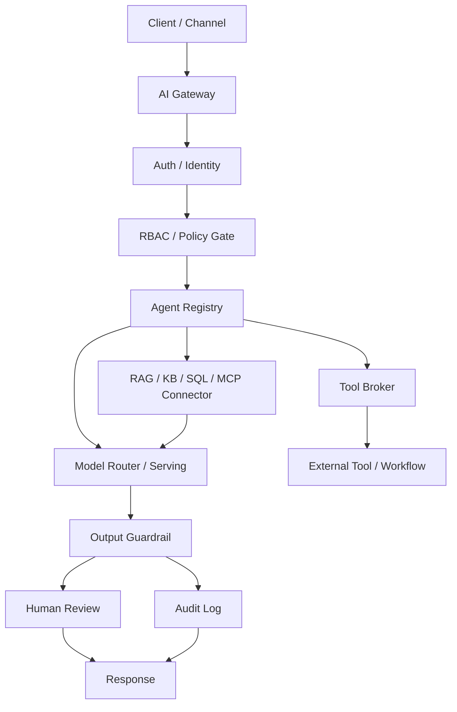

# Enterprise AI Architecture Sprint Day 1 教程設計委託包

日期：2026-06-13

對象：協助設計 `AI Systems Engineering Handbook` accelerator 教程的資訊工程學系教師

目標讀者：資訊工程大二學生，具備基礎程式設計、HTTP/JSON、資料庫與軟體工程概念，但尚未具備 enterprise AI system 設計經驗

Repo：`ai-systems-engineering-handbook`

指定 accelerator：`accelerators/enterprise-ai-architecture-sprint/`

指定 Day 1 主題：`AI Gateway Architecture Evidence`

正式課程包路徑：

```text
accelerators/enterprise-ai-architecture-sprint/day-01-ai-gateway/
```

---

## 1. 給老師的第一個結論

這份資料包的目的，是請老師協助我們設計 `Enterprise AI Architecture Sprint`
第一天的完整教程。Day 1 的課程任務不是教學生「怎麼呼叫一個 LLM API」，
而是讓大二學生第一次建立 enterprise AI system 的工程視角：一個 AI
功能要成為可部署、可治理、可審查、可維運、可驗收的系統，必須有清楚的
component boundary、request lifecycle、policy control、tool boundary、
data boundary、guardrail、audit log 與 human review workflow。

我們希望老師協助設計的不是單一講義，而是一組可放進 repo 的 Day 1
教學組件：

1. 學生版教程。
2. 教師授課指南。
3. 課前閱讀與先備知識橋接。
4. 課堂活動 worksheet。
5. 四個 Day 1 architecture artifacts 的模板。
6. 參考答案或 grading guide。
7. 100 分評分規準。
8. 後續 Day 2 / lab 的銜接建議。

Day 1 的核心句子是：

```text
Enterprise AI delivery is not proven by a working model demo.
It is proven by a system package with architecture, governance, deployment,
security, validation, and customer-delivery evidence.
```

請老師以軟體工程實踐與系統工程實踐的角度來設計課程。學生要學到的不只是
名詞，而是工程判斷：哪個 component 負責哪件事、哪個風險要在哪一層被控制、
哪個 evidence 可以證明設計是可檢查的。

---

## 2. Repo 是什麼

`ai-systems-engineering-handbook` 是一套 AI 系統工程教程型知識庫。它的正式定位是：

```text
AI 系統工程完整教程：
從地端部署、AI Gateway、Agent Governance、RAG、語音 AI 到企業交付
```

本 repo 的核心公式是：

```text
AI system
= model
+ data
+ infrastructure
+ workflow
+ governance
+ security
+ evaluation
+ delivery
```

這個 repo 不是：

- 純 machine learning textbook。
- 單純 prompt engineering cookbook。
- 雲端服務操作手冊。
- 隨機工具筆記。
- 公司內部 SOP。

它是一套用來教學生與 junior engineer 逐步建立 AI systems engineering
能力的教材系統。老師設計教程時，請把每個概念都落到可操作的工程物件：

- HTTP request / response。
- JSON schema。
- API contract。
- Docker container。
- Kubernetes Deployment / Service。
- SQL query。
- RAG metadata。
- Vector search result。
- Tool call schema。
- Policy decision。
- Audit event。
- Red-team test case。
- Acceptance criteria。

---

## 3. Repo 結構與老師可協助的位置

| 區域 | 功能 | 老師可協助的方式 |
|---|---|---|
| `master-knowledge-base/` | 全局地圖、學習路線、核心 mental model | 協助把大二學生先備知識接到 AI systems engineering |
| `modules/` | 深度教程主體 | 撰寫穩定章節、定義術語、解釋機制、設計 exercises |
| `labs/` | 實作與驗證 | 設計可執行 mini lab、debug guide、expected output |
| `accelerators/` | 7-14 天 evidence sprint | 設計短期 artifact-production 課程 |
| `case-studies/` | 真實世界整合案例 | 提供 public-safe 案例、trade-off、failure modes |
| `glossary/` | 可重用術語 | 補齊名詞定義與 cross-link |
| `templates/` | 文件模板 | 協助調整章節、lab、case study 模板 |
| `review/` | rubric 與 checklist | 協助建立可量化評分規準 |

Day 1 的主要放置位置是：

```text
accelerators/enterprise-ai-architecture-sprint/
```

相關背景文件：

```text
README.md
SPEC.md
SDD.md
master-knowledge-base/00-overview.md
master-knowledge-base/08-first-30-days-learning-checklist.md
master-knowledge-base/09-cs-professor-course-authoring-packet.md
accelerators/enterprise-ai-architecture-sprint/00-sprint-map.md
accelerators/enterprise-ai-architecture-sprint/01-ai-gateway-architecture.md
accelerators/enterprise-ai-architecture-sprint/day-01-ai-gateway/README.md
modules/07-ai-gateway-agent-governance/README.md
labs/ai-gateway/README.md
review/rubric.md
```

---

## 4. Accelerators 是什麼

`accelerators/` 是短期 evidence-generation learning paths。它的任務是把
多個 modules 的知識壓縮成可展示、可討論、可審查、可延伸到 lab 的
architecture evidence packet。

Accelerator 不是完整 module 的替代品。它不負責把所有底層知識教到最深，
而是負責在有限時間內讓學生產出一組能證明系統工程能力的 artifact。

簡化比較：

| 類型 | 主要任務 | 產出 |
|---|---|---|
| Module | 深入教一個知識域 | 概念、機制、workflow、failure modes、exercises |
| Lab | 驗證一個可執行能力 | code、commands、expected output、debug guide |
| Case Study | 整合多個知識域 | 情境、需求、架構、trade-off、monitoring |
| Accelerator | 短期產出 evidence | architecture diagram、checklist、policy map、capacity table、review packet |

`Enterprise AI Architecture Sprint` 的總目標是：

```text
potential
-> architecture evidence
-> deployable system reasoning
-> governance and security proof
-> customer-delivery readiness
```

---

## 5. Accelerators 的目標

這個 accelerator 要讓學生在 7-14 天內產出一套 public-safe enterprise AI
architecture evidence packet。學生完成後，應該能向老師、TA、mentor 或面試官
說明：

- 我能把 AI system 拆成 model、data、infrastructure、workflow、governance、
  security、evaluation、delivery。
- 我能畫出 AI Gateway 如何控制 agent、tool、model、data source、policy、
  guardrail、audit。
- 我能說明每個 component 的責任與 failure mode。
- 我能設計最低限度的 validation checklist。
- 我能區分 demo、prototype、architecture evidence、production-ready system。
- 我能把私人或情境來源轉成 public-safe、可重用的系統設計問題。

Accelerator 的每個 artifact 都要降低一種 system risk。例如：

- AI Gateway architecture 降低 uncontrolled routing、missing audit、
  policy bypass 的風險。
- Agent governance framework 降低 tool abuse、memory leakage、agent sprawl 的風險。
- Red teaming framework 降低 prompt injection、data exfiltration、unsafe output 的風險。
- GPU capacity model 降低 deployment under-sizing、latency collapse、VRAM overflow 的風險。
- K8s inference lab 降低 local-only demo、missing health check、unrepeatable deployment 的風險。

---

## 6. Accelerators 需要什麼

每個 accelerator artifact 至少需要五個部分：

1. **Architecture view**：能看出 component、資料流、控制流、責任邊界。
2. **Minimum viable output**：學生在短時間內能交出的具體成果。
3. **Validation checklist**：老師或 TA 能檢查是否合格。
4. **Failure modes**：學生知道設計缺漏會造成什麼工程問題。
5. **Next implementation gate**：下一步如何接到 lab、demo 或更完整系統。

老師設計 Day 1 時，請不要只設計概念講義。Day 1 必須是：

```text
concept explanation
-> software engineering mechanism
-> systems engineering boundary
-> real-world scenario
-> artifact template
-> student production
-> review rubric
-> next implementation gate
```

---

## 7. Accelerators 的重點

Accelerator 的重點是 evidence quality，不是速度本身。

學生的 artifact 要能回答：

- 這個設計解決哪個 system problem？
- 這個 component 的 input/output 是什麼？
- 這個 boundary 如果缺失，會發生什麼 failure mode？
- 哪些控制由 system enforce，哪些只是 model instruction？
- 哪個 log 或 audit event 可以支援日後 review？
- 這個 artifact 下一步可以怎麼變成 lab 或 prototype？

Day 1 最重要的觀念是：

```text
Prompt is not a permission boundary.
Model output is not an audit trail.
Tool calling is not safe without a broker.
RAG is not safe without data and metadata boundaries.
Human review is a workflow node, not a final disclaimer.
```

---

## 8. Day 1 的指定主題

Day 1 主題是：

```text
AI Gateway Architecture Evidence
```

Day 1 要讓學生從最簡單的 AI app：

```text
User -> Web app -> LLM API -> Response
```

提升到可治理的 AI system：

```text
Client / Channel
-> AI Gateway
-> Auth / Identity
-> RBAC / Policy Gate
-> Agent Registry
-> Tool Broker
-> RAG / KB / SQL / MCP Connector
-> Model Router / Serving
-> Guardrail
-> Audit Log
-> Human Review when required
-> Response
```

Day 1 不要求學生寫完整 backend，也不要求真的部署 Kubernetes 或 GPU service。
Day 1 的完成標準是學生能畫出 architecture、寫出 request lifecycle、定義
component responsibility、列出 risk-control map。

---

## 9. Day 1 學習目標

老師設計 Day 1 教程時，請讓學生達到以下 learning objectives：

1. 區分 model demo、AI application、AI system、enterprise-deliverable system。
2. 解釋 AI Gateway 為什麼是 enterprise AI 的 control plane。
3. 畫出 AI Gateway architecture diagram。
4. 定義 auth、RBAC、policy gate、agent registry、tool broker、RAG/MCP connector、
   model serving、guardrail、audit log、human review 的責任。
5. 寫出一個 10-14 步的 request lifecycle。
6. 用 JSON schema 描述 request、policy decision、audit event 的最小形狀。
7. 將 prompt injection、PII leakage、tool abuse、permission bypass、
   missing audit trail 連到具體 system controls。
8. 說明 prompt-only governance 為什麼不足。
9. 產出可被老師或 TA 評分的 Day 1 architecture evidence。

---

## 10. Day 1 學生先備知識

Day 1 面向大二學生。假設學生具備：

- 基礎 Python 或 JavaScript。
- HTTP request/response 概念。
- JSON object 概念。
- Web API route/handler 概念。
- 使用者登入與角色權限的直覺理解。
- 基礎 database table/query 概念。
- 基礎 software engineering 名詞：module、interface、test、log。

Day 1 不要求學生已經會：

- Kubernetes。
- GPU serving。
- vLLM。
- MCP protocol details。
- Full red-team methodology。
- Production security architecture。

但 Day 1 要埋下這些後續主題的位置，讓學生知道後面為什麼要學。

---

## 11. 軟體工程實踐角度

請老師把 Day 1 設計成一堂軟體工程課，而不是純 AI 工具課。

### 11.1 Interface contract

學生要看到每個 component 都有 input/output。例子：

```json
{
  "trace_id": "req-0001",
  "user": {
    "user_id": "student_001",
    "role": "student"
  },
  "task": {
    "task_type": "helpdesk_question",
    "message": "我無法登入 VPN，請幫我找設定方式。"
  },
  "requested_agent": "campus_it_helpdesk_agent"
}
```

教學重點：architecture diagram 不是裝飾，而是 interface contracts 的地圖。

### 11.2 Separation of concerns

請老師強調：

- Prompt 負責 instruction。
- Policy gate 負責 enforceable decision。
- Tool broker 負責 tool execution boundary。
- RAG connector 負責 data boundary。
- Audit log 負責 traceability。

不應該讓 model 同時負責權限、資料過濾、工具風險、審計紀錄。

### 11.3 Testability

學生要知道 Day 1 artifact 可以被測試。例如：

- 給一個 student role，是否能讀 staff-only document？
- 給一個 ticket creation request，是否會進入 approval gate？
- 給一個含 PII 的 output，是否會被 guardrail 標記？
- 給一個 malicious document，是否有 prompt injection test case？

### 11.4 Observability

學生要知道 log 不是最後補上的 `print()`。Enterprise AI system 需要：

- request log。
- policy decision log。
- tool call log。
- retrieved source IDs。
- guardrail result。
- human review status。
- final audit event。

---

## 12. 系統工程實踐角度

請老師把 Day 1 設計成一堂系統工程課。

### 12.1 Boundary

學生要學會問：

- 使用者邊界在哪裡？
- agent 邊界在哪裡？
- tool 邊界在哪裡？
- data 邊界在哪裡？
- model 邊界在哪裡？
- human review 邊界在哪裡？

### 12.2 Lifecycle

學生要寫 request lifecycle，不只畫 static diagram。最低應包含：

```text
1. Client sends request.
2. Gateway creates trace_id.
3. Gateway authenticates caller.
4. Gateway checks role and task policy.
5. Gateway selects agent from registry.
6. Agent requests retrieval or tool access.
7. Connector filters data by permission and metadata.
8. Model generates response from allowed context.
9. Tool broker checks side-effect actions.
10. Guardrail checks output.
11. Human review is triggered when needed.
12. Audit log records trace, policy, sources, tools, outcome.
13. Client receives response or review status.
```

### 12.3 Trade-off

學生要看到 system trade-offs：

- 更多 guardrails 提升安全，但可能增加 latency。
- 更細 metadata 提升資料控制，但增加 ingestion 成本。
- 更嚴 approval gate 降低風險，但可能降低 workflow speed。
- local model 提升資料邊界控制，但增加 GPU capacity planning。
- audit log 提升可追蹤性，但需要 log minimization 與 PII masking。

### 12.4 Failure modes

Day 1 必須教 failure modes。沒有 failure mode 的 architecture 學習容易變成空泛圖解。

---

## 13. Day 1 的真實世界案例

老師可以選一個主案例加兩個短案例。所有案例都必須 public-safe，不可使用私人客戶資料、
內部聯絡方式、未公開公司宣稱或可識別個資。

### 13.1 校園 IT Helpdesk Assistant

學生熟悉，適合當主案例。

情境：

```text
學生問：我無法登入 VPN，請幫我找設定方式。如果還是不行，幫我建立 IT ticket。
```

技術細節：

- Data source：IT FAQ、VPN 設定手冊、帳號鎖定 SOP。
- RAG metadata：`source_id`、`department`、`access_level`、`last_updated`。
- Tool：`search_it_faq` 是 read-only；`create_ticket` 是 side-effect。
- Policy：student role 可以查公開 FAQ；建立 ticket 需要 rate limit 或 review。
- Audit：記錄 `trace_id`、`user_id`、`agent_id`、`retrieved_source_ids`、
  `tool_calls`、`policy_decision`。

教學價值：

- 學生能理解 tool broker。
- 學生能理解 read-only tool 與 side-effect tool 的差異。
- 學生能理解 audit event 為什麼重要。

### 13.2 銀行內部知識助理

適合說明 enterprise permission boundary。

情境：

```text
行員查詢產品規則、合規注意事項、客戶服務流程。
```

技術細節：

- User role：staff、manager、compliance reviewer。
- Data boundary：文件有 `access_level`、`document_version`、`owner`。
- RAG：retrieval 前就要做 permission filtering。
- Output：必須引用 source IDs 和版本。
- Human review：高風險合規建議進入 review workflow。

教學價值：

- 學生能理解 prompt 不能當資料權限邊界。
- 學生能理解 source version 與 auditability。
- 學生能理解 enterprise AI 需要 governance evidence。

### 13.3 醫療預問診支援

適合說明 positive operating scope。

情境：

```text
系統協助整理病人輸入與公開衛教資料，輸出進入 staff-review intake support。
```

技術細節：

- Input 可能含 PII。
- Log 需要 masking 或 minimization。
- Output 應分成 `patient_reported_symptoms`、`source-backed education`、
  `questions_for_staff_review`。
- Human review 是 workflow node，不是最後補一句 disclaimer。

教學價值：

- 學生能理解安全與監管邊界要用正向 scope 語言表達。
- 學生能理解 high-risk domain 的 human review path。

### 13.4 製造場域異常聲音監測

適合說明 AI system 不只文字，也可能涉及 audio 與 edge deployment。

情境：

```text
工廠設備產生異常聲音，系統標記可能事件並提供 operator review。
```

技術細節：

- Audio event metadata：`event_id`、`timestamp`、`device_id`、`model_version`。
- Pipeline：audio preprocessing、event detector、knowledge retrieval、operator review。
- Deployment：可能在 edge box 或 machine room 中執行。
- Audit：記錄 model version、confidence、operator decision。

教學價值：

- 學生能理解 model output 要進入操作流程。
- 學生能理解 latency、false positive、operator review 的 trade-off。

---

## 14. Day 1 老師需要幫我們設計的完整教程組件

請老師協助設計以下八個組件。這是本資料包最重要的交付要求。

### 14.1 組件 A：學生版教程

放置建議：

```text
accelerators/enterprise-ai-architecture-sprint/day-01-ai-gateway/student-handout.md
```

內容應包含：

- Day 1 goal。
- Target learner。
- Prerequisites。
- Why AI Gateway exists。
- Core terms。
- Mental model。
- Request lifecycle。
- Minimal JSON schemas。
- Real-world public-safe examples。
- Four student artifacts。
- Exercise。
- Rubric。
- Completion checklist。

### 14.2 組件 B：教師授課指南

建議內容：

- 150 分鐘或 180 分鐘課程流程。
- 每一段的講授目標。
- Blackboard / slide diagram 建議。
- 常見學生誤解。
- 老師追問問題。
- 如何把學生回答導向 system boundary。

範例課程流程：

| 時間 | 活動 | 目標 |
|---:|---|---|
| 0-15 min | 問題導入 | 從 chatbot demo 拉到 enterprise AI system |
| 15-35 min | AI system formula | 建立 model + data + infra + workflow + governance |
| 35-60 min | AI Gateway mental model | 解釋 control plane |
| 60-85 min | Request lifecycle | 從 request 走到 audit event |
| 85-110 min | Real-world case | 校園 IT 或銀行案例 |
| 110-145 min | Group workshop | 學生產出 diagram + lifecycle |
| 145-170 min | Peer review | 用 checklist 檢查缺漏 |
| 170-180 min | Wrap-up | 連到 Day 2 / lab |

### 14.3 組件 C：課前閱讀

建議 15-20 分鐘可完成。目標是讓學生課前知道：

- AI system 不等於 model。
- AI Gateway 是 control plane。
- Request lifecycle 比單次 model call 更重要。
- Day 1 會產出 architecture evidence。

課前閱讀不應過長，也不應要求學生先懂所有技術。

### 14.4 組件 D：課堂 worksheet

Worksheet 要讓學生在課堂完成：

```text
Scenario:
Primary user:
High-risk action:
Data sources:
Read-only tools:
Side-effect tools:
Policy decisions:
Audit fields:
Human review trigger:
```

### 14.5 組件 E：四個 artifact 模板

Day 1 必須讓學生交出：

1. AI Gateway architecture diagram。
2. Component responsibility table。
3. Request lifecycle。
4. Risk-control map。

老師需要設計模板，讓學生不用從空白頁開始。

### 14.6 組件 F：參考答案

請老師至少提供一份主案例參考答案。建議使用校園 IT Helpdesk Assistant，因為大二學生
最容易理解。

參考答案要包含：

- Mermaid diagram。
- Filled component table。
- 10-14 step lifecycle。
- Risk-control map。
- Instructor notes：哪些地方是合格答案，哪些地方是常見錯誤。

### 14.7 組件 G：評分規準

建議滿分 100 分：

| 類別 | 分數 | 評分重點 |
|---|---:|---|
| Architecture diagram | 25 | component 完整，data/control flow 清楚 |
| Component responsibility | 20 | 每個 component 有 input/output/responsibility/failure |
| Request lifecycle | 20 | 從 user request 到 audit event，含 policy、retrieval、tool、guardrail |
| Risk-control map | 20 | 至少五個具體風險與 system controls |
| Beginner clarity | 10 | 大二學生可理解，術語有定義 |
| Source boundary | 5 | public-safe，沒有 private source material |

### 14.8 組件 H：下一步銜接

Day 1 結束後，下一步應該接：

```text
Build a minimal gateway mock that accepts one request, checks one policy,
routes one read-only tool call, and writes one audit event.
```

這個 next implementation gate 可以在後續 Day 2 或 `labs/ai-gateway/` 裡展開。

---

## 15. Day 1 四個學生 artifact 的詳細要求

### 15.1 Artifact 1：AI Gateway Architecture Diagram

圖中必須包含：

- Client / Channel。
- AI Gateway。
- Auth / Identity。
- RBAC / Policy Gate。
- Agent Registry。
- Tool Broker。
- RAG / KB / SQL / MCP Connector。
- Model Router / Serving。
- Guardrail。
- Audit Log。
- Human Review。
- Response。

最低合格圖：



### 15.2 Artifact 2：Component Responsibility Table

學生要填：

| Component | Responsibility | Input | Output | Failure if missing |
|---|---|---|---|---|
| Auth / Identity | 驗證 caller | token/session | trusted user context | 匿名或偽造 request 進入系統 |
| RBAC / Policy Gate | 判斷允許、拒絕、審查 | identity、task、risk | policy decision | 越權資料或工具使用 |
| Agent Registry | 選擇有 owner/scope 的 agent | task type | agent_id | agent 行為不可追蹤 |
| Tool Broker | 管理 tool call | tool request | allow/deny/review | tool abuse 或 side effect 無控管 |
| RAG / MCP Connector | 受控存取資料來源 | query、metadata、policy | allowed source chunks | 資料邊界失效 |
| Guardrail | 檢查輸入與輸出風險 | text、metadata、policy | pass/block/review | PII 或 unsafe output 外流 |
| Audit Log | 留下 trace evidence | events | audit record | 事後無法 debug 或審查 |

### 15.3 Artifact 3：Request Lifecycle

學生要寫 10-14 步，必須包含：

- trace_id。
- identity。
- policy decision。
- agent selection。
- data access boundary。
- tool broker。
- model response。
- output guardrail。
- human review trigger。
- audit event。

### 15.4 Artifact 4：Risk-Control Map

至少五個 risk：

| Risk | Example | Control | Evidence |
|---|---|---|---|
| Prompt injection | 文件要求 agent 忽略規則 | retrieval filter、instruction hierarchy、output guardrail | red-team test log |
| PII leakage | log 或回答出現電話/身分證字號 | masking、log minimization、PII detector | masked audit event |
| Tool abuse | agent 自動寄信或建立 ticket | tool broker、approval gate、schema validation | tool decision log |
| Permission bypass | student 讀到 staff-only 文件 | RBAC、metadata filtering before retrieval | policy decision log |
| Missing audit trail | 不知道回答用了哪些資料 | trace_id、source IDs、tool log | complete audit event |

---

## 16. Day 1 的教師追問問題

老師可在課堂中用以下問題逼學生建立工程判斷：

1. 如果 chatbot 回答錯了，我們如何知道它看了哪些資料？
2. 如果 agent 建立了 ticket，我們如何知道誰授權？
3. 如果 student 不該看 staff-only SOP，系統在哪一步擋下？
4. 如果惡意文件要求 model 忽略規則，哪一層要處理？
5. 如果回答包含電話或身分證字號，log 應該怎麼處理？
6. 如果新增第二個 agent，哪些 governance rule 可以重用？
7. 哪些控制可以寫在 prompt，哪些一定要由 system enforce？
8. Human review 在 architecture 裡是節點，還是只是一句 disclaimer？

---

## 17. 常見學生誤解與修正

| 誤解 | 修正 |
|---|---|
| AI Gateway 只是 proxy | Gateway 是 control plane，管理 policy、tool、data、audit、guardrail |
| Prompt 可以處理權限 | 權限要由 policy/RBAC/data filtering enforce |
| RAG 只要找相關文件 | RAG 要有 metadata、permission、version、citation、freshness |
| Tool call 只是 function call | Tool call 可能有 side effect，需要 schema、timeout、approval、audit |
| Log 只要記錄最後答案 | Audit 要記 user、agent、source、tool、policy、guardrail、outcome |
| Human review 是免責聲明 | Human review 是 workflow node，有 pending/approve/reject |
| Demo 能跑就是系統完成 | Enterprise evidence 還需要治理、安全、部署、驗證、交付 |

---

## 18. 老師撰寫時的語氣與範圍

請使用 Traditional Chinese 為主，保留常見英文技術詞：

- `AI Gateway`
- `RAG`
- `MCP connector`
- `tool broker`
- `policy gate`
- `audit log`
- `guardrail`
- `human review`
- `request lifecycle`
- `trace_id`
- `source_ids`

請採用正向、主動、可信任、邊界清楚的寫法：

- 用「本系統的 operating scope 是 staff-review support」而不是只寫「不是醫療診斷」。
- 用「資料存取由 metadata filtering 與 RBAC 控制」而不是只寫「不要洩漏資料」。
- 用「side-effect tools 進入 approval gate」而不是只寫「agent 不可以亂用工具」。

所有案例都要 public-safe。請不要寫入：

- raw private transcripts。
- customer secrets。
- credentials。
- private contact routes。
- salary or offer details。
- 未公開公司內部產品宣稱。
- 可識別個人、病人、客戶或員工的敏感資料。

---

## 19. 老師最終交付建議

請老師完成 Day 1 後，交付以下檔案或內容：

```text
1. day-01 student tutorial markdown
2. day-01 instructor guide
3. day-01 worksheet
4. day-01 reference answer
5. day-01 grading rubric
6. day-01 glossary updates
7. day-01 lab handoff note
```

建議 repo placement：

```text
accelerators/enterprise-ai-architecture-sprint/day-01-ai-gateway/README.md
accelerators/enterprise-ai-architecture-sprint/day-01-ai-gateway/student-handout.md
accelerators/enterprise-ai-architecture-sprint/day-01-ai-gateway/instructor-guide.md
accelerators/enterprise-ai-architecture-sprint/day-01-ai-gateway/worksheet.md
accelerators/enterprise-ai-architecture-sprint/day-01-ai-gateway/reference-answer-campus-it.md
accelerators/enterprise-ai-architecture-sprint/day-01-ai-gateway/rubric.md
accelerators/enterprise-ai-architecture-sprint/day-01-ai-gateway/day-02-lab-handoff.md
accelerators/enterprise-ai-architecture-sprint/day-01-ai-gateway/glossary-updates.md
```

如果老師只先交一份文件，請優先交：

```text
Day 1 instructor-ready tutorial package:
- student lesson
- worksheet
- reference answer
- rubric
```

---

## 20. Day 1 完成定義

Day 1 設計完成後，repo 應該支援以下使用方式：

1. 學生能讀懂 AI Gateway 為什麼存在。
2. 老師能用 150-180 分鐘上完第一天 accelerator。
3. 學生能完成四個 architecture evidence artifacts。
4. TA 能用 rubric 給分。
5. Reviewer 能檢查 source boundary、security、failure modes、workflow。
6. Day 2 能接續到 agent governance 或 minimal gateway mock lab。

Day 1 的最終能力描述：

```text
The student can explain and diagram how an enterprise AI request passes through
identity, policy, agent selection, tool/data boundaries, model serving,
guardrails, audit logging, and human review.
```

---

## 21. 給老師的直接委託文字

老師您好：

我們正在建立一套 `AI Systems Engineering Handbook`，希望把資訊工程學生從
「會呼叫 AI API」帶到「能設計可部署、可治理、可驗證的 enterprise AI system」。

這次想請您協助設計 `Enterprise AI Architecture Sprint` 的 Day 1 教程。Day 1
主題是 `AI Gateway Architecture Evidence`。我們希望課程面向大二學生，使用
軟體工程與系統工程的角度，清楚說明 AI Gateway 為什麼存在、它如何管理 agent、
tool、model、data、policy、guardrail、audit log 與 human review。

請您協助設計一組完整教學材料，而不只是單篇講義。理想交付包含：

1. 學生版教程。
2. 教師授課指南。
3. 課堂 worksheet。
4. 學生 artifact 模板。
5. 參考答案。
6. 評分規準。
7. Day 2 或 lab 的銜接建議。

學生在 Day 1 結束時，應該能交出：

1. AI Gateway architecture diagram。
2. Component responsibility table。
3. Request lifecycle。
4. Risk-control map。

請使用 public-safe 的真實世界案例，例如校園 IT helpdesk、銀行內部知識助理、
醫療預問診支援或製造場域異常聲音監測。請避免任何私人資料、未公開公司宣稱、
客戶秘密或可識別個資。

我們最重視的是：讓大二學生建立可檢查的工程判斷。請把每個概念連到具體工程物件，
例如 JSON schema、policy decision、tool call、source IDs、audit event、human
review status。這樣 Day 1 才能成為後續 agent governance、red teaming、K8s
deployment、GPU capacity、PII guardrail 與 voice AI evidence 的基礎。
