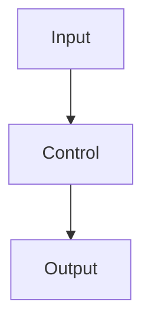

# Detailed Student Handout: <TOPIC>

This is the canonical long-form student explanation for Day <DAY_NUMBER>.

Use this file for student-facing expansions, source-derived teaching details,
examples, technical mechanisms, diagrams, protocol notes, and deeper
comparisons. Apply the source-boundary rules before adding material.

After updating this file, update `student-handout-detailed.zh-TW.md` as a
complete Taiwan Traditional Chinese version, then update `student-handout.md`
as a first-principle summary that preserves every chapter and subchapter from
this detailed version.

## 1. First Conclusion

<State the core lesson in one direct paragraph.>

## 2. Why This Day Exists

<Explain the real engineering problem this day solves.>

## 3. First-Principles Frame

```text
<Core equation or lifecycle>
```

## 4. Core Terms

| Term | Beginner definition | Engineering meaning |
|---|---|---|
| <Term> | <Definition> | <Engineering role> |
| <Term> | <Definition> | <Engineering role> |

## 5. Main Public-Safe Scenario

```text
<Scenario prompt>
```

Important design facts:

- <Fact>
- <Fact>
- <Fact>

## 6. Mechanism

<Explain how the system works underneath.>

## 7. Diagram Or Workflow



## 8. Required Student Artifacts

Submit:

1. <Artifact 1>
2. <Artifact 2>
3. <Artifact 3>
4. <Artifact 4>

## 9. Risk / Failure Pattern

| Risk | Example | System control | Evidence |
|---|---|---|---|
| <Risk> | <Example> | <Control> | <Evidence> |

## 10. Key Rules To Remember

```text
<Rule 1>
<Rule 2>
<Rule 3>
```
