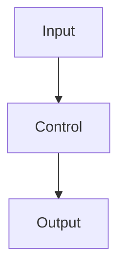

# 詳細學生講義：<TOPIC>

這份文件是 Day <DAY_NUMBER> 的台灣繁體中文完整詳細版學生講義。

此檔案必須完整對應 `student-handout-detailed.md`。翻譯時保留每一個章節、
子章節、段落、表格、圖、程式碼區塊、指令、schema、清單、範例、source
boundary 說明與參考資料。這不是摘要、改寫版或節選版。

技術識別字、檔名、指令、API 名稱、HTTP status code、schema、程式碼與 URL
預設保留原文；需要幫助學生理解時，可以在原文旁加入簡短中文說明。

## 1. First Conclusion

<以台灣繁體中文完整翻譯詳細版同一章節內容。>

## 2. Why This Day Exists

<以台灣繁體中文完整翻譯詳細版同一章節內容。>

## 3. First-Principles Frame

```text
<保留或完整翻譯 detailed version 中的核心公式或 lifecycle。>
```

## 4. Core Terms

| Term | Beginner definition | Engineering meaning |
|---|---|---|
| <Term> | <以台灣繁體中文完整翻譯。> | <以台灣繁體中文完整翻譯。> |
| <Term> | <以台灣繁體中文完整翻譯。> | <以台灣繁體中文完整翻譯。> |

## 5. Main Public-Safe Scenario

```text
<以台灣繁體中文完整翻譯 detailed version 中的 scenario prompt。>
```

重要設計事實：

- <完整翻譯 fact。>
- <完整翻譯 fact。>
- <完整翻譯 fact。>

## 6. Mechanism

<以台灣繁體中文完整翻譯詳細版同一章節內容。>

## 7. Diagram Or Workflow



## 8. Required Student Artifacts

提交：

1. <Artifact 1>
2. <Artifact 2>
3. <Artifact 3>
4. <Artifact 4>

## 9. Risk / Failure Pattern

| Risk | Example | System control | Evidence |
|---|---|---|---|
| <Risk> | <以台灣繁體中文完整翻譯。> | <以台灣繁體中文完整翻譯。> | <以台灣繁體中文完整翻譯。> |

## 10. Key Rules To Remember

```text
<Rule 1>
<Rule 2>
<Rule 3>
```
